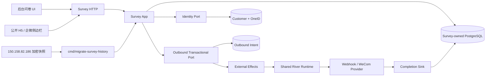

# AI-CRM v3 问卷全能力与历史数据迁移 PRD

> 文档状态：提审版  
> 设计日期：2026-09-03  
> 唯一目标仓库：`qianlan33333-png/AI-CRM-v3`  
> 冻结供体：`AI-CRM-v2@6bfbe5816bb89913c70adaca87d6a486260e016e`  
> 生产数据源：`150.158.82.186` 上 `openclaw_wecom` 数据库  
> 范围边界：只交付 Survey/问卷板块及其必需的 OneID、Outbound、External Effects 稳定 Port 接线

## 1. 执行结论

本项目要把问卷从“v3 中已有前端文件、但没有后端和数据表的兼容壳”建设为一个完整的 v3 领域。完成后，后台可以设计和发布问卷，用户可以在 H5 或企微上下文中填写，提交可以安全关联 OneID，管理员可以查看、分析和导出结果，客户侧边栏可以查看该客户的问卷记录，配置的后续动作可以通过可靠外部效果执行和对账，`150.158.82.186` 上一次性生产快照内的全部历史问卷事实均有导入或明确 unresolved 处置。本项目不切流、不停写、不做持续增量同步。

本项目不是复制 v2 目录，也不把 v2 作为运行依赖。v2 只提供前端交互、HTTP 契约、领域行为和测试向量。Go 后端按 v3 的 OneID、PostgreSQL Unit of Work、Job Queue、Outbound 和 External Effects 规则重建。

### 1.1 开发前两轴分类

```text
OneID: involved — resolves identity / provisions from verified Provider fact / reads canonical customer;
       historical declared evidence may only resolve or remain unresolved, never implicitly provision or merge.
Persistence: local transaction + internal durable job + Provider read + Provider write/external effect.
```

- Survey 拥有问卷定义、版本、提交快照、答案、业务操作配置、迁移回执和效果绑定。
- Identity 拥有外部身份与 Customer 归属；Survey 不保存第二套 openid/unionid/external_userid 到客户映射。
- Outbound 拥有 Provider 写入适配；Survey 只冻结不可变意图。
- External Effects 拥有队列、generation、lease/fence、attempt、retry 分类和 reconciliation 状态机。
- 提交、幂等回执、审计、Outbox、后续动作意图和效果接受在需要时进入同一个 PostgreSQL Unit of Work；Provider 网络调用不持有事务。

### 1.2 高层架构



关键边界：Survey 不读取 Identity、Outbound 或 External Effects 的表；跨域只调用 Port。Provider 回执通过 composition root 的 completion sink 回到 Survey 安全投影。

## 2. 已核验现状

### 2.1 v3 当前状态

截至本次检查，v3 已存在下列问卷前端资产，且与冻结 v2 供体逐字节一致：

- 后台问卷列表、详情、可视化编辑器、运营页和未解析历史页；
- 公开问卷 API 客户端；
- 企微侧边栏问卷标签页；
- 四组生成 API 客户端与两份前端契约脚本。

但当前 v3：

- 没有 `internal/survey` 领域；
- 没有 Survey-owned migration；
- `api/openapi.yaml` 中没有问卷或 survey 路径；
- `internal/webshell` 明确把 `/admin/questionnaires` 标为“入口已预留”，并测试 `/api/sidebar/v2/questionnaires` 未注册。

因此现状只能称为冻结前端资产存在，不能称为问卷已迁移或可用。

### 2.2 v2 供体能力与缺口

冻结的 v2 主分支提供：

- 问卷定义 CRUD、复制、启停、删除、排序和四种题型；
- 管理端结果、提交列表、分析、导出预览和 CSV；
- 版本化公开定义、强制 H5 OAuth、Customer-bound 提交和结果 token 查询；
- 本地运营配置、外推测试记录、效果详情和人工 reconcile；
- 客户问卷答案只读 Port、侧边栏问卷投影；
- 历史导入、隔离区、unresolved history 和真实 PostgreSQL 测试。

同时必须承认以下供体限制：

1. v2 后端明确拒绝 assessment/F02；前端虽然已有测评编辑器，后端并未闭合。
2. v2 公开问卷仅支持匿名、选择题、本地结果，不包含自由文本、手机号、测评结果或真实后续动作。
3. “外推测试”只写本地 queued 事实；真实 Provider adapter 默认 disabled，不能把它描述为已发送。
4. v2 提交快照仍包含多种 opaque 身份字段，不符合 v3 “身份只归 Identity” 的长期模型。
5. v2 历史导入会把无法映射到当前定义的答案放入单独 unresolved history；v3 必须保证这些答案仍可按原提交查看，不能因为定义已变更而丢失。

### 2.3 生产源库只读快照

检查时间：2026-09-03，检查过程只执行 schema 和聚合查询，没有导出或显示原始 PII。

| 源表/事实 | 当前数量 | 关键观察 |
|---|---:|---|
| `questionnaires` | 10 | 全部启用；7 个开启外推；0 个开启测评 |
| `questionnaire_questions` | 57 | 单选 32、多选 2、文本 14、手机号 9 |
| `questionnaire_options` | 189 | 2 个 other 选项；当前无分值或标签配置 |
| `questionnaire_score_rules` | 0 | 当前没有历史评分规则 |
| `questionnaire_submissions` | 1,585 | 覆盖 9 份问卷；时间范围 2026-03-26 至 2026-09-03 |
| `questionnaire_submission_answers` | 6,649 | 覆盖 1,583 次提交；2 次提交没有答案 |
| `questionnaire_external_push_logs` | 715 | success 709、failed 6；包含 URL、请求和响应敏感内容 |
| `questionnaire_scrm_apply_logs` | 1,211 | skipped 1,142、skipped_no_tags 47、identity_unresolved 22 |

身份关联观察：

- 1,560 次提交带 unionid，25 次完全没有可用身份字段；
- 1,532 次提交的 unionid 可关联当前 production OneID，28 次带 unionid 但关联不到；
- 按当前数据，至少 53 次提交不能安全归属 Customer；它们必须完整导入，但 `customer_id` 保持空并进入 unresolved 台账；
- production 的只读账号无权读取身份表，本次只通过本机 PostgreSQL 超级用户执行了聚合 SELECT，没有读取或输出任何原始标识值。

历史一致性观察：

- 4,327 个答案的 `question_id` 已无法关联当前问题定义。这符合“编辑器替换定义行、答案保存快照”的历史行为，不是可以丢弃的孤儿数据；
- 141 个提交有唯一 result token，1,444 个没有；已有 token 无重复；
- 1,522 个手机号题答案含文本，属于敏感数据；
- 715 条旧外推日志全部带请求载荷，714 条带响应体，不能原样进入结构化日志或 External Effects 表。

以上数字只是设计基线。正式导入必须重新生成一次性一致性快照，不能把这里的数字当成最终迁移收据。

## 3. 产品目标与成功标准

### 3.1 产品目标

1. 管理员能在 v3 完成问卷创建、编辑、复制、启停、预览、发布和运营配置。
2. 普通问卷与测评问卷均有真实后端，前端可见操作不得再命中 placeholder 或 F02 unavailable。
3. 用户只可从 `/q/{slug}` 在微信内发起 `snsapi_userinfo` 授权；新提交必须解析为 Customer，身份不确定或冲突时禁止提交且不猜客户。
4. 提交结果、答案快照、评分、标签建议、后续动作和效果状态可审计、可重放、可对账。
5. 客户详情和企微侧边栏只通过 Survey 读 Port 查看已关联到 canonical `customers.id` 的问卷记录。
6. 生产一致性快照内全部问卷事实都有 `imported` 或 `unresolved` 二者之一的明确收据，数量和 digest 可对账。
7. 迁移不修改 source、不改变问卷路由，快照后 source 新数据不在本期范围。

### 3.2 完成定义

以下条件必须同时满足，才可称“问卷板块完成”：

- 真实 PostgreSQL 上所有正常、边界、重放、并发和失败测试通过；
- v2 冻结前端的所有可见动作均有真实 v3 API 和数据库事实；
- 公开 H5 真机完成一次身份成功、一次身份冲突失败关闭和一次重复提交验证；
- Provider disabled 时明确显示未执行；启用后至少完成一次测试接收器和一次受控真实效果的 accepted/executed/reconciled 证据；
- 历史迁移对账为零未解释差异，53 个或最终快照中的实际 unresolved 数量逐条有收据；
- source 写入口关闭后验证无新增 source 行；
- 生产监控、备份、回滚和操作手册已演练。

## 4. 范围

### 4.1 本期必须交付

#### A. 后台问卷管理

- 列表、搜索、状态筛选、分页和准确总数；
- 新建、完整编辑、复制、启用、停用；
- 草稿且无提交/效果时允许硬删除；已有提交或效果时只允许 retire/停用，禁止级联删除历史；
- 题目新增、删除、排序，支持单选、多选、文本、手机号；
- 必填、选择数、文本长度、placeholder、other 选项及其长度校验；
- 普通分数规则与测评配置，包括维度、类型、等级、总评、优势/短板和建议；
- 乐观锁 `version`、actor-scoped idempotency、RBAC、CSRF、审计和事件同事务。

#### B. 发布与公开 H5

- 将可编辑定义发布为不可变 `definition_version`；
- 一个 slug 同时最多一个 public 版本；新版本发布后旧版本只读保留；
- all-in-one 和 one-by-one 两种答题模式；
- 四种题型均可在公开页真实提交；
- 草稿预览与正式公开链接分离；
- 结果 token 只存 HMAC/摘要，不在日志或 URL 中回显；
- 频率限制使用服务端 HMAC 摘要，不保存原始 IP/浏览器标识；
- disabled、版本漂移、重复提交和过期身份会话均有稳定错误。

#### C. OneID 归属

- H5 公众号 OAuth 的 openid 必须保留 App scope；UnionID 必须保留开放平台 scope；
- 企微 external_userid 必须保留 corp scope；
- Provider 验证成功后的 Adapter 才能构造 verified fact；HTTP body/query 不得自报 verified；
- verified identity 先 `Resolve`，未找到时才允许显式 `ProvisionVerifiedIdentity`；
- 手机号答案只能是严格 11 位大陆号码并作为 declared evidence；Survey 加密保存答案，Identity 通过 `phone:cn11` HMAC 与独立密文附着到 OAuth Customer，不得靠手机号隐式建客或自动合并；
- 多个 verified identity 指向不同 Customer 时生成 conflict/merge candidate，提交进入 `identity_conflict`，不得任选一个客户；
- 既有匿名/未解析历史提交继续只读保留；新公开定义、提交和新结果查询均不得匿名绕过 OAuth。

#### D. 提交、结果、分析与导出

- 一次提交冻结问卷版本、题目标题、选项文本、分值、标签建议、自由文本和评分结果；
- 旧定义被编辑后，历史答案仍按提交时快照展示；
- submission idempotency 范围为 `definition_version + respondent/session + submission_key`；相同载荷重放同一结果，载荷漂移返回冲突；
- 管理端支持结果概览、提交分页、选择题聚合、测评分布和导出；
- 默认分析/预览去标识化，不包含手机号、自由文本、外部身份和原始 token；
- 敏感导出需要独立 capability、`no-store`、审计和字段白名单；
- 客户详情和侧边栏只展示 `customer_id` 已确认关联的提交。

#### E. 运营配置和外部效果

- 保存完成页导航目标和外推配置引用；Survey 只保存 opaque reference，不保存 URL、Secret 或 Provider credential；
- 提交后的本地评分和结果生成在提交事务内完成；
- 需要异步准备的数据使用 `internal/platform/jobqueue`，不新建 Survey worker/lease/retry 表；
- Webhook、企微标签或其他 Provider 写入统一提交给 Outbound，再由 External Effects 可靠执行；
- External Effects 只保存四个稳定 digest 和效果状态，不保存客户标识、答案、URL、请求或响应体；
- `accepted`、`queued`、`attempted`、`executed`、`outcome_unknown`、`reconciled` 分开展示；
- `outcome_unknown` 禁止换幂等键重试，只能原键查询、可信回调或人工 reconcile；
- 历史日志是只读事实，导入后绝不自动重放旧外推或旧企微打标。

#### F. 历史数据迁移

- 全量迁移定义、问题、选项、评分规则、提交、答案和问卷运营配置；
- 将旧外推/SCRM 日志的业务结果导入安全只读投影，原始 URL、请求体、响应体和用户标识不导入也不归档；
- 所有源主键通过 source map 映射到 v3 新主键，不复用旧 sequence；
- 无当前定义映射的答案仍写入同一提交快照，`definition_resolution_status=unresolved`，不能丢到不可见角落；
- 无安全 OneID 映射的提交保留答案和时间，`customer_id=NULL`，并建立 digest-only unresolved case；
- 导入命令支持 `inspect`、`dry-run`、`apply --confirm-apply`、`reconcile`；
- 每行都有 source digest、target digest、disposition 和可重放收据；同源同载荷重放返回原结果，载荷漂移失败关闭。

### 4.2 明确不做

- 不迁移 Campaign、Audience、Radar、会员、支付、订单、商品或自动化板块；
- 不因为问卷选项含 tag code 就复制 Tag 或 WeCom Provider；只通过稳定 Port 提交意图；
- 不复用或运行 v2 Go module、数据库、worker 或 migration 历史；
- 不提供通用表单平台、多租户、任意脚本题、文件上传题或流程编排器；
- 不把 production 的 unionid 当 v3 Customer 主键；
- 不自动合并 Customer，不用手机号或近似资料猜身份；
- 不在迁移时执行任何历史 webhook、企微标签或后续动作；
- 不把原始 PII、Secret、URL token、请求体或 Provider 响应写入 Git、结构化日志或 External Effects。

## 5. 用户与核心 Journey

### 5.1 角色

- Admin：管理定义、发布、删除草稿、查看敏感导出、执行 reconcile。
- Ops：编辑和发布、查看去标识化分析、查看效果状态；默认不能导出敏感字段。
- Staff：在企微侧边栏查看当前 Customer 已确认关联的问卷记录。
- Respondent：通过可信公众号 OAuth 填写问卷并查看自己的结果。

### 5.2 黄金 Journey

#### GJ-S01：后台创建并发布

```text
Admin 登录 → 新建问卷 → 配置题目/校验/测评 → 保存草稿
→ 预览 → 发布 immutable definition version → 获得公开 slug
```

#### GJ-S02：有 OneID 的 H5 提交

```text
用户打开 `/q/{slug}` → 点击发起 `snsapi_userinfo` → Provider 换码验证 → Identity Resolve/显式 Provision
→ 签发 HttpOnly/Secure/SameSite=Lax 短时 survey session
→ 读取公开版本 → 提交 → 同事务冻结答案/结果/receipt/audit/outbox
→ 提交后动作由 Outbound + External Effects 异步执行
```

#### GJ-S03：身份不确定时失败关闭

```text
用户直接访问 H5/API、OAuth 会话过期或身份解析冲突
→ 返回 `survey_oauth_required` 或 `survey_identity_conflict`，不创建新提交
→ 既有 anonymous/unresolved 历史仍可由旧结果 token 只读查看
```

#### GJ-S04：侧边栏查看

```text
企微可信 external_userid → OneID Resolve → customer_id
→ Sidebar 聚合层调用 Survey read Port
→ 展示该 customer 的提交时间、问卷、分数和安全答案摘要
```

#### GJ-S05：历史快照导入

```text
source 一致性快照 → v3 inspect/dry-run → 导入/对账 → shadow read
→ 产出 snapshot_at、count、digest 和 unresolved 收据
→ source 继续原有路由和写入，无切换动作
```

## 6. 领域模型与状态机

### 6.1 定义状态

```text
draft → public → retired
  │        │
  └→ disabled ←┘
```

- 编辑 draft/disabled 会生成新的 working version；已 public 的快照不可变。
- 有提交或效果引用后，定义不可物理删除。

### 6.2 提交状态

```text
received → committed
              ├→ identity_linked
              ├→ anonymous
              ├→ identity_pending
              └→ identity_conflict
```

身份关联状态不改变答案快照。后续 reconciliation 只追加关联收据和 Customer 引用，不重写原始提交事实。

### 6.3 效果状态

```text
accepted → queued → attempted → executed
                         ├→ retryable_failed → queued
                         ├→ final_failed
                         └→ outcome_unknown → reconciled
```

UI 必须同时展示业务提交状态和外部效果状态，不能把排队成功当成 webhook/企微已成功。

## 7. 数据设计与 Owner

最终表名可在实现 PR 中按现有命名风格微调，但 Owner 和语义不可变。

| 表/记录 | Owner | 核心语义 |
|---|---|---|
| `survey_questionnaires` | Survey | 可编辑的当前定义头、状态、version |
| `survey_definition_versions` | Survey | 每次发布或提交使用的不可变定义快照 |
| `survey_definition_questions` | Survey | version 内题目快照 |
| `survey_definition_options` | Survey | version 内选项、分数、标签建议快照 |
| `survey_score_rules` | Survey | version 内评分/测评规则 |
| `survey_submissions` | Survey | immutable 提交头、可空 `customer_id`、身份解析状态 |
| `survey_submission_answers` | Survey | immutable 答案快照；source question 可无当前定义 FK |
| `survey_submission_receipts` | Survey | 提交幂等与结果快照 |
| `survey_operations` | Survey | completion 和 outbound 的 opaque 配置引用 |
| `survey_operation_receipts` | Survey | 管理写入幂等收据 |
| `survey_external_effect_bindings` | Survey | submission 到 opaque `effect_id` 的不可变绑定 |
| `survey_external_effect_results` | Survey | 从稳定 Port/事件接收的安全效果投影 |
| `survey_identity_reconciliation_cases` | Survey | digest-only unresolved/conflict 台账，不保存原始身份 |
| `survey_migration_runs/receipts/maps` | Survey | source→target、digest、disposition、对账结果 |
| `survey_legacy_effect_history` | Survey | 旧 push/SCRM 的安全只读投影 |
| `customers/customer_identities/...` | Identity/Customer | canonical Customer、scoped identity、冲突和 merge candidate |
| `outbound_*` | Outbound | Provider 目标解析、受限业务载荷和发送适配 |
| `external_effects/*` | External Effects | digest-only 效果状态、attempt、lease/fence、reconcile |

约束：

- Survey Store 只写 Survey-owned 表；`customer_id` 只来自 Identity Port 的结果或已验签迁移映射。
- Survey 不查询 Identity、Outbound 或 External Effects 表。
- `effect_id` 绑定通过 stable Port 返回并保存，不用跨域 SQL 补偿。
- 业务状态、receipt、audit、Outbox 和需要的 effect accept 必须使用 caller transaction；任何 adapter 若偷偷开独立事务，PR 必须停止并先修 Port。

## 8. 身份决策矩阵

| 输入 | assurance | 允许动作 | 禁止动作 |
|---|---|---|---|
| 企微可信上下文的 `corp_id + external_userid` | verified | Resolve；未找到时显式 Provision | 从普通 body/query 直接建客 |
| 公众号 OAuth 的 `appid + openid` | verified | 以 `wechat-app:<appid>` scope Resolve/Provision | 无 App scope 匹配 |
| 开放平台返回的 `unionid` | verified | 以 `wechat-open-platform:<platform>` scope Resolve/关联 | 无开放平台 scope 跨渠道关联 |
| 手机号题答案 | declared | 已有 Customer 时通过 Identity Port 附着 declared evidence | 隐式建客、自动合并、升级 verified |
| 匿名浏览器 | none | 引导至 `/q/{slug}` 的微信授权页 | 读取定义、创建提交或创建 Customer |
| production 历史 unionid | migrated evidence | 只通过签名的 source OneID→v3 Customer map 关联 | 直接写 `customer_id` 或复用 unionid 为主键 |
| 多条证据指向不同根 | conflict | 记录 conflict/merge candidate，提交待处理 | 任选 Customer 或自动合并 |

## 9. HTTP 与前端契约

### 9.1 契约原则

- `api/openapi.yaml` 是唯一 HTTP 真相；生成客户端不可手改。
- 为保留冻结前端交互，首期继续支持 v2 UI 消费的 36 条 questionnaire/survey 路径；内部实现全部路由到 v3 Survey handler。
- 新增 canonical `/api/v3/surveys/...` 只在确有非兼容需求时引入；不为了“看起来新”重复维护两套 API。
- 前端 `capabilities.ts` 只有在真实 Handler、Store 和 PostgreSQL Journey 通过后才可标为 `real`。

### 9.2 页面

- `/admin/questionnaires`：列表和入口；
- `/admin/questionnaires/new`、`/admin/questionnaires/{id}`：完整编辑器；
- `/admin/questionnaires/{id}/operations`：完成动作和外推配置；
- `/admin/questionnaires/external-push-logs`：效果与旧历史；
- `/q/{slug}`：二维码与分享唯一入口；授权后由服务端定义跳转 `/h5/all.html` 或 `/h5/one.html`；
- 企微侧边栏问卷 tab：当前 Customer 的安全只读记录。

### 9.3 错误合同

至少稳定区分：

- `authentication_required`、`permission_denied`、`csrf_invalid`；
- `questionnaire_not_found`、`definition_version_conflict`、`questionnaire_disabled`；
- `invalid_schema`、`invalid_answer`、`submission_payload_conflict`、`rate_limited`；
- `survey_oauth_required`、`survey_identity_conflict`、`survey_oauth_unavailable`；
- `external_push_not_configured`、`provider_disabled`、`outcome_unknown`；
- `migration_source_drift`、`migration_unresolved`、`migration_reconciliation_failed`。

## 10. 历史迁移设计

### 10.1 推荐方案

采用一次性 PostgreSQL 一致性快照。快照事务建立时记录 `snapshot_at` 和 snapshot ID，该事务可见的问卷数据是本次迁移全集。快照后 source 新增或变更的数据明确不在本期范围。

迁移不暂停旧入口、不切换路由、不修改 source、不建立 CDC、持续增量或双写。一致性依据是单个快照的 manifest、count 和 canonical digest，而不是运行期追平。

### 10.2 快照内容

快照必须覆盖九类 source table，并另带 source schema fingerprint、行数、每表 canonical digest、导出时间、事务 snapshot ID 和 high-water mark。任何文件不得进入 Git。

敏感处理：

- 原始 unionid、openid、external_userid 和问卷答案只在受限快照中作为导入输入；原始外推 URL、请求体和响应体不进入快照输出或冷归档；
- live Survey 表只保存 `customer_id`、业务答案和必要的 digest/masked projection；
- External Effects 仅保存 digest；
- 迁移日志只打印 run ID、计数、状态和 digest 前缀，不打印原始内容。

### 10.3 导入顺序

1. 冻结 source schema 与 source table allowlist；
2. 导入 questionnaire 当前定义和不可变 version 1；
3. 导入 questions/options/score rules，并建立 source ID map；
4. 校验 production OneID→v3 Customer 的签名映射快照；
5. 导入 submissions 和 answers；定义无法还原时保留答案快照并标记 unresolved；
6. 写入已确认的 `customer_id`，其余写入 identity reconciliation cases；
7. 导入运营配置，但默认 disabled，待目标引用逐个确认后启用；
8. 导入旧 push/SCRM 的状态、次数、时间、安全失败分类和业务关联；丢弃 URL、请求体、响应体和原始用户标识；
9. 对每个 source row 记录 `imported` 或 `unresolved`；
10. 对账源/目标 count、关系、时间范围、canonical digest 和抽样页面。

### 10.4 生产导入顺序

1. Provider 和所有问卷外部效果保持 disabled；
2. 确认 source 只读账号、已验证 host key、目标备份和导入授权；
3. 在单个 repeatable-read 事务中生成快照和 manifest；
4. 对目标执行 `inspect`、回滚式 `dry-run`、`apply` 和 `reconcile`；
5. 运行只读页面、API、性能和身份抽样；
6. 要求快照内所有 source row 都有处置，且目标计数/digest 一致；
7. 产出最终对账报告，但不更改任何 source 入口、路由、任务或 Provider 开关。

### 10.5 回退边界

- source 始终只读使用，不存在 source 侧回退。
- target 正式导入前必须备份；导入未验收时可按 `migration_batch_id` 删除该批目标行并恢复备份。
- 导入验收后不自动删除业务事实；任何重做使用同一 source receipt 幂等重放。

## 11. 非功能要求

### 11.1 性能与容量

- 设计容量：至少 100 万提交、2,000 万答案，无需分库；
- 公开定义读取 p95 < 300ms，提交本地事务 p95 < 800ms；
- 管理列表/提交分页 p95 < 500ms；
- 所有分页使用稳定 cursor 或受界 offset，并有匹配索引；
- 历史导入在受控 batch 下完成，单事务不超过一个 questionnaire aggregate 或 1,000 个 submission。

### 11.2 可用性与恢复

- 目标可用性 99.9%；
- 已提交业务数据 RPO 0（依赖 PostgreSQL WAL/备份策略），RTO 4 小时；
- Provider 故障不阻断本地问卷提交；只使后续效果进入可观测失败状态；
- worker 重启后任务可恢复，重复 claim 不产生重复效果。

### 11.3 安全与隐私

- 后台 human session、RBAC、CSRF；公开 H5 使用独立短时 session；
- 敏感响应 `Cache-Control: no-store`；导出有审计和最小字段集；
- Secret、Cookie、OAuth code、openid、unionid、external_userid、手机号、URL token 不进结构化日志；
- 迁移快照使用独立受限目录、加密传输、校验和和明确销毁/归档策略；
- 自由文本按 PII 处理，不进入指标 label、trace attribute 或错误文本。

### 11.4 可观测性

指标至少包括：提交成功/冲突/拒绝、身份 linked/pending/conflict/anonymous、effect 各状态、迁移各 disposition、worker lag、reconcile backlog。所有指标只带 questionnaire internal ID、状态和阶段，不带客户或答案。

## 12. 验收矩阵

| 领域 | 必测正常路径 | 必测失败/重放路径 |
|---|---|---|
| Definition | CRUD、复制、发布、四题型、测评 | version 冲突、非法 schema、已有提交删除 |
| Public H5 | 两种展示模式、四题型、结果 | disabled、版本漂移、限流、token 不泄漏 |
| OneID | scoped openid/unionid/external_userid Resolve/Provision | body 自报 verified、手机号建客、跨 scope 串号、冲突不误绑 |
| Submission | snapshot、评分、同键重放 | payload drift、Event 冲突、事务回滚、并发双提交 |
| Effects | accepted→executed、reconcile | Provider disabled、timeout unknown、同键重放、禁止换键 |
| Sidebar | canonical customer 精确分页 | declared hint 不越权、无 customer 不返回他人记录 |
| Migration | 一次性快照、replay、53 unresolved 基线 | schema drift、缺父行、4327 旧 question id、digest 漂移 |
| Release | target 备份、导入、对账、只读验证 | target readiness 失败、半批导入、Provider 误触发 |

必须有：单元测试、HTTP 测试、真实 PostgreSQL integration、race、架构 import 检查、OpenAPI 生成无差异、浏览器 Journey、迁移演练和生产只读对账。

## 13. 风险与缓解

| 风险 | 影响 | 缓解 |
|---|---|---|
| 把旧 unionid 当 Customer 主键 | 身份错误归属 | 只接受签名 identity map；否则 unresolved |
| 历史 question id 已失效 | 丢失 4,327 个答案 | 答案使用提交时 snapshot，definition FK 可空 |
| 外推旧日志包含 PII/Secret | 泄漏 | 只迁业务结果，原始 URL/请求/响应/用户标识不导入也不归档 |
| Provider timeout 后盲重试 | 重复效果 | External Effects 原键 reconcile，禁止新键 |
| 提交与 effect accept 分事务 | 状态裂开 | Transactional Port + 同一 UoW integration test |
| snapshot 后 source 继续新增 | 用户误解范围 | 报告固定 `snapshot_at`，明确后续数据不在本期范围 |
| 复用前端却没有后端 | 假完成 | capability 只有 Journey 通过后标 real |
| 删除问卷级联删除历史 | 不可逆数据损坏 | 有历史即 retire，不允许 hard delete |

## 14. 发布门与停止条件

任一情况出现即停止实现或导入：

- 同一外部身份会被归到两个 Customer，或需要靠猜测选 Customer；
- 任何 source row 无 disposition，或对账出现未解释差异；
- 业务事实与 receipt/effect accept 不能同事务；
- 导入工具对旧系统执行任何写入；
- Provider 效果可能重复，或 `outcome_unknown` 只能通过换键重试；
- PII/Secret 出现在日志、Git、External Effects 或公开错误中；
- 迁移会删除、覆盖或静默忽略历史答案。

## 15. 已确定的实施值

1. 历史数据按正式导入时的一次性一致性快照验收，不停写也不切流；
2. 全部历史提交和答案长期保留；旧 Provider URL、请求/响应和原始用户标识不导入也不冷归档；
3. 53 条当前基线 unresolved 提交不阻塞导入，但必须逐条有原因和后续人工入口；
4. 旧外推配置导入后默认 disabled，逐个验证目标引用和 Secret 后再启用；
5. 测评能力作为本次“前后端全部可用”的一部分实现，即使当前生产 10 份问卷均未启用测评。
