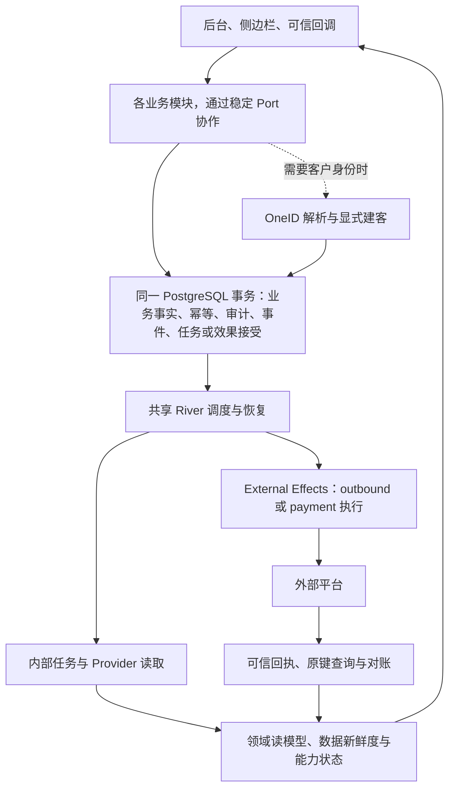

**V3 重建缺口与运行机制评估**

评估日期：2026-09-05。生产只读采样时间：北京时间 12:30–12:35。
评估对象：用户指定的 V3 生产服务器 `124.220.53.183`，以及最新 V3 主线与旧系统源码。
本文是评估与建议，未执行生产配置变更、数据修复或业务发送。

**判断**

V3 已经建立了可继续复用的 Go、PostgreSQL、OneID、事务及持久执行基础，也迁入了不少管理页面、配置和历史数据。但“旧系统经 OneID 与持久化机制重建、完整接管日常运营”的目标尚未完成。剩余工作主要是业务闭环、身份归属、实时数据接入与运行治理。

当前最明显的成本来自功能之间未接通、错误状态难以解释、上线后仍需逐项修补。此次生产采样没有显示出扩容需求；它发生在较低业务负载下，不能代表高峰容量或证明迁移后的吞吐量已经提升。

不建议用一个整体完成百分比描述现状。代码存在、页面可打开、历史数据已导入、Provider 已启用、实际效果有回执，是不同证据。

**基线与证据范围**

- 旧系统：[`AI-CRM@dd8d60d`](https://github.com/qianlan33333-png/AI-CRM/tree/dd8d60dd8ddb983aca2ec88cc9e65a9f7563f79f)，评估时的最新主线。
- V3：[`AI-CRM-v3@d6c216c`](https://github.com/qianlan33333-png/AI-CRM-v3/tree/d6c216c4d9f8fe2197bb4abcdcfa9334cedde3a1)，评估时的最新主线。
- 生产 `/opt/aicrm/current`、公网 `/healthz`、`/readyz` 均指向同一 V3 SHA。
- 工作区当前分支停在 `5fdeb02`，并有已有的未提交修改；本次使用独立源码快照检查最新主线，未把旧分支当作系统现状。
- 核对了源码装配、表结构、生产聚合数据、服务状态、进程实际开关及最近 CI。数据库查询强制只读并设置超时，未输出个人身份或凭据。
- 浏览器已打开的自动化页面提供了可见提示，但新打开的后台页面要求重新登录。因此本文不将旧页面状态视为一次完整的当前后台交互验收。
- 最新主线的 `check` 成功；`deploy` 在安装成功后执行 H5 OAuth 配置失败，明确报错为微信支付 Provider 未启用。[运行记录](https://github.com/qianlan33333-png/AI-CRM-v3/actions/runs/33918312800)

本次分类：OneID 涉及身份归属与客户引用的只读检查；持久化涉及业务事务、内部任务、Provider 读取与外部写效果的架构检查。建议继续遵循每域一个 Owner、跨域 Port、同一 UoW，不为纯配置功能强加 OneID 或外部效果。

**生产核对结果**

| 项目 | 本次观察 | 如何解释 |
|---|---|---|
| 服务器 | 4 核，内存约 3.64 GiB、可用约 2.85 GiB；1 分钟负载约 0.22 | 当前采样资源有余量 |
| 磁盘与数据库 | 磁盘约 58.94 GiB，已用 14.27 GiB；数据库约 225 MiB | 尚无证据要求分库、分片或增加中间件 |
| 服务 | API、持久任务进程均运行，本次启动以来自动重启计数为 0 | 进程健康已核实，不等于所有业务健康 |
| 客户与身份 | 23,462 个客户根，23,461 条目录投影，26,022 条身份 | OneID 与客户目录真实存在 |
| 身份类型 | 23,462 条企微 verified 身份、1,004 条 verified UnionID、1,556 条 declared 手机号 | 手机号可信等级不能升级为已验证身份 |
| 客户同步 | 9 月 3 日成功；9 月 4 日重试耗尽；9 月 5 日仍为可重试失败，错误码 provider_unavailable | 日常增量事实/目录新鲜度有现实故障；最新完整同步仍是 9 月 3 日 |
| 队列 | 采样时未见大量到期积压；今日客户同步已尝试 11 次、等待后续重试 | “队列无积压”不能掩盖业务任务长期失败 |
| 问卷 | 10 份定义、1,585 份提交；1 份 published、9 份 disabled | 定义及历史导入存在；disabled 本身不能判为故障 |
| 问卷归属 | 1,560 份 unresolved、25 份 anonymous；OAuth 实际关闭 | 当前历史提交不能普遍进入对应 OneID 客户档案；匿名提交不是错误 |
| 交易 | 783 条订单，全部为微信支付历史记录；734 条有付款人客户归属，受益人归属为 0 | 历史付款人和实际服务对象要分开处理，不能直接复制归属 |
| 实际支付 | payments、refunds 均为 0；微信支付/H5 OAuth 使用关闭默认值 | 原生支付与退款尚无生产闭环证据 |
| 商品、优惠券、权益 | 商品 31 条、优惠券规则 15 条；客户持券及服务权益均为 0 | 配置迁入与履约能力是两件事 |
| 自动化运营 | 3 个包均 paused；各 23,461 人；均无话术绑定、无发送人集合；运行记录 0 | 当前不能作为自动触达系统使用 |
| AI 助手、群运营 | AI 计划 0；群计划 13、运行 0；相应发送开关关闭 | 代码与配置已有，运行启用和旅程验收未闭合 |
| 运营闭环 | 策略、run、action、runner 均为 0 | 没有实际复盘与行动回传的生产证据 |
| 渠道 | 51 个配置：19 active、12 inactive、20 archived；24 个已验证旧二维码有地址；1 个新资产已对账且有地址 | 不应再笼统说“渠道码全部没迁”；仍需逐条解决配置和新入客闭环 |
| 渠道配置缺口 | 当前配置对应 12 条有阻断：客服缺失/不可用或分配参数不合法；入客动作记录 0 | 前者为明确数据配置缺口，后者表示未验证欢迎语、分配、打标执行 |
| 标签与素材 | 标签目录 125 条、客户标签观察 0；图片/附件/小程序记录各 0，群邀请素材 10 | 目录同步不代表客户标签管理完成；素材迁移仍不完整 |
| 雷达与侧边栏历史 | 雷达链接/事件 0，雷达导入批次 0；侧边栏历史导入批次 0 | 代码已上线，当前库未体现这些历史迁移 |
| 客户时间线 | 0 条 | 已有部分写入接口，实际历史回填与事件覆盖仍待完成 |
| HXC 看板 | 最新 2,898 人：匹配 1,227、未匹配 1,641、冲突 30；9 月 5 日 09:15 刷新成功 | 这是有真实生产运行证据的模块；30 个重复手机号冲突保持阻断是正确行为 |
| 备份与诊断 | PostgreSQL archive_mode=off；未装 pg_stat_statements；存在迁移前本机 dump | 尚未形成数据库 PITR 证据；云快照、异地备份和恢复演练本次未验证 |

上述“0 条”只说明当前数据库没有记录。只有同时结合路由、实现和运行配置，才判断为未开发、未启用或未完成迁移。

**仍需交付的能力**

| 优先级 | 能力 | 已有部分 | 剩余交付与完成条件 |
|---|---|---|---|
| P0 | 客户同步与数据新鲜度 | OneID 建客、目录、持久同步及重试 | 定位连续两天同步失败；恢复定时同步；展示失败阶段、最后成功时间和陈旧提示；证明后续周期可正常运行 |
| P0 | 可判定的发布与能力状态 | SHA、健康检查、版本化发布、主线测试 | 发布前检查已启用能力的配置；分开软件发布与业务启用；解决“安装成功但整次发布红”的状态歧义 |
| P1 | 问卷身份闭环 | 编辑、发布、历史答案、OAuth 代码 | 完成生产 OAuth 与来源验证；对有可信证据的历史提交绑定 OneID，其他保持 unresolved/anonymous；客户档案可读到对应提交 |
| P1 | 雷达生产迁移与归因 | 链接、viewer、事件、UnionID 归因代码 | 按快照迁移定义与历史；完成生产授权配置；验证链接/图片/PDF 查看、真实统计及可核验归因 |
| P1 | 公开购买、微信支付、退款 | 公共购买页面、预支付/回调/退款/对账代码；历史订单 | 补生产支付就绪条件并做受控完整旅程；验证重复回调、结果未知、原键查询和退款金额一致 |
| P1 | 周期商品与权益履约 | 周期商品定义、历史权益导入/读取、备注 | 开通、续费、到期、取消/退款后的权益调整；会员数据表及相关视图；重放不重复发放。现有历史权益接口不能替代履约 |
| P1 | 优惠券使用闭环 | 券规则、历史持券导入/读取 | 公开领券、限领、订单占用、支付核销、失败释放及退款规则；并发领券/支付不能多发或多用 |
| P1 | 自动化运营 | 人群配置/快照、固定话术、持久执行框架 | 修正活跃定义；接通阶段/标签/负责人/渠道等受众来源；配置话术和发送人；形成预览→审批/激活→发送→回执→对账 |
| P1 | AI 助手 | 计划、版本、审批、专用 intake、outbound 接口 | 外部内容/计划输入、生产 intake 与 dispatch 就绪、审批到执行实测；模型内容生成或外部 Agent 调用另有调用方契约，不能只交审批页面 |
| P1 | 群运营与素材 | 13 个群计划、延时节点及执行代码 | 素材导入/上传与 Provider 预处理；群和人员可用性；启用后验证定时/延时/回执及失败恢复 |
| P1 | 渠道入客业务 | 配置、旧码读取、新资产对账、Provider 开关已开 | 解决 12 条配置阻断；在指定测试渠道验证扫码→OneID→分配→欢迎语/渠道打标→回执；不能仅以 QR 地址验收 |
| P1 | 客户档案与 OneID 数据归属 | 基础档案、客户根、部分跨域读 Port | 补时间线、订单/问卷/权益的数据归属与新鲜度；未匹配/冲突需有原因、处理入口和安全重放 |
| P2 | 负责人迁移、通用客户标签写入 | 负责人/标签读取结构、标签目录、渠道专用打标 | 重建旧系统的批量负责人转移、预览/结果查询；补客户标签分配、去标及批量动作。渠道专用打标不是通用标签管理 |
| P2 | 运营闭环的真实运行 | 策略版本、报告快照、action/runner 协议 | 导入/创建实际策略、接入指标读 Port、执行与结果回传；明确外部 Runner 与共享任务内核的边界 |
| 按业务依赖排序 | 支付宝、消息存档、通用 MCP/外部集成 | 支付宝历史读取/身份类型；AI 助手专用接入 | 支付宝原生支付/退款 Provider；存档增量同步和读取；MCP/外部 API 授权及通用业务推送。这些是相对旧仓的缺口，不要求为菜单对齐全部立即开发 |

保留此前确定的精简侧边栏/Customer 360 边界：消息存档、通用客户标签、聊天与完整自动化摘要独立规划，不借这次评估重新塞回侧边栏。

主要代码证据：

- [旧系统实际路由注册](https://github.com/qianlan33333-png/AI-CRM/blob/dd8d60dd8ddb983aca2ec88cc9e65a9f7563f79f/aicrm_next/router_registry.py)与 [V3 运行装配](https://github.com/qianlan33333-png/AI-CRM-v3/blob/d6c216c4d9f8fe2197bb4abcdcfa9334cedde3a1/cmd/aicrm/composition.go)。
- [周期权益当前应用能力](https://github.com/qianlan33333-png/AI-CRM-v3/blob/d6c216c4d9f8fe2197bb4abcdcfa9334cedde3a1/internal/order/app/entitlement.go)和[客户持券当前应用能力](https://github.com/qianlan33333-png/AI-CRM-v3/blob/d6c216c4d9f8fe2197bb4abcdcfa9334cedde3a1/internal/coupon/app/sidebar.go)：主要是历史导入、读取和权益备注。
- [负责人迁移保留入口](https://github.com/qianlan33333-png/AI-CRM-v3/blob/d6c216c4d9f8fe2197bb4abcdcfa9334cedde3a1/internal/webshell/handler.go#L265)、[标签模块范围](https://github.com/qianlan33333-png/AI-CRM-v3/blob/d6c216c4d9f8fe2197bb4abcdcfa9334cedde3a1/internal/tag/README.md)。
- README 和迁移复核文档有早期状态描述，本文不单独据此判定现状；以上生产数据和当前装配优先。

**机制建议：保留单体，补齐共享运行能力**

建议继续使用一个 Go 模块化单体、一个 PostgreSQL，以及现有 River/External Effects 内核。先把读写职责、运行状态和失败恢复做清楚。

该图表示需要异步或外部效果的链路；普通本地配置仍可只做领域事务。

| 方案 | 获益 | 代价与结论 |
|---|---|---|
| 只继续补管理页面 | 局部功能上线快 | 身份、数据新鲜度和运行故障会继续拖慢运营，不建议单独推进 |
| 完成共享运行机制，同时按业务旅程补能力 | 复用当前投资，降低日常排障和后续开发成本 | 推荐；需要先解决若干跨域契约和发布治理问题 |
| 现在引入微服务、多套队列或分库 | 将来可能隔离大规模负载 | 当前规模无证据支持其成本；暂不采用 |

下面的决策均为建议，后续开发应按能力形成独立 PR/ADR，并继续执行仓库核心 Skill。

**决策 1：从“模块已实现”升级为“能力可运行”**

生产 readiness 目前能与客户同步失败、支付关闭、雷达空库同时成立；这是健康检查粒度不足，不代表 readiness 本身应对所有可选功能一律失败。

建立统一能力清单，记录：Owner、依赖、schema/素材版本、配置是否存在、开关、最近 worker 心跳、最近成功旅程、数据时间戳、当前阻断原因。页面与后台诊断消费同一份能力状态。计划中的功能、已安装未配置、可使用、暂停、故障应明确区分。

只有能力被选为本次正式上线范围时，它的缺失依赖才阻断发布。未启用支付不能拖垮客户目录发布，也不能显示成支付可用。现有 modules/registry.yaml 中 AI 助手仍是 contracted，而其实现已经装配，说明手填状态已发生漂移，应由声明、测试和运行证据共同校验。

配置也需区分“已保存”和“已应用”。当前部分 Config API 明确返回 runtime_applied=false。发送限速等设置只有被运行内核读取并回报生效版本，才应显示为已生效。[现有配置返回](https://github.com/qianlan33333-png/AI-CRM-v3/blob/d6c216c4d9f8fe2197bb4abcdcfa9334cedde3a1/internal/config/http/handler.go#L350)

完成条件：运营人员在一个页面能看到某能力为何不可用、影响哪条业务链、上次何时成功，以及对应修复入口。

**决策 2：统一调度与恢复，缩小每次任务的工作量**

共享 River 与同事务入队已经存在，应保留。当前并非缺少持久化，而是部分调用仍以长任务或独立领取协议承载。客户同步 worker 可运行 30 分钟，受众成员事件派发可运行 45 分钟；失败后虽有幂等保护，仍可能重复大量检查。

将较重工作拆成有上限的批次，每批提交游标/检查点，并在同一事务安排下一批。发布快照只切换已完整准备的版本。保持业务幂等键与效果键稳定，不能通过更换键“修复”未知结果。

企微回调目前由 systemd 每 30 秒启动一次完整应用，再处理 Inbox。每次启动都记录多项诊断状态；生产已累计 4,349 条 composition 观察。建议把 Inbox 的业务收据保留，执行调度接入现有持久任务进程，按角色装配所需模块；诊断仅在状态变化或有界心跳时记录。外部 systemd timer 可继续承担必要的周期唤醒与灾备触发。

运营闭环的外部 Runner 领取/心跳协议需单独定性：保留业务回传契约，把可恢复调度放回共享内核，避免新增第三套重试机制。

这不要求购买新的任务平台。River 的同事务入队能让任务与业务记录一同提交。[River 官方说明](https://riverqueue.com/docs/transactional-enqueueing)

完成条件：中途重启只续做未完成批次；空闲时没有反复全量初始化；任务失败能指出最后完成位置。

**决策 3：区分 Provider 读取与写入，并按业务重要性分配执行资源**

当前不同内部任务已有多个队列，但各队列并发固定为 4，External Effects 的多类外部写仍进入同一个 outbound 队列。大批营销任务上线后，可能与支付、欢迎语等动作争用执行资源；本次低负载采样尚未出现这种拥堵。

在现有内核内增加可配置的队列预算：支付/退款、及时欢迎语、批量触达、后台刷新分配各自并发与配额。按 Provider、企业、发送人等必要维度限流，并把接收批次上限、超时和重试预算纳入统一配置。拆队列只改变调度，不再造新的效果表或 Worker 框架。[当前队列实现](https://github.com/qianlan33333-png/AI-CRM-v3/blob/d6c216c4d9f8fe2197bb4abcdcfa9334cedde3a1/internal/platform/jobqueue/river.go#L99)

标签目录读取目前也通过 External Effects，读取在网络请求后失败会进入 outcome_unknown。对纯读取，这会不必要地套用写入对账逻辑。应将其归为“Provider read + 持久任务 + 读取收据”，仅对确有写效果的操作保留严格未知结果控制。[当前读取分类](https://github.com/qianlan33333-png/AI-CRM-v3/blob/d6c216c4d9f8fe2197bb4abcdcfa9334cedde3a1/internal/outbound/tag_catalog_provider.go#L55)

写入继续保留 accepted、queued、attempted、executed、outcome_unknown、reconciled 的区别。已证明未执行的临时失败可自动按原逻辑键重试；结果未知只能凭原键查询、可信回调或明确证据对账。付款/退款与企微发送分别由各自 Provider Owner 执行。

River 原生支持多队列。迁移队列时要保留旧队列消费者直到存量任务处理完，不能直接改名丢下旧任务。[多队列与迁移说明](https://riverqueue.com/docs/multiple-queues)

**决策 4：建立事件驱动的客户读模型与指标语义**

当前 ActiveWithin 使用 customer_directory_projection.updated_at。该字段表示目录数据更新，不能直接解释为客户活跃。生产三个不同时间窗口相同人数，是此语义问题的直接表现。[查询实现](https://github.com/qianlan33333-png/AI-CRM-v3/blob/d6c216c4d9f8fe2197bb4abcdcfa9334cedde3a1/internal/customer/store/postgres.go#L70)

应分别定义：同步时间、客户实际互动时间、雷达浏览时间、问卷提交时间、支付时间、触达时间。对“活跃”采用明确的事件集合与时间窗口，页面能够解释入选原因；某种事件尚无来源时，不用同步时间代替。

按领域事件维护客户时间线、客户行为摘要、标签/负责人/渠道及交易统计投影。跨域写仍通过 Owner Port 或订阅事件完成，不用跨域 SQL 拼接一张万能大表。高频列表读本地投影；强一致性决策通过领域 Port 读事实。

当前受众 DSL 有阶段、标签、负责人、渠道等模板，但 composition 实际装配的 CustomerSource 只处理 active_contacts。需接入对应领域的稳定数据源，而非让运营配置任意生产 SQL。[受众装配](https://github.com/qianlan33333-png/AI-CRM-v3/blob/d6c216c4d9f8fe2197bb4abcdcfa9334cedde3a1/cmd/aicrm/composition.go#L355)

复用 PostgreSQL 增加统一订阅登记、每个消费者的处理收据/游标、版本与受控重放；不要让一个事件的单一 processed 标志承担多个消费者进度。既有少量未 processed 的事件不能仅为清监控而标记完成，应先确认它们是否有约定消费者。

当前已实现 OneID 批量解析与快照批量写入，继续使用；对 HXC 这类独立业务源先保留有边界的只读同步，在实际负载增长后按源更新时间/事件增量构建投影。不能把旧 CRM 重新变成正常数据源。

完成条件：目录刷新不改变活跃用户集合；同一事件重放不会重复时间线、统计或自动化触发；所有读模型都能报告数据截至时间。

**决策 5：把 OneID 用于业务归属和安全重放**

OneID 的唯一键和验证边界已建立，但业务数据覆盖仍不完整：问卷 1,560 份 unresolved、历史订单没有受益人归属、HXC 有未匹配与冲突。这些不应通过猜测统一。

为每个外部来源保留稳定来源键、可信证据、解析状态和规则版本。身份补全或人工确认后，发出版本化事件，让相关领域有选择地重算归属和读模型。历史事实、付款人、受益人、外部联系人与负责人保持独立含义。

统一冲突处理入口提供来源证据、阻断原因、可执行的修正及审计。现有 HXC 30 个重复手机号冲突应继续隔离。不能把“匹配率达到 100%”当作验收目标，也不能用前端手机号或未经验证的 UnionID 建客/合并。

已冻结受众快照用于业务审批；真正发送前仍需复核当前客户根、发送权限和禁止触达条件。身份变更后，不把旧审批无条件套到新的归属。

完成条件：一条来源事实为何归属此客户可解释；重复导入与重复处理结果一致；无法验证的归属始终保留为未解析或冲突。

**决策 6：把发布、初始化和数据迁移分开**

当前 CI 在安装后继续配置 HXC、执行 HXC rollout、配置支付 OAuth。任何最后一步失败，整体发布显示失败，但新二进制已实际生效。发布脚本还承担一次性初始化与多种导入工具打包，增加每次普通发布的耦合。[当前工作流](https://github.com/qianlan33333-png/AI-CRM-v3/blob/d6c216c4d9f8fe2197bb4abcdcfa9334cedde3a1/.github/workflows/ci.yml#L252)

建议分成明确流程：

1. 软件发布：同一已验证制品，schema 兼容检查、静态资源完整性、切换、基础及本次能力验收。
2. 能力配置/启用：在启用前检查凭据存在性、授权范围、依赖与可用性，记录实际生效版本。
3. 一次性迁移：固定快照、dry-run、apply、reconcile、隔离记录和回执；普通发布不反复执行历史导入。
4. 数据变更采用先扩展、后切换、再清理；回滚二进制时继续兼容已迁移 schema。

本地已经存在原子发布目录与文件摘要，应继续保留。迁移收据归档，运行时也不依赖旧库。切流验收按入口逐项确认：回调 URL、公开链接、定时任务与写 Owner，防止旧系统和 V3 同时执行同一业务。

完成条件：一次普通发布可以清楚说明哪个版本已生效、哪些能力被启用；任何迁移失败不被解释成“重复跑全部导入”。

**决策 7：用少量业务指标替代大批无差别诊断记录**

先建设足以解释当前故障的指标：

- 客户目录、受众、HXC 投影的最后成功时间与新鲜度。
- 队列最长等待、运行时间、重试耗尽、未确定外部结果及其滞留时间。
- 已接受业务数、实际 Provider 成功数、可核对的送达/履约数。
- 数据库连接等待、慢查询、锁等待、磁盘增长；API 延迟和错误按能力划分。

告警针对需要处理的变化，区分 Provider 暂时不可用、权限错误、数据配置缺失、重试耗尽。不要因功能有意关闭而持续报警，也不要因基础 health 正常而忽略昨日同步失败。

生产尚无 pg_stat_statements，可在后续维护中受控启用以建立慢查询基线。采样和保留策略不能收集原始身份、敏感 payload 或高基数个人标签。[PostgreSQL 查询统计说明](https://www.postgresql.org/docs/16/pgstatstatements.html)

目前 HXC 已保留有限份完整行快照并保留版本收据，无需重写这部分；把类似保留政策扩展到受众快照、过期任务和重复诊断，保留必要的业务审计与效果幂等证据。

**决策 8：建立能验证的恢复能力，并固化模块扩展契约**

本机迁移前 dump 是有价值的恢复材料，但不是连续时间点恢复。PostgreSQL 当前 archive_mode=off。按可接受数据损失与停机时间，建立异机备份、必要的 WAL 归档、备份失败告警，并定期在隔离环境恢复验证。先核对云侧是否已有备份，避免重复购买。[PostgreSQL PITR 说明](https://www.postgresql.org/docs/16/continuous-archiving.html)

为后续每个新能力提供统一接入规范：

- 明确表 Owner、OneID 分类、同步事务/内部任务/Provider read/Provider write 分类。
- 声明稳定 Port、版本化事件、幂等范围、数据权限及运行依赖。
- 必须需要原子性的业务事实、收据、审计、Outbox、任务/效果接受加入同一 PostgreSQL UoW。当前 TransactionalAccepter 已存在，应复用并做回滚验证。
- 自动检查跨域具体实现 import、表所有权、Provider writer 所有权、生成契约漂移及迁移编号/兼容性；现有 import gate 是基础，还不是完整 SQL Owner 检查。
- 一个 PR 交付一个可观察能力，按真实 PostgreSQL 与用户旅程证明，包含适用的重放、重启和并发失败路径。
- 冻结 donor 前端继续保持字节边界；新功能通过 V3 Host/Adapter 接入。临时 Adapter 登记 Owner、替代路径和删除条件，未来按明确批准的界面迁移逐步替换。

优先从同一代码库中按角色调整 API/worker 的资源和装配；只有持续监测证明单机或单库是瓶颈，再决定增加 worker 进程、调整主机或隔离数据库。当前没有充分证据支持引入更多分布式组件。

**建议实施顺序**

| 阶段 | 交付单位 | 退出条件 |
|---|---|---|
| 第一阶段：恢复可信运行 | 分别修复客户同步、发布状态、能力就绪提示；核实备份与恢复路径 | 同步恢复且后续周期成功；发布结果与实际版本一致；用户知道哪些能力可用 |
| 第二阶段：完成身份与交易闭环 | 问卷/Radar 可信归因；公开购买→支付→回调→权益；优惠券单独交付 | 一个真实测试客户从进入到购买、履约、档案均可追踪；重放与退款行为正确 |
| 第三阶段：完成运营闭环 | 活跃与受众来源；话术/素材；AI 审批；渠道/群/私聊分别验收 | 一个小范围运营批次能准确圈人、审核、触达并核对结果，失败可恢复 |
| 第四阶段：迁移尾项与持续降本 | 负责人迁移、通用标签、按需存档/MCP；任务批次化、指标、配置生效与迁移退场 | 旧系统对应入口和写入者逐项退役；新功能无需理解旧仓历史就能开发 |

这里的“阶段”不要求做成大 PR；例如优惠券、周期权益、支付与渠道都应独立交付。第一阶段中的共享基础修正与第二阶段的明确业务开发可分开推进。

**如何衡量效率与成本改善**

先记录基线，再确定最终目标，不能从 Go 或持久化本身推导“性能提高几倍”。建议首批验收指标如下；数值是目标建议，不是已经测得的结果：

| 指标 | 建议目标或验收方式 |
|---|---|
| 常用列表/详情 | 在约定数据量下 P95 小于 500ms，明确不含 Provider 网络时间 |
| 交互后的普通内部任务 | 常规负载下 95% 在 30 秒内开始；周期任务以各自新鲜度约定验收 |
| 客户同步 | 连续至少 3 个约定周期成功；失败时明确新鲜度与影响，不能默默保留旧数据 |
| 新功能交付 | 需要改动的共享核心文件数、开发到生产验收时间逐步下降 |
| 运维成本 | 每周人工补数/重试次数、排障耗时、重复告警量，先测一周再定下降目标 |
| 数据恢复 | 明确 RPO/RTO，再用隔离恢复演练验证；仅有备份文件不算达标 |
| 外部效果正确性 | 重放不重复写；所有 unknown 都有责任人/查询路径和证据；不把人工填 completed 当作成功 |

本次已足以确定开发优先级和机制方向。完整性能结论仍需覆盖真实高峰、持续负载与已启用业务；旧生产所有入口是否已经切走、云侧备份、全部后台交互和真实发送/支付旅程不在本次已验证范围内。
