# 一级分销业务契约、接口冻结与文件所有权

本契约配套 [PRD](../prd/2026-09-14-first-level-distribution.md)。它将业务规则转成可测的输入、输出、事务和失败闭环。

## A. 领域边界与接口分工

| 接口方 | 责任和稳定输入/输出 | 禁止行为 | 首要负责人 |
| --- | --- | --- | --- |
| `identity/port` → Distribution | 用 canonical Customer 解析可信微信登录及付款/受益人身份范围；冲突/未知可表达 | Distribution 不查 identities，不用 OpenID/UnionID 自行匹配，不隐式建客 | 既有 Identity Owner |
| `product/port` ↔ Distribution | `SaveWithDistributionPolicy` 使用共享 UoW 保存商品和 CAS 政策；读取可售商品摘要 | Product 不读写 policy 表；Distribution 不写 products | Product integration + Distribution |
| `order/port` ↔ Distribution | 对同商品项提供可信的已支付购买证据；checkout command 可携带仅服务器验证的 attribution preparation，Order 与 attribution 在同一 UoW 固化 | 不以 `Owned` 代替；不先发布 created 事件再异步补归因；Distribution 不读 orders/order_items | Distribution + Order extension |
| `payment/port` ↔ Distribution | 退款暴露/累计成功退款、收款准备、原交易分账可用性、资金协调、immutable split intent、结果查询和释放冻结；支付/退款持久事件 | Distribution 不调用 SDK/Provider，不查 payments，不换幂等键；Payment 不写佣金账本 | Payment Owner + Distribution |
| `jobqueue` → Distribution | 持久的 due check job，固定 job key | 不起 ticker/领域 worker/自建重试表 | Distribution |

### 文件所有权

```text
Distribution：internal/distribution/{domain,app,port,store,http}、distribution migration、Distribution tests、docs 本文。
Product integration：internal/product/{app,port,store,http} 和对应迁移；不得改 Distribution Store。
Order extension：internal/order/{app,port,store,http} 和对应迁移；不得改 Distribution Store。
Payment settlement：internal/payment/{domain,app,port,store,provider,http}、External Effects payment contract/迁移；不得改 Distribution Store。
Composition：cmd/aicrm/*distribution*，只装配 Port 和路由，不含规则/SQL。
UI：internal/webshell、web/src；只调用冻结 HTTP 合同，不含金额/资格权威判断。
```

## B. 关键值对象与拒绝规则

```text
Policy: enabled bool; commission_rate_basis_points int [0,3000]; wait_days int [0,29]; version > 0.
PromotionCredential: opaque random token only; database stores SHA-256 digest, distributor_id, product_id, product_type, active state.
Qualification: eligible | ineligible | suspended | identity_conflict | evidence_unavailable; successful evidence has one concrete order/item/payment reference.
Commission: all money int64 minor CNY; rate basis points; non-negative; initial, current_payable and actual_paid separately immutable/audited.
Settlement state: pending | held | settling | paid | cancelled | exception.
```

Every malformed policy, token, amount, product type, foreign Customer target, missing trusted session, version mismatch, unavailable read, unknown identity or unknown refund fails closed. No HTTP request can send a commission amount, payout receiver, payer/beneficiary Customer ID, policy snapshot, qualification evidence, Provider result or “verified” identity assertion.

## C. Required atomic commands

| Command | Same PostgreSQL UoW must include | Idempotency/CAS |
| --- | --- | --- |
| Save product + policy | Product row/snapshot, Distribution policy version, receipts/audit/outbox | Product version + policy version; conflict returns no partial save |
| Register distributor | canonical Customer relation, public sequence/number, agreement version, receipt/audit | unique canonical Customer; repeat returns original distributor |
| Create checkout with attribution | Order and item snapshots, trusted Payment session consumption, Distribution attribution/frozen qualification/policy/promotion credential reference, receipt/audit/outbox | checkout idempotency; existing pending order keeps its original attribution |
| Consume confirmed payment | initial commission/zero-sale record, source-event receipt, audit/outbox, due job request | unique `(order_id,item_id,distributor_id)` initial fact plus source event receipt |
| Start settlement | qualification/refund/read snapshots, commission version transition, amount reserve, immutable Payment split intent, effect acceptance binding, audit/outbox | stable logical settlement key; all or none |
| Refund/split coordination | Payment owns conflict lock/reserve; Distribution only receives factual result in a coordinated command | same logical refund/split cannot race to duplicate effect |

Provider network calls never occur within those UoWs. If a proposed Payment adapter cannot join the UoW for start settlement, that is an architecture defect to fix before enabling live split.

## D. Event and query contracts

No redundant `order.created` event is introduced. Distribution consumes existing durable paid/refund facts and their stable read Ports. Payloads contain only opaque IDs, versions, amounts, currency, occurred time and digests; raw OpenID, phone, token, cookie, Provider body or secret is excluded.

```text
Order purchase evidence query:
  input: distributor canonical Customer, product id, product type
  output for each candidate: order/item ID, trusted payer Customer, trusted beneficiary Customer,
  item actual-paid minor, paid-confirmed time, native/history origin and evidence completeness.

Payment refund projection query:
  input: payment/order refs
  output: payment confirmed state; successful refund total; requested/processing/unknown totals;
  original transaction split capability/deadline/available funds; receiver readiness; read freshness/result state.

Payment settlement command:
  input: Distribution settlement ID, immutable original transaction ref, receiver reference held by Payment,
  positive minor amount, stable logical idempotency key and source/payload/policy digests.
  output: accepted immutable Payment instruction ref, state and exact original query identity.

Payment settlement result query:
  output: accepted/attempted/outcome_unknown/reconciled plus receiver-specific success only when Provider confirms success.
```

The exact exported Go names are set jointly with Payment before its code lands; these shapes are frozen so neither side invents incompatible or table-coupled APIs.

## E. State transitions

```mermaid
stateDiagram-v2
  [*] --> pending: paid event, eligibility proof, initial commission
  pending --> held: refund exposure / qualification uncertain / receiver unavailable
  held --> pending: proof and payment conditions restored
  pending --> settling: due checks pass + Payment instruction atomically accepted
  settling --> paid: receiver-specific Provider success confirmed
  settling --> exception: unknown or non-normal Provider result
  exception --> settling: original-reference query confirms still processing
  exception --> paid: original-reference query confirms receiver success
  exception --> cancelled: original-reference query confirms no payment and cancellation is authorized
  pending --> cancelled: zero payable, success refund, or qualification revoked before submission
  held --> cancelled: success refund/revocation with no replacement proof
  paid --> exception: later buyer or qualification refund; retain paid fact
  exception --> [*]: audited human resolution when Provider recovery cannot decide
```



`pending` is not an authorization to pay. `held` includes exact machine reason. `exception` carries `unpaid_due_minor` and `already_paid_minor` separately. A zero commission sale has no settlement state and cannot enqueue a split.

## F. Acceptance examples

1. An enabled distributor bought matching product P as both trusted payer and beneficiary, then a different buyer uses their P credential to pay 1,001 cents for P at policy 333 bp: that downstream payment confirmation creates one 33-cent commission and a due job. Replaying the downstream paid event changes neither total nor job identity; the distributor's qualification purchase never creates self commission.
2. P has 100 cents cumulative successful refunds after a 1,001-cent downstream purchase at 333 bp: current payable is `floor((1001-100)*333/10000)=30`, recorded as an adjustment. A requested/unknown refund holds rather than reduces it.
3. A customer who paid P for another beneficiary, or was beneficiary for another payer, cannot generate a credential. A second complete self purchase can be evidence even if the first is refund-pending.
4. A valid A credential remains A after forwarding. A B credential yields B. An order created from A remains A when B link is opened later. A cashier cannot pass their own Customer ID to replace the server-resolved payer/beneficiary.
5. A policy update after checkout cannot alter frozen 333 bp/wait days. A copied product has disabled policy and no inherited eligibility.
6. Qualification purchase refund before split holds/cancels only A/P unpaid records. A different product or a different distributor is unchanged. Rebuy restores only future permission.
7. Concurrent buyer refund and settlement cannot yield a second split. The Provider availability/deadline read occurs outside the lock as a snapshot; Payment rechecks and atomically reserves the authoritative amount inside its transaction. Unknown split result retains the original Payment instruction and is recoverable by original-reference query/reconciliation, never a new instruction.
8. A Provider HTTP 200 without receiver success does not become `paid`; a completed refund/reconciliation does not by itself become a commission payout result.
9. Own dashboard never reads another distributor. Admin action requires authorized actor and append-only audit; “manual paid” cannot claim WeChat success.

## G. Production gate

Before enabling live split: all contract and integration tests pass on the exact merged SHA; a Linux package binds that SHA; migrations and rollback plan are rehearsed; Payment provider capability/receiver readiness is verified against the merchant; a small controlled original payment demonstrates freeze, split, receiver-confirmed success, query/replay and reconciliation. Missing merchant permission, original transaction compatibility or test conditions blocks the funds-closure claim while leaving the exact blocker recorded.
