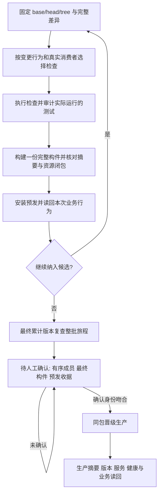

# CRM v4 国内发布工作台

累计预发的设计与边界见 [PRD](../prd/2026-09-29-cumulative-staging-batch-promotion.md)。同一预发环境依次运行 P+A、P+A+B；每项安装和相关验证仍串行，生产保持 P。封批后人工确认最终累计版本，生产只安装这份最终构件一次。

国内裸仓库 `main` 是源码权威。开发任务交付准确 `base/head/tree` 和行为说明；唯一发布工作台使用现有候选队列、串行锁、attempt 与收据。GitHub 人工择机归档，不参与日常晋级。预备机维持 2 核 2GB；普通发布不备份数据库，只有生产迁移前备份。

## 一条发布路径



按准确差异、Go base/head 消费图、变更测试及页面入口选择检查；`cmd/aicrm/*`、`internal/platform/*` 不再凭目录标签触发全仓。具名 Go 测试必须在 JSON 事件里出现 `pass`，`skip` 和 `[no tests to run]` 都不是通过。无法确定消费者时先调查，再扩大到相关包或页面；真正全局输入、迁移或缺失依赖图才走相应的更大范围。选检规则由候选的可信基线执行，候选不能为自己缩减清单。

Web 运行代码变化构建整个 Web 一次，避免遗漏共享 chunk 和动态 import。受影响 Go 程序按依赖图重建；迁移和静态载荷单独汇总。一次 attempt 拥有自己的工作目录，非空旧产物拒绝重用。最终只写一次完整文件清单，核对基包与已安装摘要的绑定和页面资源闭包。构建器合同测试在构建工具变化时执行，不夹进每次页面打包。

## 累计预发与人工晋级

`release` 提交并检查队首候选；运行时代码安装到预发后停在 `stage_validation_pending`。发布工作台完成本次业务旅程，形成与安装收据绑定的受保护预发证据；`poll` 将它纳入开放批次，允许下一项从累计预发 HEAD 出发。源码或工具候选也纳入批次，不直接更新生产源码游标。下一项先由原开发任务更新自己的分支与验证，工作台不代为解决冲突。

决定收批后，`batch-seal` 要求最终累计版本覆盖各成员仍适用的业务旅程，冻结有序成员和生产基线。向人展示准确 `base/head/tree`、最终构件清单摘要、源码 bundle 摘要、预发安装与业务旅程收据、实际检查和未验证项。人工明确确认这整个批次的 `approval_digest` 后，发布工作台才调用 `promote`。控制器重新核对成员链、候选 ref、构件字节、预发正在运行的版本与健康、生产基线；任一身份变化，旧确认失效。等待期间不长期占用执行锁。

封批后如又有需求要加入且生产尚未晋级，工作台先核对当前封批摘要、成员链、预发构件与收据、生产基线，再用 `batch-reopen --approval-digest <旧摘要>` 使旧审批失效并继续使用原批次。若重开本身更新控制器，附 `--sha/--ref` 指向已安装且通过相关 Linux 检查的准确源码候选；它原子地成为源码成员，业务应用不重装。该命令不写生产，保留旧封批收据。新候选由原开发任务沿当前预发 HEAD 更新；追加后重新封批、展示全新摘要并等待人工确认。

若开放批次队首在检查准备阶段被标记为“未评价”，而修复该环境需更新控制器，使用 `batch-tool-repair --failed-candidate <队首SHA> --sha <工具SHA> --ref <工具ref>`。控制器验证工具修复的 Linux 检查和完整 bundle 后将其记为批次源码成员，保留原业务队首的失败收据与顺序；原开发任务再从新的累计 HEAD 重提该候选。此入口不接受已被代码测试判失败的候选，也不安装业务应用或生产。

```sh
sudo /usr/local/libexec/aicrm/domestic_main_release.py release --config /etc/aicrm/domestic-main-release.json --ref refs/heads/codex/<work-item> --head <SHA> --base <SHA>
sudo /usr/local/libexec/aicrm/domestic_main_release.py poll --config /etc/aicrm/domestic-main-release.json
sudo /usr/local/libexec/aicrm/domestic_main_release.py batch-seal --config /etc/aicrm/domestic-main-release.json
# 仅在封批后新增候选且生产未晋级时，先使旧摘要失效：
sudo /usr/local/libexec/aicrm/domestic_main_release.py batch-reopen --config /etc/aicrm/domestic-main-release.json --approval-digest <旧64位摘要> --ref refs/heads/codex/<reopen-controller> --sha <准确控制器SHA>
# 仅在用户确认上一步完整身份之后：
sudo /usr/local/libexec/aicrm/domestic_main_release.py promote --config /etc/aicrm/domestic-main-release.json --approval-digest <64位摘要>
```

晋级只传预发已安装的同一包，生产不编译。生产安装结果不明时只读对账同一 attempt、运行版本、收据与源码游标，禁止猜测成功或盲目重装。真实支付、扫码和 Provider 效果单独列出业务验收状态，不以健康检查冒称完成。

## 工作台交接和当前基线

工作台身份由 `/Users/qianlan/Downloads/新CRM/release-control/workstation.json` 唯一指定。交接前核对旧任务无执行中的发布、timer 状态和国内队列；旧工作台停止发起新发布后才切换该文件。timer 的启停只以主机实测为准，不能从文档推断。

2026-09-29 交接审查时，旧工作台已将裂变头像候选 `c6f2f34cfb4570f9c7b416f145ae55a43361f1f0` 安装到预发和生产，并使国内 `main` 对齐；构建时使用了临时修补，本方案将其纳入源码修复。旧结果不证明真实微信登录头像视觉验收。历史初始化与恢复细节见 `domestic-main-bootstrap.md`。
