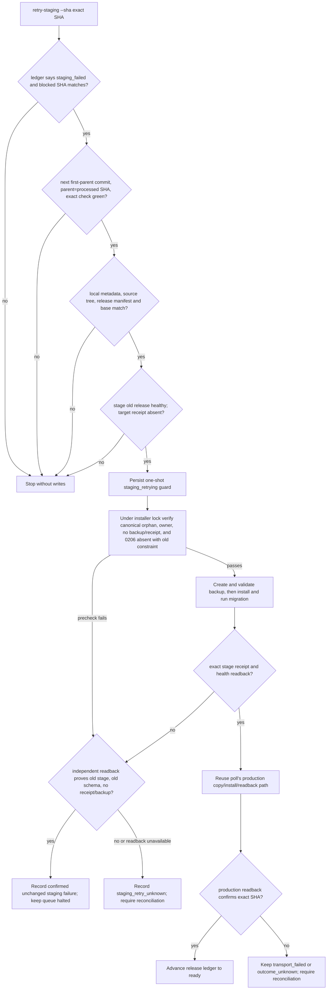
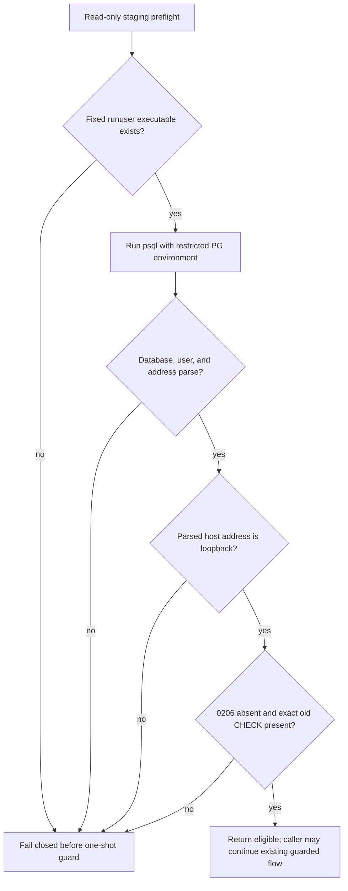

# Staging Migration Backup Retry PRD

## Business judgment

The failed `pg_dump` for `5538d615a9abe2e25be799936866a7330b1d3af8` happened before the release switched `current` or ran migration 0206. The release controller correctly halted the queue, but it has no safe way to reuse the verified orphan after the backup invocation is repaired. This change restores only that blocked release through an explicit, exact-SHA operation; it is not a general migration retry mechanism.

## Business decision flow

## Product requirements

- Parse PostgreSQL connection URIs into a strict, explicit `PG*` environment. Never pass the URI or password as a process argument or log field. Support only the observed `sslmode` query parameter and reject unknown, duplicate, malformed, or unsupported options.
- Keep ordinary installs and production orphan recovery unchanged. Migration orphan reuse is available only through the explicit staging retry path on a host with a trusted staging identity.
- Restrict this one-time recovery to SHA `5538d615a9abe2e25be799936866a7330b1d3af8` and migration `0206_order_native_alipay_checkout.sql`; reject future migration releases.
- Require a full SHA and current ledger status `staging_failed`; bind the attempt to the exact blocked SHA, `processed_sha`, first-parent queue head, parent SHA, and latest exact `check` success.
- Before the special retry, require DSN host `127.0.0.1`, user `aicrm_test`, and database `aicrm_test_baseline_5d15`; on the same read-only connection verify `current_database()`, `current_user`, and loopback `inet_server_addr()`.
- Verify local build metadata and the complete release manifest; verify stage current/readiness/processes/manifest remain on the previous deployed SHA and the target receipt is absent.
- Under the host install lock, verify the root-owned canonical orphan, exact metadata/manifest, no target receipt or backup, migration 0206 absent from `platform_schema_migrations`, and the old validated `orders_origin_effect_shape` CHECK still present. Stop on any unknown state.
- Persist a one-shot attempt guard before invoking the stage helper. Only exact stage health and receipt readback can continue into the existing production promotion path. Do not mark the ledger ready or advance cursors before exact production readback.
- After helper failure, mark a confirmed unchanged staging failure only if a separate read-only inspection proves the old stage is healthy, 0206 remains unapplied, the old CHECK remains, and target receipt/backup remain absent. Any other result is `staging_retry_unknown` and requires human read-only reconciliation.

## Data ownership and external effects

- **OneID:** not involved; no customer identity reads or writes.
- **Persistence:** release ledger JSON and the existing PostgreSQL migration ledger/schema. The retry action writes only its own atomic attempt/state record before stage installation; migration 0206 is applied only by the existing migration service after a verified backup.
- **External effects:** no payment/provider call, outbound message, or customer job. The only external side effect is the already-authorized release installation. Production promotion remains gated on successful stage verification and is not considered business acceptance.
- **Owner:** the domestic release controller owns the operational cursor and attempt guard; `internal/order` owns the `orders` schema and migration.

## Acceptance and checks

- Unit-test URI decoding (including percent-encoded credentials), default/explicit port, allowed `sslmode`, duplicate/unknown/malformed options, and verify that argv and errors contain no synthetic password.
- Test the exact permitted retry and rejection of wrong status/SHA, non-head commit, wrong parent, failed exact check, stale/mismatched artifact, unhealthy or changed stage base, existing receipt/backup, noncanonical/non-root-owned orphan, already-applied 0206, or changed/missing old CHECK.
- Fault-inject stage helper failure with unchanged readback, ambiguous readback, stage success followed by production transport failure, and production result unknown. Assert no production request before verified staging, no cursor advancement before production readback, and no second attempt.
- Run focused release-controller tests, fast development preflight, and required full CI for deployment/migration-related changes. Host installation and real payment acceptance are separate release gates.

## References

- PostgreSQL documents that `pg_dump` connects to a database and uses libpq connection parameters; use `--dbname` or the corresponding `PG*` environment rather than assigning a connection URI to `PGDATABASE`: [pg_dump](https://www.postgresql.org/docs/17/app-pgdump.html), [libpq environment variables](https://www.postgresql.org/docs/17/libpq-envars.html), [connection URI syntax](https://www.postgresql.org/docs/17/libpq-connect.html). libpq's default TLS root certificate is under the effective user's home, so the backup environment preserves the `aicrm` home path as well: [libpq SSL support](https://www.postgresql.org/docs/16/libpq-ssl.html).
- A GitHub Action example invokes `pg_dump` with `--dbname` and the supplied database URL: [tj-actions/pg-dump](https://github.com/tj-actions/pg-dump/blob/main/entrypoint.sh).

## Corrective PRD addendum — staging preflight executable and address format (2026-09-24)

### Business judgment and decision flow

The approved retry is still a read-only inspection until every identity and schema gate passes. Two representation/runtime assumptions made the inspector stop before writing its one-shot guard: the restricted child `PATH` omitted the host's `/usr/sbin/runuser`, and PostgreSQL returned the IPv4 loopback as `127.0.0.1/32` while Python `ip_address()` accepts a bare address. Stage and production host checks confirmed the fixed `runuser` path; the staging DB returned the CIDR-form address. No backup, migration, service switch, ledger write, or production action occurred in the failed preflight.

### Bounded product requirements

- Use the verified absolute `/usr/sbin/runuser` for both backup `pg_dump` and read-only baseline `psql`; keep the subprocess `PATH` restricted to `/usr/bin:/bin` for the nested database clients.
- Parse `inet_server_addr()` with `ipaddress.ip_interface(value).ip.is_loopback`, accepting PostgreSQL's host-with-mask form (including `127.0.0.1/32` and `::1/128`) while rejecting blank, malformed, and non-loopback addresses. Preserve the exact synthetic database/user allowlist and all current fail-closed schema checks.
- Add focused tests for both subprocess command paths and their bounded environments, IPv4/IPv6 loopback, blank/malformed values, and non-loopback values. The preflight must remain read-only and fail before the one-shot guard on any mismatch.
- No OneID: this helper addresses a database/runtime boundary and does not read or assign customer identities. Persistence: none in this preflight fix; it does not write the release ledger or PostgreSQL, and its existing one-shot guard remains downstream of successful inspection. External Effects: none; it issues no Provider call or customer-facing action. Data owner remains the release controller; `internal/order` continues to own migration 0206. The release operation's rollback and acceptance gates are unchanged.

### Repository reuse and references

- Repository scan found exactly two `runuser` invocations paired with the restricted `PATH` in `deploy/domestic-promote.py`: the backup and the baseline inspector. Both will use one fixed executable constant; the other Python release helper already invokes `/usr/bin/psql`. No shared resolver is needed.
- Python recommends a fully qualified subprocess executable path and documents that `env` replaces the child environment and can affect POSIX `PATH` lookup: [subprocess](https://docs.python.org/3/library/subprocess.html#popen-constructor).
- Python `IPv4Interface.ip` is the address without network information; the equivalent IPv6 interface API follows the same model: [ipaddress interface objects](https://docs.python.org/3/library/ipaddress.html#interface-objects). PostgreSQL `inet` carries an optional netmask and `host(inet)` extracts the host text: [PostgreSQL 16 network address types](https://www.postgresql.org/docs/16/datatype-net-types.html), [network address functions](https://www.postgresql.org/docs/16/functions-net.html).
- `runuser` is the util-linux command for running a command as a substitute user; upstream documents its environment behavior in the [runuser manual](https://man7.org/linux/man-pages/man1/runuser.1.html) and maintains the [util-linux implementation](https://github.com/util-linux/util-linux/blob/master/login-utils/su-common.c). The absolute host path is based on the authorized stage/production read-only verification, not inferred from the documentation.

### Verification and rollout boundary

Run the focused domestic-release tests, Python compile check, and `python3 scripts/dev_preflight.py fast`; current-head GitHub CI remains the deployment-tool merge gate. This PR only repairs the previously blocked read-only inspection. It does not execute `retry-staging`, install a release, or claim technical or business acceptance. If inspection still fails, it must stop before the one-shot guard; revert this code change if the executable or address contract differs from the confirmed hosts.
