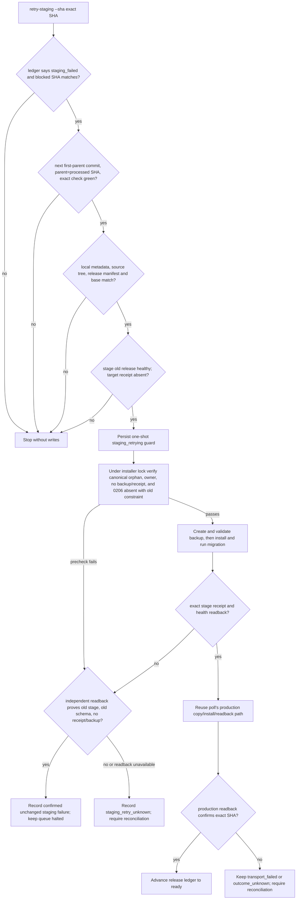

# Staging Migration Backup Retry PRD

## Business judgment

The failed `pg_dump` for `5538d615a9abe2e25be799936866a7330b1d3af8` happened before the release switched `current` or ran migration 0206. The release controller correctly halted the queue, but it has no safe way to reuse the verified orphan after the backup invocation is repaired. This change restores only that blocked release through an explicit, exact-SHA operation; it is not a general migration retry mechanism.

## Business decision flow

## Product requirements

- Parse PostgreSQL connection URIs into a strict, explicit `PG*` environment. Never pass the URI or password as a process argument or log field. Support only the observed `sslmode` query parameter and reject unknown, duplicate, malformed, or unsupported options.
- Keep ordinary installs and production orphan recovery unchanged. Migration orphan reuse is available only through the explicit staging retry path on a host with a trusted staging identity.
- Restrict this one-time recovery to SHA `5538d615a9abe2e25be799936866a7330b1d3af8` and migration `0206_order_native_alipay_checkout.sql`; reject future migration releases.
- Require a full SHA and current ledger status `staging_failed`; bind the attempt to the exact blocked SHA, `processed_sha`, first-parent queue head, parent SHA, and latest exact `check` success.
- Verify local build metadata and the complete release manifest; verify stage current/readiness/processes/manifest remain on the previous deployed SHA and the target receipt is absent.
- Under the host install lock, verify the root-owned canonical orphan, exact metadata/manifest, no target receipt or backup, migration 0206 absent from `platform_schema_migrations`, and the old validated `orders_origin_effect_shape` CHECK still present. Stop on any unknown state.
- Persist a one-shot attempt guard before invoking the stage helper. Only exact stage health and receipt readback can continue into the existing production promotion path. Do not mark the ledger ready or advance cursors before exact production readback.
- After helper failure, mark a confirmed unchanged staging failure only if a separate read-only inspection proves the old stage is healthy, 0206 remains unapplied, the old CHECK remains, and target receipt/backup remain absent. Any other result is `staging_retry_unknown` and requires human read-only reconciliation.

## Data ownership and external effects

- **OneID:** not involved; no customer identity reads or writes.
- **Persistence:** release ledger JSON and the existing PostgreSQL migration ledger/schema. The retry action writes only its own atomic attempt/state record before stage installation; migration 0206 is applied only by the existing migration service after a verified backup.
- **External effects:** no payment/provider call, outbound message, or customer job. The only external side effect is the already-authorized release installation. Production promotion remains gated on successful stage verification and is not considered business acceptance.
- **Owner:** the domestic release controller owns the operational cursor and attempt guard; `internal/order` owns the `orders` schema and migration.

## Acceptance and checks

- Unit-test URI decoding (including percent-encoded credentials), default/explicit port, allowed `sslmode`, duplicate/unknown/malformed options, and verify that argv and errors contain no synthetic password.
- Test the exact permitted retry and rejection of wrong status/SHA, non-head commit, wrong parent, failed exact check, stale/mismatched artifact, unhealthy or changed stage base, existing receipt/backup, noncanonical/non-root-owned orphan, already-applied 0206, or changed/missing old CHECK.
- Fault-inject stage helper failure with unchanged readback, ambiguous readback, stage success followed by production transport failure, and production result unknown. Assert no production request before verified staging, no cursor advancement before production readback, and no second attempt.
- Run focused release-controller tests, fast development preflight, and required full CI for deployment/migration-related changes. Host installation and real payment acceptance are separate release gates.

## References

- PostgreSQL documents that `pg_dump` connects to a database and uses libpq connection parameters; use `--dbname` or the corresponding `PG*` environment rather than assigning a connection URI to `PGDATABASE`: [pg_dump](https://www.postgresql.org/docs/17/app-pgdump.html), [libpq environment variables](https://www.postgresql.org/docs/17/libpq-envars.html), [connection URI syntax](https://www.postgresql.org/docs/17/libpq-connect.html).
- A GitHub Action example invokes `pg_dump` with `--dbname` and the supplied database URL: [tj-actions/pg-dump](https://github.com/tj-actions/pg-dump/blob/main/entrypoint.sh).
