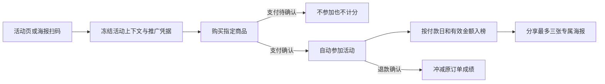

# 裂变活动：排行榜优先的移动页与专属海报

## 依据与范围

业务依据：[2026-09-25 会议纪要](https://wsbj757q14.feishu.cn/docx/G9P5dMmsqomg9BxpK38cr6PmnYg)及[逐字稿](https://wsbj757q14.feishu.cn/docx/Tdl8dBuUWoeF0txhY3lcijsTnwf)。购买型活动关闭战队，按退款调整后的有效销售金额排名。支付页字段修改、分账排查不在本交付范围。界面参考用户提供的排行榜截图，已保存为个人 Product Design 图像模板 `artifact-template-crm-2`；后台仍用 V4 工作台样式。

## 参考与复用判断

- [Viral Loops Leaderboard Widget](https://developers.viral-loops.com/docs/leaderboard-widget)：借鉴单独可见的个人排名，不引入其服务。
- [Talon.One Referral Overview](https://docs.talon.one/docs/product/campaigns/referrals/referral-overview)：借鉴邀请码作为来源凭据的清晰边界，不迁移其引擎。
- [GitHub referral-bot](https://github.com/alerrad/referral-bot)：参考“本人排名”呈现，不使用其存储或缓存。
- V4 已有 Referral 排行 API、Distribution 推广凭据、Order 确认支付和退款事件、Media 图片素材、Customer 公开资料读取。缺口是活动推广扫码上下文、付费有效邀请人数、已发布海报及移动端层级。

## 产品行为

1. 一级页先显示活动标题、榜单、本人名次、倒计时和固定按钮。活动信息入口打开介绍、奖励规则、参与说明、邀请明细。购买型活动无单独确认参加；免费报名保留确认。
2. 无战队时仅个人榜；战队活动为个人榜/战队榜。默认总榜，另有今日日榜；北京时间按原订单付款时间确定日期。切换时读取最新数据，无手动刷新、历史日期或持续轮询。
3. 榜单姓名、真实头像、指标值与排名口径一致。资料缺失或图片失败时用统一默认头像。本人名次固定可见；空榜、网络失败和活动结束有明确状态。
4. 购买按钮先从 Referral 获取活动上下文，再进入绑定商品。专属海报上的链接通过签名活动跳转入口设置活动上下文，再跳到既有 Distribution 推广凭据页。上下文与推广人、商品、买家均由后端验证并在结算前冻结。未付款或待确认不计入。不得改变全局客户关系。
5. 后台从已启用图片素材选择 0–3 张海报，填写不超过 80 字的说明。建议画面至少 600×800，右下角预留二维码区域。发布时保存 Referral 专属原图快照和审计；前台只读取已发布元数据与活动范围内的图片。弹层以海报一至三点选预览，下载 PNG 时叠加当前邀请人的二维码；仅有下载和关闭操作。
6. “有效邀请”在购买型活动指被当前推广人带来的不同实际付款买家，按活动内所有确认销售及退款的净额大于零计数。重复购买仍为一人，全部退款后移出计数。

## 数据与架构分类

- OneID：只通过 Customer 公共资料投影读取可信头像和昵称；不建客、匹配、合并或改写归属。
- 持久化：Referral 拥有 `referral_campaign_posters` 快照及已有销售事件；活动配置版本、海报、幂等收据和审计在同一个 PostgreSQL UoW 中提交。Order 确认支付及退款沿用既有事务交接。
- 外部效果：无新增 Provider 写入、任务队列或发送动作。海报下载在浏览器本地完成，素材读取仅为已启用 Media 的本地投影。

## 验收

- 有/无战队活动的榜单选项、总榜/今日榜、本人名次；375px 和 430px 的按钮、头像失败回退、二级信息、空榜、结束和网络失败。
- 扫海报二维码进入绑定商品，验证活动和推广来源同时冻结；未付款、待确认、无来源、重复购买、退款及北京时间日界线分别读回业务事实和榜单。
- 后台权限、海报上限、图片验证、并发版本冲突；1–3 张逐张预览、下载 PNG、扫码读回专属归因。
- 交付证据明确区分本地编译/测试、预发布部署、支付 Provider 确认、认证业务读回和观察。生产合并和晋级交由 CRM v4 发布指挥台。
