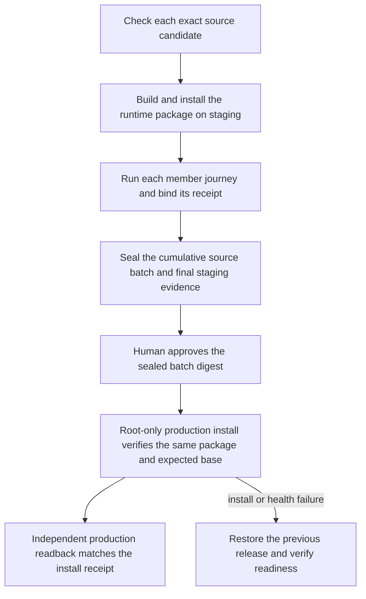

# Release contract checker recovery — retargeted to 76dcfdc (2026-09-30)

## Scope and business decision

Repair the operator contract checker that still expects GitHub Actions to deploy. The domestic release workbench is the production authority, so the checker should test its existing protections and retain the host installer’s release-ordering checks.

This sequence is already specified in `docs/operations/domestic-main-release.md` and implemented by `scripts/domestic_main_release.py` plus `deploy/domestic-promote.py`. The candidate updates the checker to assert those contracts and invoke their existing behavior tests. The GitHub workflow remains verification-only.

## Retargeted candidate review

- The source is the exact `76dcfdc30ab2eb1c3e08754625c98ff0336a01cf` UnionID candidate, whose first parent descends from `6b4235f1f7622aaaeac769e08cadc55af9b5cb3d`. Its domestic publisher, promoter, install-contract checker, and release-ordering test files match the old `6b4235f` baseline; the e412 port therefore applies without changing publisher behavior.
- The active publisher supports a sealed cumulative batch. The old checker invoked the single-candidate artifact/approval tests but omitted the existing cumulative-batch assertions. This port adds the batch test that verifies one production install and one durable attempt, and the negative test that rejects a mismatched batch approval before production.
- The exact 76dc base reproduces the stale checker failure `CI must promote the accepted staging package` (exit 1). Its output is retained outside the repository at `/Users/qianlan/Documents/Codex/2026-09-30/install-contract-76dc-20260930/evidence/base-first-red.json` and `.log`.
- The installed workbench's Linux checks for 76dc are separate from this local candidate. This branch is prepared only for local validation; it has not been pushed, handed off, or installed.

## Reference and reuse

GitHub’s official [deployment environments guidance](https://docs.github.com/en/actions/reference/workflows-and-actions/deployments-and-environments) describes reviewer gates and withholding environment secrets until approval. This is a useful reference for preserving explicit approval and protected credentials, but it does not prove equivalence with this repository’s release flow. The authoritative mapping is the current domestic workbench document and its behavior tests; no new deployment mechanism is introduced.

## PRD delta

- Replace obsolete GitHub deploy-job, `GITHUB_SHA`, and workflow-secret assumptions with the domestic controller’s root-only promotion, exact artifact/staging approval, same-package verification, expected-base check, readback equality, and rollback contracts.
- Keep package inventory/build checks that feed `scripts/domestic_release_build.py`, plus the `deploy/install-release.sh` ordering suite because it shares `install-release.lock` with the domestic promoter. Remove checker dependencies on legacy GitHub/manual staging wrappers, chunk upload, and direct promotion entrypoints after source review confirmed the domestic controller does not call them; do not delete those scripts as part of this candidate.
- Update the canonical backend test invocation to match the current JSON-producing quality lane.
- Make the release-ordering fixture deterministic across developer hosts by building a Linux amd64 ELF fixture and stubbing `uname` only inside the test. Add a Darwin negative case. The production Linux/ELF guard is unchanged; macOS simulation does not replace the workbench’s Linux run.
- Include the existing sealed-batch approval and one-install behavior tests in the release contract checker; do not change the publisher or installer runtime code.

## Impact and classification

- External behavior: no customer-facing, API, or release-flow change; only the checker’s expected contract and its test fixture change.
- Business mechanism: no change to identities, customer data, permissions, persistence, or external effects. The fixture uses temporary files and mocked host commands; behavior tests use the existing temporary test setup.
- Related components: `scripts/check-install-release-contract.sh`, `scripts/test-install-release-ordering.sh`, the domestic controller/promoter, and their existing tests. No UI changes.
- OneID: not involved; no customer or external identity is read or changed.
- Persistence: candidate changes are stateless tooling and temporary test fixtures. The domestic workbench’s existing durable release state is only exercised through local behavior tests, not changed.
- External Effects: not involved; no provider or production installation is performed.
- Constraints: no new release restriction. Existing approval, artifact identity, host, expected-base, and rollback checks are retained.

## Acceptance

The checker itself exits zero on the candidate, including exact artifact/approval/rollback behavior tests, cumulative-batch approval/install tests, and the host installer ordering suite. Run `fast`, affected checks, and the release checker. Record initial stale-contract failures and the remaining limitation: Linux workbench execution must still rerun the checker on its actual Linux host.
