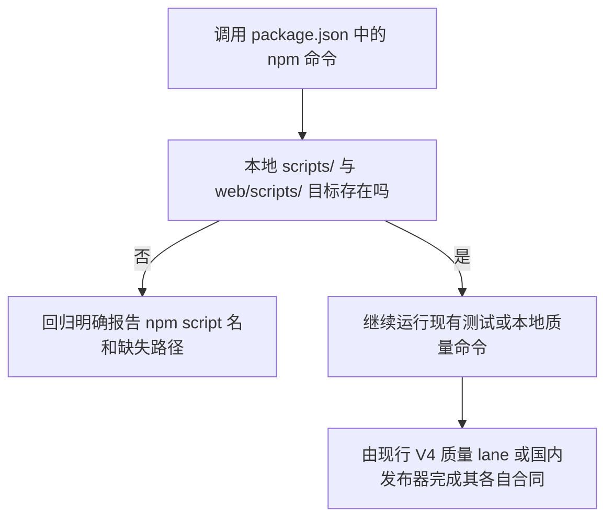

# npm 本地脚本入口修复

基线：国内 `main` `73de4fb8ea9626077a39e3fafbc6724eae824201`，tree `73854f20095fad075a945fb09fe0403f37ae4de9`。本候选沿用已授权的 npm 入口完整性父 brief，只补当前 V4 基线复核与本次小范围决策。

## 业务判断流程

## 当前基线核对与选择

基线声明的 `edge:contract`、`release:contract`、`deploy:check` 分别指向不存在的脚本；三条命令在基线上均实测退出 127。其源路径仍出现在冻结的 V2 donor package 清单中，但当前仓库没有这些脚本，也没有 G2 edge 或 Cloudflare 部署实现。当前国内发布入口是 `scripts/domestic_main_release.py`。GitHub CI 调用 `scripts/ci/quality_lanes.py`；frontend lane 会用 `npm run orval:check`，但当前 workflow 不运行根 `npm run ci`，也不调用这三个旧别名。根 `npm run ci` 是本地脚本链，不是正式发布器。

旧 `scripts/check-install-release-contract.sh` 需要单独审查：当前 `.github/workflows/ci.yml` 与 `scripts/ci/quality_lanes.py` 未直接调用它；`scripts/ci/local_first_gate.py` 将它列为 `OPERATOR_ONLY` 路径，`scripts/domestic_release_build.py` 将它列为 `CI_ONLY_FILES`，这些分类本身都不执行该脚本。历史验收台账曾记录 CI 执行此检查。基线与候选实跑都在原断言 `CI must promote the accepted staging package` 处退出 1；当前国内发布文档并未证明该旧断言由等价检查替代。本候选保留该脚本及断言，不把它报作通过，作为独立发布门禁审查项留给发布/CI 维护者处理。

基线上 `scripts/check-pr03-frontend-donor-manifest.sh` 首次因 source-view 视图未物化而失败；运行 `fast` 完成视图准备后重跑通过，冻结 donor 摘要未变。

| 旧 npm 名称 | 决定 | 现行合同边界 |
| --- | --- | --- |
| `edge:contract` | 明确退役失效别名，并从本地 `ci` 链删除调用；不创建无法证明语义的替代脚本 | 当前 V4 主发布流程没有 G2/Cloudflare edge 部署实现；GitHub quality lane 不运行此别名 |
| `release:contract` | 明确退役失效别名，并从本地 `ci` 链删除调用；不宣称旧断言已有替代 | 当前 V4 发布通过国内发布器；GitHub quality lane 不运行此别名。旧安装合同脚本的失败断言单独待审，不由本候选修改或判为通过 |
| `deploy:check` | 明确退役未被本地 `ci` 调用的失效别名 | 当前发布工作流不调用此 V2 目标，也没有对应脚本 |

保留现有 `npm test` 的全部业务/页面回归，并在其第一步加入只读静态守卫：检查 root `package.json` 中字面引用的 `scripts/`、`web/scripts/` 本地文件存在且位于仓库内。未加网络、数据库、用户数据、部署或工具版本限制；未修改依赖与 lockfile。

## 复用与参考

- 复用 `package.json` 现有 `npm test` / `npm run ci`，Python 标准库 `unittest`，当前 V4 release controller 测试及 domestic release path；不另建测试框架、release 命令或空壳脚本。
- [npm v11 scripts 文档](https://docs.npmjs.com/cli/v11/using-npm/scripts/)说明 package scripts 会交给平台 shell 执行，非零退出会中止命令链。这支持在测试层检查明确声明的本地文件目标，避免缺目标以 shell 的 127 报错。
- `web/scripts/validate-release.mjs` 是制品清单与资源闭包检查，需提供 dist 目录和预期 SHA；它与旧 ID.dev 部署别名语义不同，因此只保留、不拿来代替缺失目标。

## 影响分类与验收

- **OneID：不涉及。** 只读 package 脚本配置和路径，不访问客户或身份数据。
- **Persistence：stateless。** 不访问数据库、不写业务状态；回归仅使用临时目录。
- **External Effects：不涉及。** 不联网、不调用 Provider、不部署、不发送消息。
- **页面影响：无 UI 改动。** 现有 npm 测试内容保持不变。
- **PRD delta：** 延续父 brief 的“清除悬空入口并防止回归”；当前 main 的复核将修复范围收窄为本地 npm 中三个不存在的 V2 别名。现行国内发布器及 GitHub quality lanes 不依赖这些别名；旧安装合同脚本目前失败且是否应更新仍待单独审查，不由本候选声称等价覆盖。

## 验证与边界

- 修复前在精确基线 `73de4fb8ea9626077a39e3fafbc6724eae824201` 上分别执行 `npm run edge:contract`、`npm run release:contract`、`npm run deploy:check`，均因目标文件不存在退出 127；首轮原始输出留档。
- 候选入口守卫：`npm run qa:script-targets` 和 `python3 scripts/qa/test_package_script_targets.py` 均为 5/5；`python3 scripts/ci/test_workflow_contract.py` 为 7/7；`python3 -m unittest scripts.test_domestic_release scripts.test_domestic_release_build` 为 99/99；工具链 ownership、冻结 donor 检查通过。
- V4 `python3 scripts/dev_preflight.py fast --report-dir <evidence>` 通过；本候选无 Go 改动，不运行 compile。机器为 Node `v24.21.0`/npm `11.19.0`，与仓库固定 `v24.18.0`/`11.12.1` 不同，因此未运行完整 `npm run ci`。
- `bash scripts/check-install-release-contract.sh` 在基线和候选均以退出 1 重现原始断言 `CI must promote the accepted staging package`；该失败作为待审门禁保留，非本候选通过项。
- 最终 `affected --dry-run` 因 `package.json` 是全局输入选择 `preflight, backend, frontend, browser, archive-sdk`；dry-run 未执行这些 lane，不作为回归通过声明。
