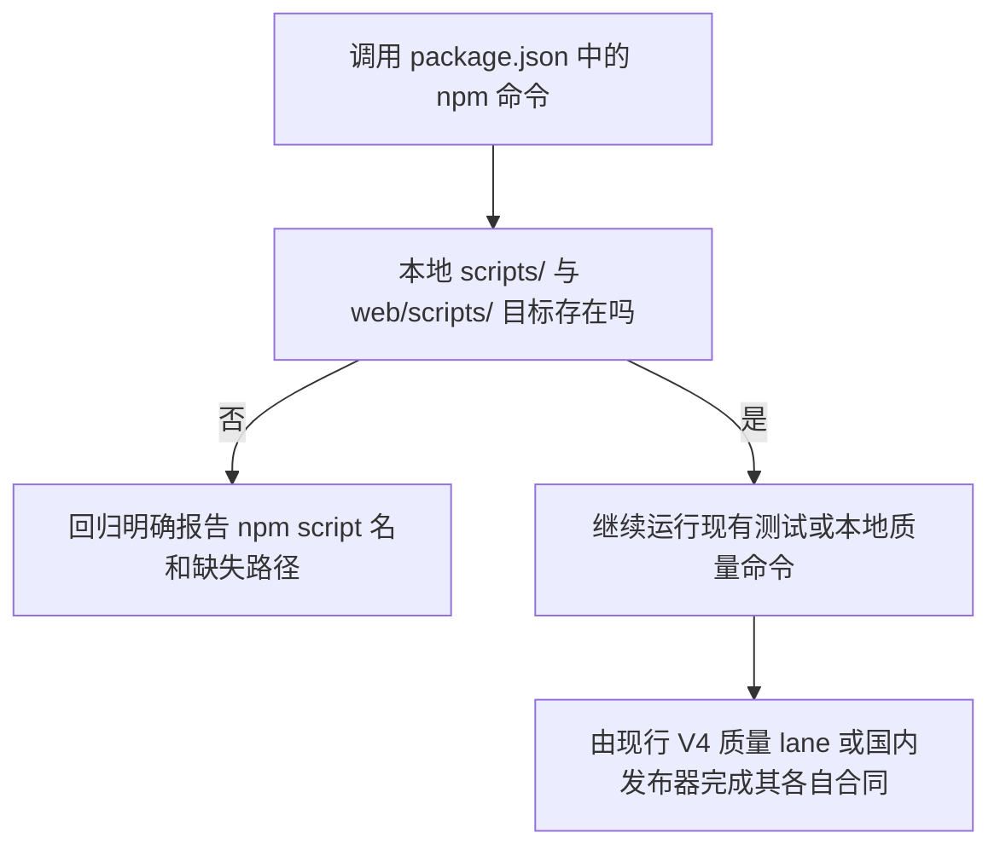

# npm 本地脚本入口修复

基线：国内 `main` `73de4fb8ea9626077a39e3fafbc6724eae824201`，tree `73854f20095fad075a945fb09fe0403f37ae4de9`。本候选沿用已授权的 npm 入口完整性父 brief，只补当前 V4 基线复核与本次小范围决策。

## 业务判断流程

## 当前基线核对与选择

基线声明的 `edge:contract`、`release:contract`、`deploy:check` 分别指向不存在的脚本；三条命令在基线上均实测退出 127。仓库中没有对应的 `id.dev`、G2 edge 或 Cloudflare 部署代码/调用方。V4 的日常发布入口是 `scripts/domestic_main_release.py`；GitHub CI 通过 `scripts/ci/quality_lanes.py`，其 preflight 包含国内发布控制器和构建合同测试。根 `npm run ci` 是项目本地脚本链，不是该 GitHub 工作流或国内发布器本身。

另一个未被当前 workflow/quality lane 调用的 `scripts/check-install-release-contract.sh` 在基线与候选均因要求 GitHub Actions 执行预发晋级而退出 1；这是旧 GitHub 发布断言，与现行国内发布路径不符，不用它冒充当前合同覆盖。基线上 `scripts/check-pr03-frontend-donor-manifest.sh` 首次因 source-view 视图未物化而失败；运行 `fast` 完成视图准备后重跑通过，冻结 donor 摘要未变。

| 旧 npm 名称 | 决定 | 现行合同边界 |
| --- | --- | --- |
| `edge:contract` | 删除过期别名及 `ci` 中的调用；不创建无法证明语义的替代脚本 | 当前 V4 源码与发布路径未声明 G2/ID.dev/Cloudflare edge 部署，没有需维持的本地 edge 部署合同 |
| `release:contract` | 删除失效别名及 `ci` 中的调用 | 国内发布控制器、安装合同测试由正式发布质量路径覆盖；保留 `release:validate` 作为需要制品目录和源码 SHA 的独立清单校验，不将二者混为一谈 |
| `deploy:check` | 删除未被调用的失效别名 | 本候选不触发部署；国内发布控制器的静态测试与主机演练仍归其现行工具路径 |

保留现有 `npm test` 的全部业务/页面回归，并在其第一步加入只读静态守卫：检查 root `package.json` 中字面引用的 `scripts/`、`web/scripts/` 本地文件存在且位于仓库内。未加网络、数据库、用户数据、部署或工具版本限制；未修改依赖与 lockfile。

## 复用与参考

- 复用 `package.json` 现有 `npm test` / `npm run ci`，Python 标准库 `unittest`，当前 V4 release controller 测试及 domestic release path；不另建测试框架、release 命令或空壳脚本。
- [npm v11 scripts 文档](https://docs.npmjs.com/cli/v11/using-npm/scripts/)说明 package scripts 会交给平台 shell 执行，非零退出会中止命令链。这支持在测试层检查明确声明的本地文件目标，避免缺目标以 shell 的 127 报错。
- `web/scripts/validate-release.mjs` 是制品清单与资源闭包检查，需提供 dist 目录和预期 SHA；它与旧 ID.dev 部署别名语义不同，因此只保留、不拿来代替缺失目标。

## 影响分类与验收

- **OneID：不涉及。** 只读 package 脚本配置和路径，不访问客户或身份数据。
- **Persistence：stateless。** 不访问数据库、不写业务状态；回归仅使用临时目录。
- **External Effects：不涉及。** 不联网、不调用 Provider、不部署、不发送消息。
- **页面影响：无 UI 改动。** 现有 npm 测试内容保持不变。
- **PRD delta：** 延续父 brief 的“清除悬空入口并防止回归”；当前 main 的重新核对确认现行正式质量通道使用国内控制器合同和 V4 quality lanes。仅退役无代码目标的旧 edge/ID.dev npm 别名，不弱化现行发布检查。

验证：首轮缺失目标复现留档；运行入口守卫专项、V4 `fast` 和适用发布/CI 静态合同；对最终 base/head 执行 `affected --dry-run`。affected 输出的未执行 lane 仍标记未验证。
