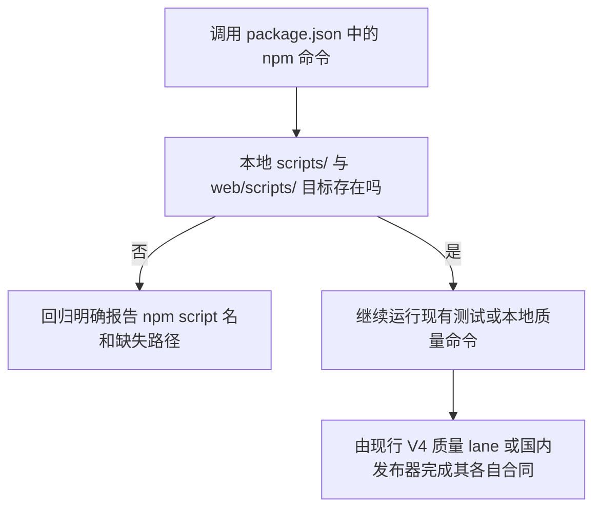

# npm 本地脚本入口修复

基线：累计源码 `746fc36b9e1d93135b6ff783b27f303d98755c4b`，tree `d7c245cfb791c3c864d2cae94f9f230c532e1e97`，parent `39d68958930a860fc7ac6a6fea780549147e0717`。本候选沿用已授权的 npm 入口完整性父 brief，只补当前 V4 基线复核与本次小范围决策。

## 业务判断流程

## 当前基线核对与选择

精确基线仍声明 `edge:contract`、`release:contract`、`deploy:check`，分别指向不存在的文件。基线 worktree 上按仓库固定 Node `v24.18.0` / npm `11.12.1` 逐条运行这三个 npm alias，均以 shell `No such file or directory` 退出 127；原始输出见 `/Users/qianlan/Documents/Codex/2026-09-30/npm-script-targets-746fc36/evidence/npm-alias-base-repro.log`。路径仍出现在冻结的 V2 donor package 清单中，但当前源码没有这些脚本，也没有 G2 edge 或 Cloudflare 部署实现。候选删除这三个旧 alias；不改冻结 donor 清单。

正式准备路径会物化 fresh checkout 的 donor source views。GitHub frontend lane 先经 `.github/actions/ci-setup` 安装锁定的 Node/npm、依赖并运行 `node scripts/prepare-donor-source-views.mjs`，再进入 canonical quality lane；国内主发布构建和 `scripts/run-donor-view-consumers.sh` 也会执行同一准备命令。此次在干净候选上仅执行 `npm ci` 后直接冷启动 `npm test`，新守卫通过，但 `transport-contract` 因视图尚未物化、esbuild 无法解析 `./transport` 等模块而退出 1，日志见 `/Users/qianlan/Documents/Codex/2026-09-30/npm-script-targets-746fc36/evidence/npm-test-cold-no-donor-prep.log`。随后按正式路径运行 `bash scripts/run-donor-view-consumers.sh check`，准备视图后的 `npm test` 和完整前端检查通过，日志见 `/Users/qianlan/Documents/Codex/2026-09-30/npm-script-targets-746fc36/evidence/donor-view-consumers-check.log`。因此冷启动错误归因于缺少正式前置准备；本候选不把准备逻辑偷偷加进 `npm test`。

此前 `25ef514` 首轮 `npm test` 中 `admin.test.ts` 经 `funnelGrid` → `DataWorkspace` → `tabulator-tables` 报 `ReferenceError: document is not defined`，在 `e412` 也曾出现，后来重跑通过。当前精确 `746` 候选的准备后回归未复现该异常；保留历史首次失败为 **FLAKY**，不以它作为当前 blocker，也不改测试运行器或 UI。

当前国内发布入口是 `scripts/domestic_main_release.py`。GitHub CI 调用 `scripts/ci/quality_lanes.py`；frontend lane 会运行 canonical frontend verification，但当前 workflow 不运行根 `npm run ci`，也不调用这三个旧别名。根 `npm run ci` 是本地脚本链，不是正式发布器。

旧 `scripts/check-install-release-contract.sh` 需要单独审查：当前 `.github/workflows/ci.yml` 与 `scripts/ci/quality_lanes.py` 未直接调用它；`scripts/ci/local_first_gate.py` 将它列为 `OPERATOR_ONLY` 路径，`scripts/domestic_release_build.py` 将它列为 `CI_ONLY_FILES`，这些分类本身都不执行该脚本。历史验收台账曾记录 CI 执行此检查。基线与候选实跑都在原断言 `CI must promote the accepted staging package` 处退出 1；当前国内发布文档并未证明该旧断言由等价检查替代。本候选保留该脚本及断言，不把它报作通过，作为独立发布门禁审查项留给发布/CI 维护者处理。

旧 PRD 记录的 donor manifest 首轮失败及准备后结果属于当时的专项审计。本候选以此次正式 frontend preparation/check 的实跑为准，不复用旧 SHA 的绿灯。

| 旧 npm 名称 | 决定 | 现行合同边界 |
| --- | --- | --- |
| `edge:contract` | 明确退役失效别名，并从本地 `ci` 链删除调用；不创建无法证明语义的替代脚本 | 当前 V4 主发布流程没有 G2/Cloudflare edge 部署实现；GitHub quality lane 不运行此别名 |
| `release:contract` | 明确退役失效别名，并从本地 `ci` 链删除调用；不宣称旧断言已有替代 | 当前 V4 发布通过国内发布器；GitHub quality lane 不运行此别名。旧安装合同脚本的失败断言单独待审，不由本候选修改或判为通过 |
| `deploy:check` | 明确退役未被本地 `ci` 调用的失效别名 | 当前发布工作流不调用此 V2 目标，也没有对应脚本 |

保留现有 `npm test` 的全部业务/页面回归，并在其第一步加入只读静态守卫：检查 root `package.json` 中字面引用的 `scripts/`、`web/scripts/` 本地文件存在且位于仓库内。未加网络、数据库、用户数据、部署或工具版本限制；未修改依赖与 lockfile。

## 复用与参考

- 复用 `package.json` 现有 `npm test` / `npm run ci`，Python 标准库 `unittest`，当前 V4 release controller 测试及 domestic release path；不另建测试框架、release 命令或空壳脚本。
- [npm v11 scripts 文档](https://docs.npmjs.com/cli/v11/using-npm/scripts/)说明 package scripts 会交给平台 shell 执行，非零退出会中止命令链。这支持在测试层检查明确声明的本地文件目标，避免缺目标以 shell 的 127 报错。
- `web/scripts/validate-release.mjs` 是制品清单与资源闭包检查，需提供 dist 目录和预期 SHA；它与旧 ID.dev 部署别名语义不同，因此只保留、不拿来代替缺失目标。

## 影响分类与验收

- **OneID：不涉及。** 只读 package 脚本配置和路径，不访问客户或身份数据。
- **Persistence：stateless。** 不访问数据库、不写业务状态；回归仅使用临时目录。
- **External Effects：不涉及。** 不联网、不调用 Provider、不部署、不发送消息。
- **页面影响：无 UI 改动。** 现有 npm 测试内容保持不变。
- **PRD delta：** 延续父 brief 的“清除悬空入口并防止回归”；精确 `746` 复核仍确认本地 npm 中三个 V2 别名指向不存在的文件。正式 CI/国内构建会准备 source views；冷启动 `npm test` 的缺视图错误不据此增添隐式前置门槛。旧安装合同断言是否应更新仍待独立审查，不由本候选声称等价覆盖。
- **限制必要性：不涉及新增限制。** 只增加 package script 文件目标静态回归，不改依赖、版本门槛、网络权限或部署路径。

## 验证与边界

- 修复前准确基线三个失效 alias 均复现退出 127，见 `/Users/qianlan/Documents/Codex/2026-09-30/npm-script-targets-746fc36/evidence/npm-alias-base-repro.log`。
- `python3 scripts/qa/test_package_script_targets.py` 为 5/5；正式 `scripts/run-donor-view-consumers.sh check` 在固定 Node `v24.18.0` / npm `11.12.1` 下退出 0。其准备后的 `npm test` 包含脚本守卫，浏览器/前端回归报告 `447 通过 / 0 失败`，其余 frontend host、组件和 staging contracts 均通过；完整原始输出见 `evidence/donor-view-consumers-check.log`。
- 冷启动错误和旧 Tabulator `document` 首次失败均单独保留，不能并入正式准备后的结果，也不能把旧 FLAKY 当作当前失败或绿灯。
- 最终候选 fast、affected 计划与执行及准确 HEAD/tree 单独记录在 `/Users/qianlan/Documents/Codex/2026-09-30/npm-script-targets-746fc36/` 外部证据目录；只报告实际运行的 lane。无 Go 改动，不运行 compile。旧 `check-install-release-contract.sh` 的失败只见旧候选记录，本次不宣称在准确 `746` 上验证。
