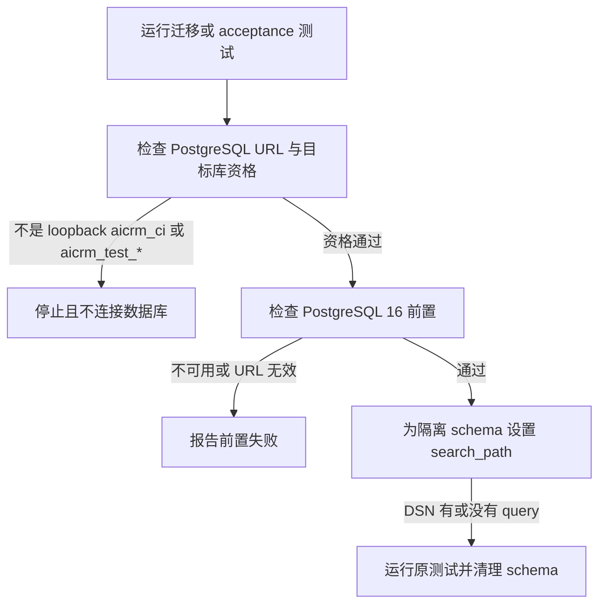

# QA 测试环境修复：PRD delta

基线：国内 `main` `73de4fb8ea9626077a39e3fafbc6724eae824201`，tree `73854f20095fad075a945fb09fe0403f37ae4de9`。本候选只处理旧台账 L06、L07 对应的测试环境缺陷；不移植旧工具候选中的 Runner、npm 入口、应用逻辑或发布器改动。

## 业务判断与验收流程

开发者或 CI 运行迁移集成测试、shipping acceptance 时，前置校验和测试必须接受同一类隔离数据库；测试为自身 schema 设置 `search_path` 时，DSN 有无现存 query 都必须得到有效 PostgreSQL URI。



## 范围与复用

- L06：shipping acceptance 原先要求数据库名以后缀 `_acceptance_test` 结束，和现有 preflight 接受的 loopback `aicrm_ci` / `aicrm_test_*` 不一致。复用 `quality_lanes.is_local_test_database_url` 的既有边界，并保留 PostgreSQL 16 可达检查。
- 目标校验和清理入口共用 URL 校验，拒绝 query 中可覆盖连接目标的 `host`、`hostaddr`、`database`、`dbname`、`service`、`servicefile`；libpq 探测与清理清除同类环境覆盖变量后再按已校验 URL 连接。普通 `sslmode` 等非目标参数保留。
- 当前 GitHub PostgreSQL 16 服务使用 `aicrm_test_acceptance_test` 与 `aicrm_ci`；发布检查的临时数据库名为 `aicrm_test_clone_<16 位 hex>_acceptance_test`。这些既有 loopback 命名均由回归测试覆盖。
- L07：多个迁移测试直接拼接 `&search_path=`。复用标准库 `net/url` 的 query 解析和编码，集中到仅供 PostgreSQL 测试使用的 `internal/platform/postgres/testutil`；更新五个受影响迁移包。
- PostgreSQL 的 [连接 URI 文档](https://www.postgresql.org/docs/16/libpq-connect.html) 定义 `?` 后的第一个参数以及 `&` 分隔的后续参数；Go [net/url 文档](https://pkg.go.dev/net/url) 提供 `URL.Query` / `Values.Encode` 处理 query。实现按这两个既有约定更新参数，不手工拼接分隔符。
- 不改变允许的主机/数据库、数量或超时边界：继续使用 `docs/prd/2026-09-13-ci-evidence-and-outcome-classification.md` 已规定的 loopback `aicrm_ci` / `aicrm_test_*` 边界。拒绝能改写该既有目标的参数，以免检查目标与实际连接目标分离。保留现有数据库创建能力探测和测试运行入口。

## 影响与分类

```text
OneID: 不涉及；不读取客户或外部身份。
Persistence: stateless 工具修复；测试只在既有本地测试数据库内创建/清理隔离 schema，不写业务数据。
External Effects: 不涉及；不调用 Provider、共享发布队列或生产服务。
```

- 对外合同：不变；只调整测试配置和前置失败提示。
- 业务机制：不变；不改业务数据、事务、权限或迁移。
- 关联模块：`internal/platform/postgres/testutil`、`cmd/aicrm`、五个迁移测试包、`scripts/ci/quality_lanes.py` 与 shipping acceptance 脚本。
- 页面影响：无 UI 或用户页面变化。
- 验收：覆盖无 query / 有 query DSN、原 query 保留、loopback 数据库资格一致、非法 URL 在连接前拒绝；运行 `fast`、Go 编译、受影响 Go 包和工具专项测试。数据库环境未配置时，PostgreSQL 集成断言保持未验证。

没有新增限制；复用现有隔离数据库边界。
