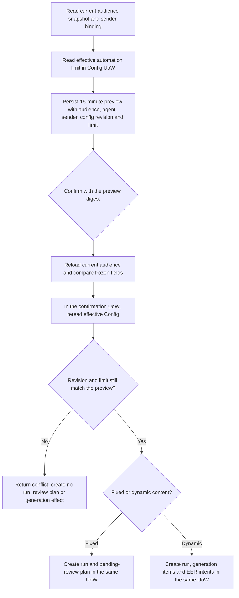

# Automation preview configuration drift

Status: code_complete; staging and provider acceptance not performed

Base: `origin/main` at `6d3ee9ccd8e9b7ce36b9980507fb6e17d217977c`

## Business decision flow

## Defect contract

`CreateBroadcastPreview` stores `RuntimeConfigRevision` and `MaxRecipientsPerRun` with the preview. The attached test plan explicitly requires a preview to become invalid after its relevant configuration changes. At the base commit, `ConfirmRun` checks audience and agent drift and applies the stored recipient limit, but it does not compare the current Config revision/limit with the frozen preview before creating either a fixed-content review plan or dynamic generation intents. Lowering the safety cap after preview can therefore leave an old confirmation usable.

For a preview made under Config revision `r` and limit `n`, confirmation may create its run only when the effective Config revision and automation limit still equal `r` and `n`. A mismatch returns `ErrRuntimeConflict` and the transaction leaves no confirmation run, review plan, generation item, EER acceptance, completion receipt, or confirmation fact. Exact idempotent replays of an already completed confirmation continue to return their recorded result.

The acceptance case changes the current Config revision and lowers the recipient limit after a preview has been created. It runs both fixed-content and dynamic-generation confirmation paths. Each path must reject the stale preview before owner records or external-effect intents are accepted. An unchanged Config remains confirmable.

## Market and public implementation references

| Reference | Relevant behavior | Decision |
| --- | --- | --- |
| [Terraform saved plan workflow](https://developer.hashicorp.com/terraform/tutorials/cli/plan) | A saved plan represents a reviewed set of actions and is applied as that saved plan; current state drift is treated as a stale plan by Terraform. | Adopt the stale-plan rule for the frozen automation safety settings; retain this CRM's existing short preview lifetime and digest contract. |
| [Azure Bicep What-If](https://learn.microsoft.com/en-us/azure/azure-resource-manager/bicep/deploy-what-if) | What-If provides a non-mutating preview for review before deployment. | Keep preview read-only and require a fresh preview when reviewed inputs change. |
| [HashiCorp Terraform source](https://github.com/hashicorp/terraform/blob/main/internal/backend/local/backend_local.go) | Terraform's local backend validates saved plan freshness against state before apply. | Reference only; do not import Terraform code or add a general plan framework. |

## Reuse and architecture classification

- Reuse Automation's existing `RuntimeService`, preview digest, 15-minute expiry, `runtimeMutation` Unit of Work, and `RuntimeStore`.
- Reuse the Config `EffectiveReader` through `EffectiveSnapshotWithin` for the check in the same UoW that creates the run.
- Reuse Segment's `ExecutionConfigurationReader` and immutable `SnapshotReader`; do not duplicate audience identity resolution.
- Reuse the existing AI Assistant transactional review-plan intake for fixed content and the External Effects transactional accepter for dynamic generation.
- Add no table, queue, worker, provider adapter, permission, or frontend behavior.
- OneID: reads canonical customer IDs through the published Segment snapshot; does not resolve identities, provision customers, or change identity links.
- Persistence: local PostgreSQL Unit of Work. The live Config comparison and the chosen run mutation must use the caller's same transaction.
- External Effects: fixed-content confirmation creates a pending review plan but no provider call. Dynamic-generation confirmation accepts EER intents and River jobs in the existing shared UoW; stale Config must reject before either is accepted.

## Scope and verification

Files in scope: `internal/automation/app/runs.go`, `internal/automation/app/dynamic_generation.go`, focused tests under `internal/automation/app`, and this defect contract.

The new regression failed on the base implementation for both `fixed_content` and `dynamic_generation`: each stale confirmation returned nil instead of `ErrRuntimeConflict`. After the change, these commands passed:

| Command | Result |
| --- | --- |
| `go test ./internal/automation/app -run '^TestConfirmRunRejectsRuntimeConfigDriftForFixedAndDynamicContent$' -count=1` | PASS |
| `go test ./internal/automation/app -count=1` | PASS |
| `AICRM_DATABASE_URL='postgresql:///postgres?host=/tmp' go test ./internal/automation/store -run '^TestPostgreSQLDynamicGenerationUOWConcurrencyAndReplay$' -count=1 -v` | PASS on local PostgreSQL 16.13; the existing helper created a random isolated schema and dropped it during cleanup |
| `python3 scripts/dev_preflight.py fast` | PASS; claim limited to fast checks |
| `python3 scripts/dev_preflight.py compile` | PASS; all Go test packages compiled with tests filtered out |

The fast and compile commands emit temporary evidence directories recorded in the originating task report. They ran on Go 1.26.6, Darwin arm64, and each supports only its named lane; neither is full delivery evidence. The additional PostgreSQL test is storage-level transaction/concurrency evidence only: it is not the locked E1 PostgreSQL 16.14 environment and does not exercise the new App-layer stale-config check against a real database. Full backend integration, staging, provider, browser, and production acceptance remain unperformed. The random test schema was verified absent after cleanup. No real provider or production database was used.

## Rollback

Revert the revision/limit comparison and its regression test together. This restores the previous stale-preview behavior, so do not use rollback to resolve a failing unrelated lane.
