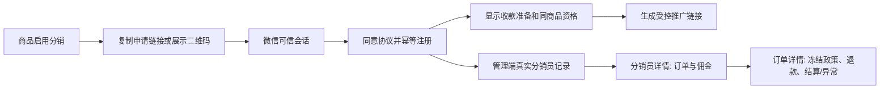

# 分销申请入口与管理明细 PRD

## 目标与边界

商品启用分销后，商品管理员能取得带 `product_id`、`product_type` 上下文的公开申请链接和二维码。用户从该链接进入分销中心，先完成 Payment 已验证的微信会话桥接、阅读并同意当前协议，再按 canonical Customer 幂等注册为分销员。商品开启分销不自动把任何用户注册为分销员，也不代表收款准备、推广资格、结算或分账已经成功。

管理端 `/admin/distribution` 使用唯一的 `admin_base`，展示真实分销员、归因订单和异常记录。每行提供“查看详情”：分销员详情关联推广订单、佣金汇总和状态；订单详情展示资格依据、冻结政策、金额、退款调整、结算和异常事实；异常详情展示可见资金状态与允许的人工操作。没有真实记录时，页面明确说明原因，不填充示例数据。

本 PRD 不改变佣金计算、退款复核、Payment 分账策略或人工异常处理规则；默认关闭分账时，申请入口和注册仍存在，但页面只展示服务端返回的未就绪原因，绝不将注册或链接生成显示为分账/到账成功。

## 设计分类

```text
OneID: reads canonical customer。公开中心仅接收 Payment 已验证的可信会话；管理详情仅读取既有 Customer 引用，不解析、创建、合并或暴露外部身份。
Persistence: local transaction（现有注册和人工命令保持原 UoW/CAS/审计）；本次新增管理详情为只读查询。Payment 的前向 schema migration 仅收紧并扩展 `payment_h5_oauth_states.return_path` 的本地可信回跳约束，以持久化严格的分销商品申请上下文。
External Effects: not involved。本次不新增支付、分账、收款人准备或 Provider 调用；该 Payment schema migration 不触发 Provider write。异常处理仍不得伪造到账。
```

## 参考与前端复用

- 借鉴 [Ant Design DESIGN.md](https://github.com/ant-design/ant-design/blob/master/DESIGN.md) 和其[组件治理说明](https://github.com/ant-design/ant-design/blob/master/.github/copilot-instructions.md)的 token、语义状态和不虚构组件原则；不引入 Ant Design、React 或新依赖。
- 借鉴 [CRMEB 分销规则说明](https://github.com/crmeb/crmeb_java/wiki/%E5%88%86%E9%94%80%E8%A7%84%E5%88%99%E8%AF%B4%E6%98%8E) 中“商品详情/中心提供链接二维码，资格与冻结期可见”的交互方向；不采用其二级分销、固定售价返佣、收货结算或身份资金模型。

| 参考页面/组件 | 本次复用或扩展 | 受影响调用 |
| --- | --- | --- |
| `admin_base` | 唯一管理端侧栏、顶栏、Access 会话和 CSRF | `/admin/distribution` 及旧 `.html` 别名 |
| `web/v3/shared/ui/detailDrawer.ts` | 通用 drawer：焦点恢复、Esc/关闭、加载/失败状态 | 分销员、订单、异常详情 |
| `web/v3/distribution.css` | Distribution 的卡片、表格、状态和响应式样式 | 公开分销中心、管理明细 |

## 用户流程



## 管理读取接口

现有三个全局分页接口继续保留：

- `GET /api/admin/distribution/distributors`
- `GET /api/admin/distribution/orders`
- `GET /api/admin/distribution/exceptions`

新增受控只读端点，均要求现有 Access 员工会话；详情不接受或回显外部身份、收款人、Provider 响应、金额指令等浏览器输入：

| 端点 | 返回的服务端事实 |
| --- | --- |
| `GET /api/admin/distribution/distributors/{id}` | 注册/启停/协议/收款准备，累计推广成交、退款、初始佣金、当前待付、确认到账、追回，以及首批关联订单与 `next_cursor` |
| `GET /api/admin/distribution/distributors/{id}/orders?cursor&limit` | 严格按该分销员过滤的归因订单；零佣金成交也返回 |
| `GET /api/admin/distribution/orders/{attribution_id}` | 资格证据引用、商品与冻结政策、原实付、退款累计、初始/当前应付/已付、佣金状态/原因、受控结算状态和关联异常 |
| `GET /api/admin/distribution/exceptions/{id}` | 异常金额、原因、状态、受控结算引用、可用人工操作和审计可见事实 |

公开申请页还读取 `GET /api/v1/distribution/application-context?product_id=&product_type=`：严格验证正整数与 `standard_product|service_period`，通过稳定 Product Port 只返回已启用分销且可售商品的真实名称、购买链接和商品上下文。不存在、未启用或不可售统一为受控 404；读取不可用为 503。它不读取任何身份、佣金、收款人或 Provider 事实，也不产生外部效果。

Payment H5 OAuth 的 `return_url` 只允许既有无查询公开商品路径、`/distribution`，或精确 `/distribution?product_id=<int64 正整数>&product_type=standard_product|service_period`。推广链接进入购买页时，只允许普通商品 `/p/<code>`、`/pay/<code>`，或周期商品 `/s/<code>`、`/s/<code>/pay` 加唯一 `promotion_context=dpc_<43>` 参数；不能附带其他参数。重复、乱序、未知、编码拼接、片段、开放跳转和溢出 ID 必须在服务与数据库边界拒绝。

推广凭证以既有必填的 Survey DataKey 派生 HMAC，不另增运行时密钥或保存可恢复的 bearer token。凭证、operation receipt、审计和 outbox 在同一 Distribution PostgreSQL UoW 提交。相同客户、同一幂等键和同一商品快照回放同一 URL；商品快照漂移返回 409。DataKey 轮换后，已签发链接仍按数据库中已有 token digest 校验；使用轮换前幂等键重放会因无法复现原 token digest 而 fail closed，不能生成第二个凭证或事件。

查询只读取 Distribution 已拥有的 `distribution_*` 表。按分销员的订单明细必须由 PostgreSQL 过滤和 cursor 分页，禁止前端跨页加载全局列表后筛选。不存在、无权限和读取失败分别返回既有受控错误；空态保留为空态。

## 前端与装配

`/admin/distribution` 不再直接流式输出 `web/dist/admin/distribution.html`。Webshell 在 `DistAdminPageFile` 分支之前，以 `admin_base` 装配 `#distribution-admin-root` 与经 manifest 验证的 Distribution runtime assets；不增加侧栏、独立 HTML 外壳或第二套登录/CSRF。

详情采用先复用现有共享 dialog/drawer 能力、再扩展公共组件的顺序。若现有组件缺少需要的可访问性、焦点恢复、关闭和加载/失败语义，新增公共 drawer 并登记组件索引；不能在 `distributionAdmin.ts` 复制私有弹窗框架。页面只调用上表的 Distribution HTTP 合同。

## 文件边界与验收

Distribution 读取：`internal/distribution/{port,app,store,http}`；不新增迁移，不读取其他领域表。Webshell 装配：`internal/webshell/{renderer.go,handler.go,templates/admin_base.html,dist.go}`。管理 UI：`web/v3/distributionAdmin.ts` 和与第三方协作的 `web/v3/distribution.css`；共享抽屉位于公共 UI 路径并更新 `skills/aicrm-v3-frontend-consistency/references/component-map.md`。

验证包括：管理端实际 DOM 存在 `admin_base` 侧栏/顶栏；三个全局列表和四个详情端点分别覆盖真实记录、空态、分页、401/403/404/5xx；分销员详情只显示其关联订单；订单详情保留零佣金成交、退款调整和异常；分账关闭时注册页面不显示资金成功；既有资格、退款、管理员审计和异常人工动作回归。
