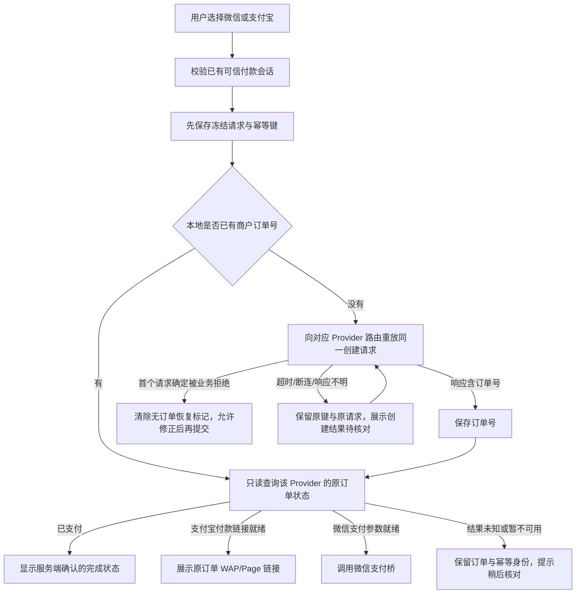

# 支付宝公开结算读回与创建恢复缺陷 PRD

## 业务判断流程

## 缺陷与目标

页面已有支付宝选项与 WAP/Page 渠道字段，但调用和读回仍硬编码到微信路由；服务端 `GetCheckout` 也固定读取微信付款记录及微信 prepay effect。支付宝支付无法从公开页面读回自己创建的订单/付款链接。另一个页面恢复问题是：下单前已保存 key 的 checkpoint 没有商户订单号时，价格区域显示“待确认”，混淆了订单创建状态与付款金额；确定性业务拒绝和响应不明也曾统一显示成待核实。

目标是让创建、状态查询、effect 读回及支付宝完成动作都以已冻结的 Provider/Channel 为准，明确区分首次提交的确定性业务拒绝与超时/响应不明：前者清除无订单 checkpoint 并恢复可编辑状态；后者保留同一个请求键与冻结请求安全重试，且旧 checkpoint 在没有服务端订单读回前不会被一次新的拒绝响应清除。没有商户订单号时显示创建状态，不显示付款金额待确认。

## 外部参考

- [支付宝官方：通知页与返回页的职责](https://help.alipay.com/support/help_detail.htm?help_id=397355)：同步 return 只负责把交易信息带回商户，最终业务状态应由服务端通知/查询核实；WAP/Page 返回值是用户继续支付所需的链接。
- [Stripe 官方：Idempotent requests](https://docs.stripe.com/api/idempotent_requests)：网络错误重试必须复用原幂等键，避免重复创建对象。
- [Alipay EasySDK 官方 GitHub 文档](https://github.com/alipay/alipay-easysdk/blob/master/APIDoc.md)：将 WAP 与 Page 作为不同网页支付入口处理，按设备场景构造对应导航 URL。

## 仓库复用与边界

- 复用 `internal/payment/http` 已存在的 `/api/v1/wechat-pay/checkouts` 与 `/api/v1/alipay/checkouts`；按路由 Provider 校验请求，读回只授权对应 Provider 的订单。
- 复用 `Payment Service`、`Payment Store`、`external_effects.Reader`、`payment_handoffs` 和现有产品页 checkpoint / 支付宝链接区域；不新增身份匹配器、订单表、任务队列、重试状态机或 Provider。
- WAP/Page 对应 `alipay_wap_pay_v1` / `alipay_page_pay_v1`；微信仍使用 `wechat_pay_prepay_v1`。客户端只认服务器状态，不将打开付款链接或点击“我已支付”当作成功。

## 数据、身份与外部效果分类

- **OneID：涉及既有可信付款会话。**从 Payment session 取得 payer 身份并复用当前授权；不接受浏览器自报客户 ID，不解析/创建/合并新的支付宝身份。
- **Persistence：本地 PostgreSQL 事务。**Order、Payment、幂等收据及 Provider intent 继续由现有 Payment/Order Unit of Work 原子持久化；付款链接由 Payment owner 持久化到 handoff。
- **External Effects：复用 Payment effect。**effect 类型由 Provider 与 Channel 决定。读取 effect 状态不发起 Provider 调用。集成验收用确定性的虚拟 Provider 链接，不访问支付宝、不扣款。
- **Owner 与事务边界：**Order owner 持有订单；Payment owner 持有 Payment、intent、handoff。创建期间保持当前同一 Unit of Work，Provider 处理仍在事务外；effect 完成与 handoff 写入沿用现有完成事务。

## 验收标准

1. `/api/v1/alipay/checkouts` 只能创建支付宝订单；WAP 与 Page 分别生成匹配的 effect kind。错误 Provider、未知 Provider 和无效 Channel 失败关闭。
2. `/api/v1/alipay/checkouts/{merchant}` 只读回原支付宝订单、金额、effect 状态和有效 handoff；错误 Provider 路径不能读取另一渠道的订单。微信控制组行为保持不变。
3. 完整迁移序列上的隔离 PostgreSQL 16 HTTP 旅程分别覆盖 Alipay WAP、Page、未知 Provider、错误 Channel 和微信路由误读控制；WAP/Page 必须由 worker 生成 `.test` 虚拟链接，并核对订单、支付、intent、effect 与 handoff。另以现有 `TestPostgreSQLPublicCheckoutResponseLossRejectsRenewedSessionReplay` 做微信创建响应丢失及终态回读对照；该对照不启动微信 Provider worker。所有旅程不得触发真实 Provider 支付。
4. 首次 POST 的已知业务拒绝清除无订单 checkpoint，恢复可编辑表单和商品报价；网络超时/断连/响应丢失保留 checkpoint。其后重试沿用同一 key、冻结请求与 Provider 路由；旧的不确定 checkpoint 不因后续拒绝而被误清除。无商户订单号时金额区不显示“待确认”，且同 key 重放不得多建订单。
5. 浏览器状态恢复、支付宝“我已支付”读回与刷新均使用原 Provider 路由；只有服务器 `paid` 状态显示支付成功。

## 回滚与风险

无数据库迁移。回滚为恢复页面与 Payment 读回逻辑；保留已创建订单和其幂等 checkpoint，不生成替代订单。主要风险是错误 Provider 路径导致他渠道的订单泄露或状态查询错误，因此服务端必须用 URL Provider 与持久化 Provider 双重匹配，并继续执行原 payer session 授权。
