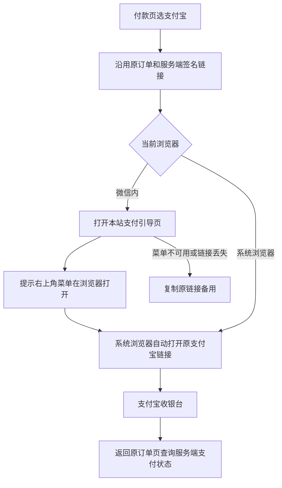

# 支付宝微信内跳转缺陷合同（2026-09-24）

## 业务判断

现象：已有有效 `alipay.trade.wap.pay` 签名链接，但微信内付款页要求用户复制长链接、切换浏览器、再粘贴。该操作容易失败，也把后续跳转错误误认为订单创建失败。本修复只处理浏览器交接；支付宝应用审核和支付通道状态由运营另行处理。

## 参考与复用

- 用户提供的 `alipay_in_weixin_demo.zip` 中 `ap.js` / `pay.htm`：微信内显示“在浏览器打开”，外部浏览器自动前往原支付链接。借鉴交接模式，不复制 2015–2017 年的 Base64 实现、示例订单、前端签名或旧视觉。
- [Ping++ `pingpp-js` 的 `alipay_in_weixin` 说明](https://github.com/PingPlusPlus/pingpp-js)：同类 `pay.htm` 交接模式。此处不引入 SDK。
- V4 复用 `internal/product/http/public.go` 公共付款页、原 `handoff.redirectUrl`、订单 checkpoint 和“我已支付”服务端状态查询。新增同一 Product 公共路由的轻量引导页，不新增 Provider 调用、订单或持久表。

## 验收

1. 微信内已有支付宝 handoff 时，用户点一次“继续支付宝支付”进入本站引导页；引导明确说明使用右上角菜单“在浏览器打开”，无需粘贴长链接。
2. 系统浏览器打开同一引导页时，只对格式有效的支付宝 HTTPS 网关链接自动跳转；不接受任意外部地址、HTTP、缺签名或非支付 API。
3. 原签名链接仅放在 URL fragment，不传给本站 HTTP 服务；页面 `no-store`、`no-referrer`。自动跳转失败时可复制原链接作为备用。
4. 原付款页继续持有同一订单 checkpoint，并通过服务端查询确认“已支付”；跳转或用户点击“我已支付”本身不标记成功。
5. 系统浏览器直接下单仍可直接打开同一签名链接；无链接、非法链接和 fragment 丢失有清楚提示，不建立新订单。

## 边界与回滚

- OneID：不涉及。只读取当前付款页已有的 handoff，不解析或关联身份。
- Persistence：无新增持久化；原订单和支付状态归 Order/Payment，沿用已有事务与 checkpoint。
- External Effects：无新增 Provider 写入；只打开已签名的原支付 URL，不重新调用预下单，不更换幂等键。
- 前端：复用公共 H5 页既有蓝色按钮、卡片、状态反馈；已按 Product Design 插件的现有页面复用原则核对，真实微信设备视觉和菜单行为留在验收旅程检查。
- 风险：微信“在浏览器打开”对 fragment 的保留受客户端版本影响；丢失时不能恢复签名链接，必须明确提示回原付款页复制，不能创建新订单。真实设备完整链路需预发布验收。
- 回滚：回退此 PR，原复制链接路径仍可使用；不需数据迁移。
