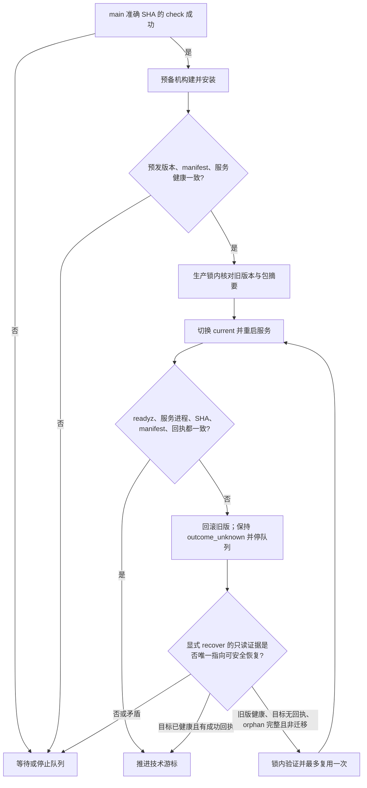

# 国内发布目录权限修复与受控恢复 PRD

## 业务判断流程

本次只判断技术发布是否能安全完成，不把技术安装当作业务验收。所有关口按同一 SHA、同一 manifest 和生产实际进程逐项核验。

恢复决策只覆盖能由只读证据确定的状态。current、readyz、进程可执行文件、manifest 或成功回执出现冲突时继续停止；禁止通过手工改写 state.json 清除阻塞。

## 现状与判断

生产第一次安装 `9ab9b3b0d3069736b6e23521657e8ee8bf1f4491` 后，API 和 effects worker 在 systemd 日志中连续报 `Changing to the requested working directory failed: Permission denied`。只读核对发现目标 release 根目录为 `0700 root:root`，旧版根目录为 `0755 root:root`，而目标内层目录均为 `0755`。服务以 `aicrm` 身份运行，无法进入 `WorkingDirectory=/opt/aicrm/current` 指向的 0700 目录；回滚后旧版 `/readyz` 与两个服务恢复健康。kernel journal 在失败时段没有条目，证据不支持 OOM。

目标 release 的 marker、manifest digest 与保留的 production metadata 相符；目标成功回执不存在，incoming 已移动进 releases，current 指向健康旧版。metadata 标记 `migrations_changed=false`、`frontend_changed=false`。因此恢复只允许受控复用这一份已经校验的 orphan，不运行迁移、不重建业务数据，也不作应用层业务验收声明。

## 参考案例

- systemd 的 [WorkingDirectory 配置文档](https://manpages.debian.org/unstable/systemd/systemd.exec.5.en.html#WorkingDirectory=) 说明它决定服务执行目录；[systemd issue #10568](https://github.com/systemd/systemd/issues/10568) 展示了 `WorkingDirectory` 为 0700 时出现 `Changing to the requested working directory failed: Permission denied`，改为 0755 后通过的复现。这与本次生产日志及目录模式一致。
- [Deployer 的配置文档](https://github.com/deployphp/docs/blob/master/configuration.md) 将发布目录作为任务工作目录，并将 web 可写目录权限默认设为 0755。此处只复用“运行用户应能遍历发布目录”的权限约束，不扩大业务可写目录。
- 项目内发布设计和生产锁、manifest、回滚语义以 [`domestic-serial-release` PRD](2026-09-23-domestic-serial-release.md) 为准。

## PRD

### 目标

1. 安装器在完成 manifest 验证和 root 所有权校验后，确保 release 内各级目录可由服务账户读取和遍历，同时保持 group/other 不可写。
2. 不通过递归 chmod 改动普通文件权限或 `--link-dest` 共享 inode。
3. 为 `outcome_unknown` 提供精确且显式的 `recover --retry-blocked --sha <blocked-SHA>`：只读核对目标回执、旧版 current/readyz/进程、目标 metadata、stage 版本和 orphan 文件摘要；仅满足已批准条件时，在状态锁与主机安装锁内最多复用一次。
4. 若目标 current、readyz、进程 `/proc/<pid>/exe`、manifest 与成功回执已一致，则只补技术游标，不重复安装。
5. 调用固定安装器时显式传入预期 release SHA 与 controller 已验证的 metadata SHA256；安装器只读取一次 metadata bytes，在解析及任何安装副作用前同时校验两个值，消除单独远程 `sha256sum` 与后续解析之间的替换窗口。

### 恢复门槛

- 状态必须为 `outcome_unknown`，blocked SHA 必须是命令显式确认的准确 SHA，且 timer 保持停止。
- GitHub main 中该 SHA 仍在第一父链上，准确 `check` 成功；stage current、readyz、API 和 worker 的 executable 都匹配该 SHA；本地构建 metadata 与 stage manifest 匹配。
- 可重试状态必须同时满足：目标成功回执缺失；生产 current 与 ledger 中旧 `prod_installed_sha` 一致且服务健康、进程 executable 匹配旧版；orphan 为非 symlink 的 root-owned release；orphan marker、metadata 和完整 manifest/file set 一致；`migrations_changed=false`；该 SHA 尚无恢复尝试记录。
- 如果目标成功回执存在，只允许在 current、健康响应、服务进程 executable 和 manifest 均匹配目标 SHA 时推进游标。回执与现场不一致时拒绝。
- recovery helper 完成后再次验证目标进程 PID/executable、readyz SHA、manifest 和回执；失败则由 helper 回滚，ledger 保持阻塞，禁止第二次复用。

### OneID、持久化、外部效果和事务边界

- OneID：不涉及。
- 持久化：不改 CRM 业务记录或数据库 schema。仅写发布技术账本和每个 release 的成功回执；本次目标明确无迁移。
- 外部效果：不调用支付、企微或其他 Provider。应用和 worker 的 systemd 重启是发布副作用。
- 事务边界：stage ledger lock 串行化队列状态；production `install-release.lock` 串行化 current 切换、服务重启和回滚。两者之外不得直接改账本或 symlink。
- Owner：源码由 GitHub protected main 确认；包由 stage build 生成；生产 current、服务健康与 receipt 是生产安装证据。

### 验收标准

1. 生产形态的 0700 incoming 根目录在安装后变为服务可遍历的 root-owned release 根目录，内层目录逐级可进入；服务账户不能写 release。
2. 固定安装器拒绝 metadata SHA256 或 source SHA 与 controller 预期不符，且在任何切换或服务副作用前失败。
3. 回归测试确认普通文件的 mode 和 inode 不因目录权限修复而改变，覆盖 `--link-dest` 硬链接。
4. orphan 复用验证与初次安装使用同一 canonical manifest parser；重复路径、绝对路径、`..`、遗漏/新增/篡改文件、坏 marker、非 root owner、symlink 和特殊文件均在切换前拒绝。
5. `migration=true`、成功回执/current 不一致、旧版不健康、stage 或生产 executable 不匹配、第二次 retry 均拒绝；健康失败后生产回滚旧版且 ledger 仍阻塞。
6. 完整 CI 通过。固定 helper 只在独立 PR checks 通过后按运维文档更新并先做预发演练；显式恢复及 timer 重启分别记录只读 readback。

### 范围与非目标

本 PR 只修改国内发布 helper、队列恢复入口、相应单元测试和运维说明；不修改产品页面、支付逻辑、迁移、PR #22/#24 或市场配置。CI、merge、预发、生产安装、生产健康和业务验收仍分别记录。
