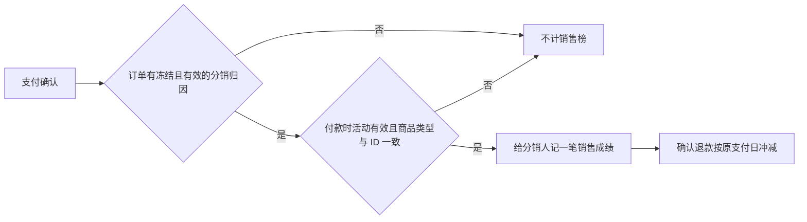

# 裂变活动按分销订单销售计分

状态：已按用户 2026-09-24 确认的业务规则实施。范围仅限销售计分、销售榜和历史补录；页面及公开分享链接保持原样。

## 业务判断

- 用 Order 的首次原生支付事件时间判断活动期，结合活动创建和状态变更审计还原付款时状态；区间为开始时刻包含、结束时刻不包含。
- 分销人由 Distribution 在订单创建时冻结的归因决定。有效同商品分销人无需先报名，也无需活动专用链接。自购不计分。买家不会因这条新规则自动入会。
- 个人榜可显示未报名分销人；战队榜只用付款时已加入且仍有效的战队归属。销售金额是净分，部分退款减金额，全额退款减金额并减一单。退款归原支付日期。
- 邀请榜继续使用原有邀请事件。现有商品、订单、分销佣金与支付流程不因补录重建。

## 原因与复用

现有销售榜查询 `referral_sales_facts`，该表没有写入路径；活动页 Cookie 只作用于活动报名与下单上下文，而普通分销链接可能没有这个上下文。改用已有 `referral_product_sale_events` 作为销售榜来源，复用 Order 支付/退款事件、Distribution 冻结归因以及 Referral 销售事件。外部口径参考 [Shopify Collabs](https://help.shopify.com/en/manual/promoting-marketing/collabs/merchants/affiliates)、[ReferralCandy](https://help.referralcandy.com/en/articles/6490013-referralcandy-101) 和 [Nakama 排行榜](https://github.com/heroiclabs/nakama-docs/blob/master/docs/nakama/concepts/leaderboards.md)。

## 架构分类

- OneID：只使用 Order 与 Distribution 已确定的 `customers.id`，不解析新外部身份，不建客、不合并。
- Persistence：Referral 追加销售 credit/reversal 与审计、Outbox，实时支付路径与 Order 在同一个 PostgreSQL Unit of Work；用唯一 credit 和退款收据做幂等。没有新表或迁移。
- External Effects：无新增 Provider 读写或外发。历史补录只追加 Referral 事件，不重放支付、退款和分销佣金。
- Owner：Order 提供支付、退款只读事实；Distribution 提供冻结归因；Referral 拥有活动和销售事件；审计由 Platform 提供时间线 Port。

## 补录与异常

`go run ./cmd/migrate-referral-sales -mode dry-run` 预览全部原生已支付订单，列出冻结分销候选、可计分数、已计分数及异常。每行证据摘要和总清单摘要用于复核。执行时需使用相同清单摘要及 `-confirm-apply`，再次核对单笔证据后逐单提交。重复执行不加分。

订单支付事件、结算历史、活动状态审计或冻结归因不完整时列入异常，不推测归属。活动开始后商品与起止时间由领域规则锁定，所以历史期内的商品与时间配置可直接核对；活动状态仍以审计还原。`referral_sales_facts` 暂不删除。

## 验收与发布

目标订单 `v3pay_ZKHMLQBFISDRSTCUFYTWW5LCAU` 应在“测试裂变”个人总榜为 1 单、¥9.90；重复处理仍为 1 单。部分退款按净额展示，全额退款从有效订单数扣除。还需覆盖普通分销链接、未报名、其他商品、自购、活动期边界、历史停用活动、战队归属和邀请榜。

PR 通过准确 head 检查后，由 V4 国内串行发布流程合并、预备机安装与业务读回、生产晋级。生产补录先预览并保存清单，再执行与榜单读回；线上技术安装和真实业务验收分别留证。
