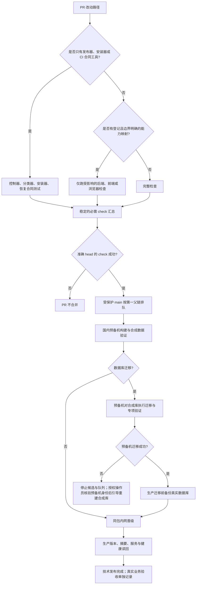

# CRM v4 发布测试闭环简化 PRD

日期：2026-09-24。状态：按用户确认方案实施。关联主 PRD：
[国内构建与内网串行发布](2026-09-23-domestic-serial-release.md)。

## 业务判断与选择流程

业务决策：将一次失败排查的范围限制在实际改动及相关合同。发布器、安装器和 CI 改动需要针对其状态机、权限和失败恢复的合同检查，不因此重新编译整套应用或运行所有浏览器旅程。数据库迁移和未知/共享构建影响仍走完整门禁。必需 `check` 工作流本身始终运行，再由它汇总该提交实际选择的 lane。

## 参考调研与采用

| 参考 | 结论 |
| --- | --- |
| [GitHub required status checks](https://docs.github.com/en/pull-requests/reference/status-checks) | 分支保护依赖准确提交上的检查结论；保留一个稳定的 `check` 汇总门禁。 |
| [GitHub skip workflow runs](https://docs.github.com/en/actions/how-tos/manage-workflow-runs/skip-workflow-runs) | 路径/分支过滤可能令必需工作流检查停在 Pending；本仓不对必需 CI 工作流使用 `paths` 过滤。 |
| [Testcontainers Go PostgreSQL module](https://golang.testcontainers.org/modules/postgres/) | 隔离 PostgreSQL 是成熟测试方式；本仓预备机和开发机已有 PostgreSQL 16，不新增 Docker 作为强制前置。 |
| [Forgejo PR 与 Git flow](https://forgejo.org/docs/v15.0/user/collaboration/pull-requests-and-git-flow/) | 自托管 Git 平台可实现 PR 审核；本次继续使用现有 GitHub，避免维护第二个主仓库和 runner。 |

## 范围与边界

- `scripts/ci/**`、`.github/workflows/ci.yml`、国内控制器/构建器/安装器和对应合同测试可选轻量 `tooling` profile：运行 CI 单测、控制器/构建器合同与安装器合同，不运行全量 Go race、前端全量和 Chromium 全量。
- SQL 迁移、未知路径、共享组件、构建规则、依赖锁文件及非白名单部署文件必须完整检查。CI 失败或分类器失效也回退完整检查。
- 普通业务 PR 继续由能力影响报告选择已登记的测试；路径无法映射时完整检查。管理员可在明确选择的 ref 上手动要求全部 lanes，不能通过跳过 required check 合并。
- OneID：不涉及，流水线不读写客户身份。
- Persistence：CI 本身无业务持久化；发布游标/收据属于技术状态。预备机仅用可丢弃合成数据，迁移失败不做整库备份；当前发布器只停止该候选并回退运行版本，仓库没有数据库重置工具。队列保持停止，由授权操作员核对主机角色及精确的合成库身份后引导重建，再用候选迁移服务和合成夹具完成读回。生产数据库是真实业务数据，只在迁移前备份，角色由受保护的主机配置确定，PR 参数不得关闭。
- External Effects：生产服务切换是运维效果；本 PR 不新增支付/企微调用。技术健康通过不等于真实业务验收。

## 验收标准

1. CI 路径配置不跳过 `pull_request` 工作流；`check` 使用 `always()` 汇总 plan、执行 lanes 与 governance，并对失败、取消、意外跳过失败关闭。
2. 只改白名单发布工具时，准确 required `check` 选择轻量合同 profile，执行发布器/构建器/安装器/恢复用例，不启动 Go 应用构建、全量前端或浏览器 lane。
3. 白名单工具与迁移/共享构建文件混合、未知路径或分类器错误时，转完整检查；普通登记能力保留受影响测试选择。
4. `workflow_dispatch` 对选定 ref 的 `force_full=true` 跑完整 lanes；记录运行的真实 head 并与 PR head 对照。
5. 预备机合同工具变更另需以真实服务用户、目录、PATH 和 systemd 环境演练；普通业务 PR 不重复主机故障注入。
6. 预备机迁移失败时必须停止候选和队列、回退运行版本且不备份数据库；不得声称自动重建。当前 `10.0.4.6` 合成库身份为 `127.0.0.1`、`aicrm_test`、`aicrm_test_baseline_5d15`、PostgreSQL `16.15`。授权操作员先通过固定 helper 主机合同检查并确认该身份，再按引导流程重建，运行候选迁移服务与 `deploy/seed-staging-business-fixtures.sh` 完成读回。自动/防误删重置工具与真实主机恢复演练仍是后续工作，完成前失败后保持人工处置。
7. 目标先按十次发布测量：工具 PR 的 check 不超过 5 分钟，普通业务 PR 约 14 分钟，check 变绿至生产健康不超过 10 分钟。记录每段时间，不用目标值冒充已达成。
