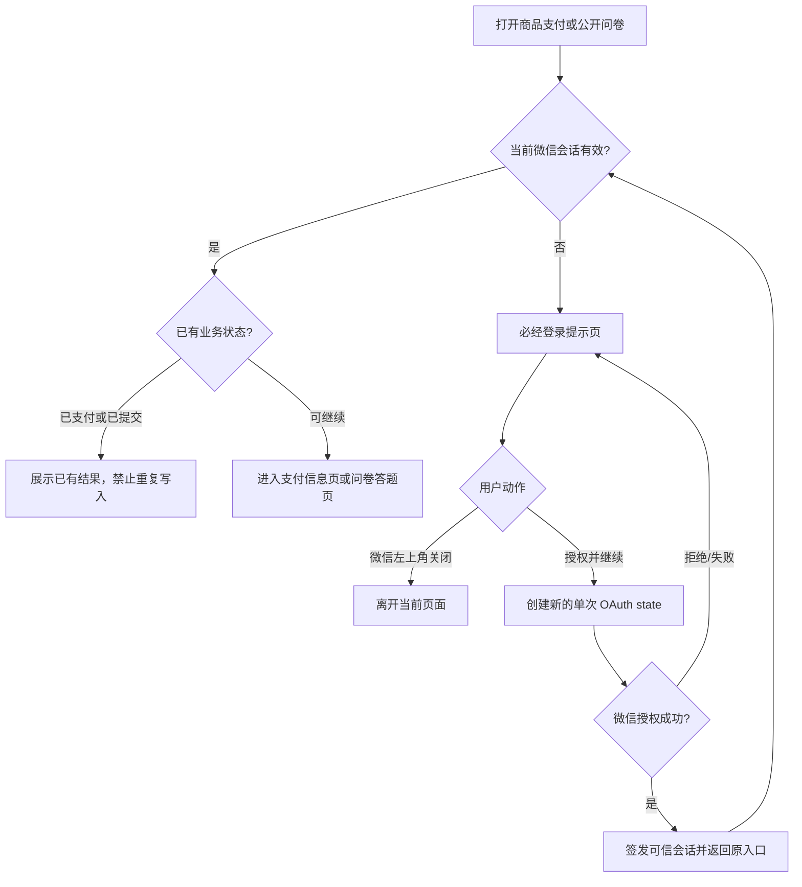

# 微信内支付与问卷的必经登录提示

## 已确认的业务决定

采用用户选定的第一种移动端视觉：浅灰画布、白色大圆角卡片、微信身份插画、醒目标题、蓝色主按钮。页面内只有「授权并继续」一个操作；离开由微信左上角原生关闭完成，不增加「退出」按钮。支付与问卷共用视觉规范，各有独立文案。

## 缺陷与根因假设

生产支付回调失败当前返回 401 纯文本页面，明确要求用户关闭重进，却没有下一步。商品页缺失会话时会自动发起 OAuth；问卷缺失会话也自动发起一次，失败时另有停用式错误面板。单次 state 已消费后不能重放，明确拒绝回调（code=authdeny 或 error=access_denied/authdeny）只找回入口、不交换 code，必须由用户再次点击创建新 state；任何重试不得创建订单、替换旧订单幂等键或提交问卷。

## 页面合同

| 场景 | 标题 | 说明 | 主按钮 |
| --- | --- | --- | --- |
| 支付 | 登录才能完成支付 | 请先完成微信登录验证，验证成功后继续支付。不会自动扣款。 | 授权并继续 |
| 问卷 | 登录才能填写问卷 | 请先完成微信登录验证，验证成功后返回问卷继续填写。不会自动提交。 | 授权并继续 |

底部为静态提示「如不继续，可关闭当前微信页面」。加载中可显示「正在核验微信身份」，但不得把它当成可无限等待的最终态。非微信环境说明须在微信打开，不伪造可用授权按钮。身份冲突保持明确的人工处理提示，不能靠重新授权绕过。

## 复用与参考

- 微信支付 JSAPI 的 OpenID 获取和授权是支付前条件；复用现有 Payment H5 OAuth 和一次性 state，不新建支付会话协议。参考：https://pay.weixin.qq.com/doc/v3/merchant/4012791870
- Shopify checkout 可要求账户登录才继续，说明登录门槛应在受保护步骤前给出清晰动作；本任务只借鉴门槛语义。参考：https://help.shopify.com/en/manual/checkout-settings/checkout-form-options
- WooCommerce 账户与隐私设置区分访客和账户结账；本产品选已确认的强制微信登录。参考：https://woocommerce.com/document/configuring-woocommerce-settings/accounts-and-privacy/
- GitHub `dghubble/gologin` 将 OAuth start/callback 分开，失败后重新启动新流程；仅作流程参考，不引入依赖。参考：https://github.com/dghubble/gologin
- 前端复用 `publicCommerce` 产品页和 `h5AuthAdapter`/`surveyPublicHost` 问卷页；不用管理端壳，不改冻结问卷 donor 模板。Product Design 的 image-to-code 路径用于匹配用户选择的第一张图。

## 边界、验收与上线

OneID：复用现有 Payment Session / Survey OAuth 对可信微信身份的校验；不新增身份映射、客户主键、隐式建客或合并。Persistence：仅原有单次 OAuth state 和会话；如增加恢复入口，只保存规范的同源 return path。External Effects：授权为 Provider 读取；点击登录不能创建订单、扣款、提交问卷或改变已有幂等标识。Payment 和 Survey 各自拥有自己的业务状态。回滚点是恢复旧页面和回调路由的前一生产包。

验收包括：缺会话显示正确门槛；点击才进入 OAuth；拒绝/失败返回同门槛且再次点击产生新 state；成功返回原商品/问卷；有效会话直达；已支付/已提交不重复；无合法恢复路径、非微信、身份冲突分别给出真实状态；移动端 360/390/430 宽度视觉对照。当前发布流程以受保护 main 的当前 PR 检查为门禁；合并后由国内预备机按第一父链串行构建、合成数据验收并以内网把同包晋级生产，检查版本、完整文件摘要、健康和两条业务读回。真实微信设备授权另行验收，不把合成结果当作 Provider 成功。

## 并行依赖

PR #33 同改 `internal/product/http/public.go` 的支付宝浏览器交接；合并前检查实时 main 和冲突。新发布器按第一父链串行处理，旧发布指挥台与候选事件仅作历史审计，不再写生产。
