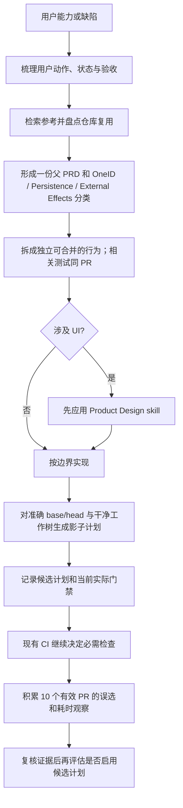

# PRD: 小步交付与受影响检查影子计划

## 业务判断

目标是让每个 PR 聚焦一个可独立合并、可回退的用户可观察能力或明确缺陷，同时在不改变现有必需 CI 检查的前提下，记录候选受影响检查计划。PRD 在父任务中形成一次；拆出的子 PR 复用同一业务 brief，只补充各自的范围差异和验收结果。

## 交付规则

- 每个 PR 交付一个独立可合并、可回退的用户可观察行为或明确缺陷；相关测试与行为放在同一 PR。按行为边界拆分，不设行数或文件数配额。
- 整个父 brief 和拆分实施留在同一个 Codex task 中；子 PR 复用父 brief，不重复要求确认已授权的业务方向。
- 涉及侧栏、客户页面或后台页面等 UI 时，编码前使用 Product Design 插件/skill。
- 普通说明、PRD 和开发 skill 文字可走文档一致性检查；改动 CI 工作流、影响选择策略的可执行代码或能力登记表时，候选检查保守全量。
- 发布失败诊断和修复由单独的 `gpt-6-luna` max agent 执行；其他工作不受此模型限制。

## 影子影响计划

- `python3 scripts/dev_preflight.py affected --base SHA --head SHA --dry-run` 从准确 Git base/head、树、策略指纹和能力登记表生成候选计划。工作树脏、head 不匹配、检查映射无效或未知路径都不得形成窄计划。
- 计划同时记录 `candidate` 与当前已执行的 `enforced` 选择，观察模式为 `shadow`。不改 `.github/workflows/ci.yml` 的实际门禁。普通本地执行会运行候选计划中的 lane、受影响 Go 包完整测试（包括新测试）及登记检查；缺失环境、日志或收据时明确标记不完整。
- PR1 使用现有 capability registry。PR2 增加 Go 包依赖闭包、按受影响包运行能力、结构化收据、计划/执行对照、每日全量回归和试验观察。未知、混合且未登记的路径保持全量回退。
- 试验观察覆盖至少 10 个不同 PR（所有类别合计），从现行门禁已执行的 lane 收据中采集；不为这 10 个观察重复运行测试。观察绑定准确 PR/run/attempt、source SHA/tree、策略、父 PRD、trusted enforced lane 清单和原 CI 结果。原门禁失败且候选也明确失败仍是有效观察；原门禁失败而候选通过是确认漏选，候选未知不计入有效观察并阻止启用。仅按该 PR trusted enforced 的实际 lane 清单判断观察完整，工具/文档轻量计划不要求未执行的应用 lane。
- 时耗配对证据独立于 10 个观察。每个拟启用类别至少有 3 个不同 PR 的实际完整/候选命令配对，必须绑定同一 SHA/tree、环境、缓存、策略、PRD 和 run/attempt，记录整条 lane 的实测耗时、设置、静态检查、测试命令与 Go JSON 日志；不能用包内测试时长之和估算。仓库生成的质量 lane `run.json` 含 canonical 执行收据；`affected_shadow.py pair` 从完整/定向 backend 收据与日志适配真实配对记录。候选 p50 至少降低 30%。
- 能力成本通过 `affected_shadow.py export-ci-history` 只读导出每个 PR 的完整 GitHub CI run/attempt/jobs 历史，失败、取消及无 jobs 的终态也计入；缺页、仍在运行或无法归属的同分支 run 均使证据不完整。成功 attempt 记录 plan 开始至 required `check` 完成的全 CI wall time，失败与取消记录 attempt 开始至终态；backend 单 lane 耗时不能代替整个 CI 成本。父 PRD 负责人须核对并留档业务能力的全部 PR 清单；评估器验证清单覆盖，不能自行证明业务范围穷尽。它同时复用候选 backend 收据、国内发布器既有 `state.json`、构建 `domestic-release.json` 与 `last_release_timings_seconds.total`；发布状态需就绪，`processed_sha`、`deployed_source_sha` 与 `prod_installed_sha` 必须一致，安装 manifest 与 source tree 精确匹配。比较清单内全部 PR 的 CI 加部署总时长之和与一份已绑定基线，不取 PR 均值。清单未经核对或缺少完整履历、source/manifest/phase timing/能力基线时保持原门禁。
- 已知缺陷重放必须证明旧门禁和候选门禁都能在缺陷版本上失败，并在修复版本上通过；缺少任一指定缺陷的双边重放结果，不得启用该类别。只有零已知漏选、样本量、耗时和能力成本条件全部满足后，才可按现有授权评估启用；未达到则保持影子模式。
- 样本统计不能替代当前必需 `check`；启用前 GitHub 现行门禁保持不变。

## 复用与参考

- 仓库复用：`scripts/ci/governance_impact.py` 的能力所有者与消费者影响，`scripts/ci/impact_selection.py` 的当前门禁与候选策略，`scripts/ci/quality_lanes.py` 的现有检查执行，`scripts/dev_preflight.py` 的本地准确源码证据。
- Google 工程实践建议以一个自包含改动作为 CL，带上相关测试，并明确指出大小没有固定行数门槛：[Small CLs](https://github.com/google/eng-practices/blob/master/review/developer/small-cls.md)。
- Nx `affected` 使用 base/head、项目图和依赖关系确定受影响项目，并要求 CI 显式设置比较端点：[Run Only Tasks Affected by a PR](https://nx.dev/docs/features/ci-features/affected)。本 PR1 只记录候选计划；PR2 再接入 Go 包图。

## 领域分类

- **OneID：不涉及。** 仅判断代码路径和测试范围，不读取或归属客户身份。
- **Persistence：不涉及。** 计划是只读、临时的 Git 派生 JSON，不保存业务数据或持久任务。
- **External Effects：不涉及。** 不调用 Provider，不发送消息，不写外部系统。

## PR1 验收与回退

- JSON 将 baseline/head SHA 与 tree、策略指纹、变更路径、候选/现行检查、选择原因和 `observed_mode=shadow` 绑定在一起。
- 脏工作树和错误 head 标记为不可作为证据，并强制候选全量；未知或混合未知路径全量回退。
- 混合发布工具与普通 PRD/skill 文档汇总为轻量候选计划，不带入无关应用消费者测试；可执行检查策略变化保持全量。
- 若影子计划出错，删除本地 `affected` 调用即可；GitHub 当前门禁和发布流程不依赖新计划。
