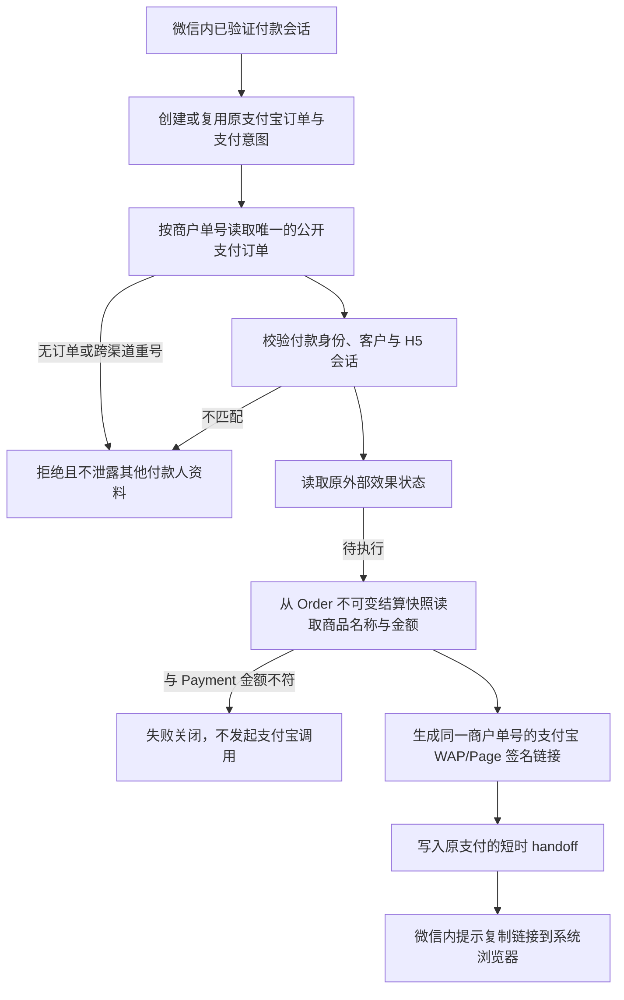

# 支付宝原订单付款链接恢复：缺陷 PRD（2026-09-24）

## 业务判断流程

## 生产缺陷与目标

- 2026-09-24 09:57–09:58 CST，支付宝支付 948、949 已创建；对应外部效果 37575、37576 为 `retryable_failed`，首次尝试的 `call_attempted=false`、`real_external_call_executed=false`，无 handoff。订单 948 的 Order 不可变快照已保存“OPC/OPT商学院”和实付金额。仅记录内部 ID，不把手机号或凭据放进 PR/日志。
- 当前支付宝适配器把仅用于微信小店退款的 `ProviderIntent.ProductID` 当作付款标题；支付宝意图该字段为空，本地标题校验失败，尚未调用支付宝。
- 当前 `GetCheckout` 只查询微信支付，且只接受微信渠道和微信预付效果类型；支付宝订单被误报为“请求失败”。
- 目标：原订单通过原会话读回，按真实 Provider/渠道检查外部效果；支付宝链接使用 Order 不可变商品快照的标题，校验快照金额与 Payment 一致。不得新建订单、替换幂等键或绕过身份约束。

## 参考与仓库复用

- [smartwalle/alipay 的 WAP 示例](https://github.com/smartwalle/alipay)显式设置 `Subject`、`OutTradeNo`、`TotalAmount` 并生成签名 URL。当前仓库已使用该 SDK，无需引入新支付库。
- 复用 `order/port.CheckoutSnapshotReader`、Payment 的 `ProviderIntentReader`、已有 `payment_handoffs` 与 External Effects；Order 表仅由 Order Store 读取，Payment 不跨领域读表。
- H5 页面沿用现有“复制支付宝链接到系统浏览器”的引导，并修复支付宝创建与读回路由、首次确定失败与响应不明时的恢复提示；交互细则见 [公开结算读回与创建恢复 PRD](2026-09-24-alipay-checkout-readback-recovery.md)。

## 边界与验收

- OneID：读取现有已验证付款会话与 canonical customer，只作授权校验，不新增身份匹配、客户或归属。
- Persistence：原订单、支付、效果状态均保持现有 Owner 与 Unit of Work；本修复读取不可变快照并修复读回，不新增表或后台队列。
- External Effects：支付宝 WAP/Page 为现有 Payment 外部效果；现有失败记录未进行外部调用。任何旧订单恢复须先核对原效果的全部尝试和收据，沿原效果 ID/代次受控重试；`outcome_unknown` 不重试。
- 验收：支付宝 WAP/Page 可用原身份查询原订单，异身份与跨渠道会话拒绝；效果类型不匹配拒绝；不可变商品名进入签名 URL，金额不匹配拒绝；隔离 PostgreSQL 16 的公开 HTTP→持久化→worker→虚拟链接旅程通过。生产 948 仍须在准确版本发布、核对未外呼证据后按原效果受控恢复。微信支付原路径保持通过。
- 发布后分别验证准确 SHA、预发布合成旅程、生产服务/订单/效果/链接回读。生成链接和技术健康不等于真实收款；真实付款由用户完成并以签名回调与订单状态确认。
