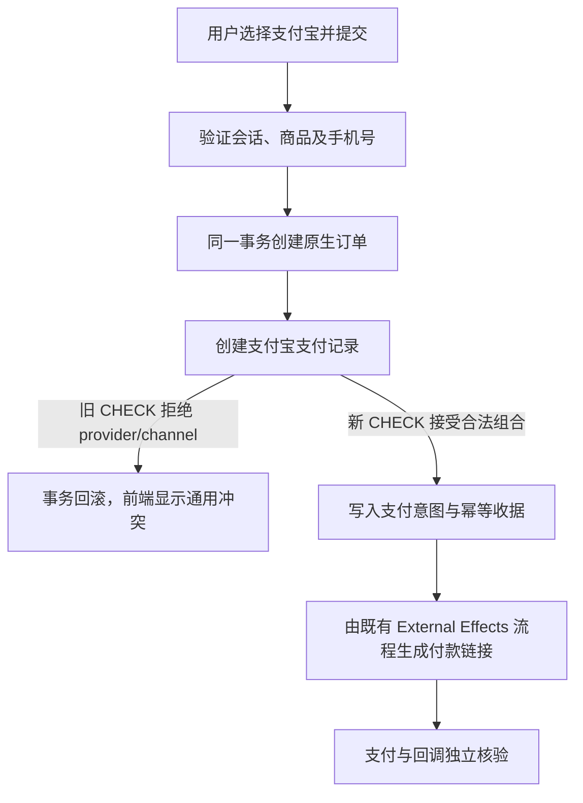

# 支付宝支付创建被旧数据库约束拒绝：缺陷合同

## 生产证据与业务判断

2026-09-24 08:58（中国时间）用户在 OPC/OPT 商学院支付页选择支付宝，页面显示“商品或手机号状态不符合购买要求”，实付金额仍为“待确认”。生产运行 V4 `39fff01c6e0dfde5a090b71415a065e21f3bbefc`；商品 55 为启用状态、¥19,800、联系信息级别为手机号；同一时段有有效且已验证的 H5 支付会话，未产生订单或支付宝支付记录。生产 `orders_origin_effect_shape` 已允许原生支付宝订单，但 `payments_provider_check`、`payments_payment_channel_check`、`payment_refunds_provider_check` 仍只允许微信值。Payment 创建支付宝记录时违反 CHECK，整笔 Unit of Work 回滚；HTTP 把数据库冲突折叠成通用 `conflict`，前端因此误提示商品或手机号不合格。

## 修复范围与架构分类

- 新增 Payment Owner 的 forward-only 迁移，允许 `payments.provider=alipay`、`payments.payment_channel=alipay_wap|alipay_page`、`payment_refunds.provider=alipay`。既有微信值继续允许，未知值仍拒绝。不重写历史支付、退款、意图或订单数据。
- 复用现有 Order/Payment 同一 PostgreSQL Unit of Work、支付幂等收据、External Effects 支付意图、回调验签与对账；不新增 Provider 调用、重试或第二套队列。
- OneID：只使用已验证 H5 会话中的 canonical payer/beneficiary；不改身份归属。
- Persistence：本次只调整 Payment Owner 表的 CHECK；支付及其意图仍原子提交，Provider 网络调用不在事务内。
- External Effects：沿用 `alipay_wap_pay_v1` / `alipay_page_pay_v1` 和既有 `outcome_unknown` 处理。
- 前端无需改动；文案是后端冲突映射的结果。本次不开发前端能力。

## 验收与回滚

1. 在 PostgreSQL 16 上按当前迁移序列创建原生支付宝订单，再创建 WAP 与 Page 支付记录；退款记录可使用支付宝 provider。
2. 保留微信创建路径，并明确拒绝未知 provider 和未知 channel；相同幂等键不生成第二笔支付。
3. 预发布以当前 V4 main + PR head 的准确 merge-preview 构建，完成带虚拟 Provider 的收银台旅程和数据库读回；这只证明合同和跳转流程。
4. 指挥台串行合并后晋级同包，核对生产 release SHA、迁移、健康、认证读回和支付页；真实小额支付宝付款、可信回调与订单读回单独作为业务验收。若真实支付结果未知，只读对账，不重试换键。
5. 发布前可撤销候选。迁移安装后不能收紧 CHECK 以免拒绝合法新记录；如需暂停新交易，使用既有支付宝开关并保留对账数据。

## 参考与复用评估

- 本仓 `migrations/0202_alipay_web_payment.sql` 已扩展支付宝效果与回调 allowlist，但遗漏 Payment 核心表；本次补齐同一合同，不换支付 SDK。
- GitHub 案例 [`gocardless/nandi` 的约束迁移 fixture](https://github.com/gocardless/nandi/blob/a423b98d70e85701282b72eb87ac8aedfc39eb9f/spec/nandi/fixtures/rendered/active_record/drop_constraint.rb) 演示以显式 `DROP CONSTRAINT` 更新数据库约束。本仓沿用既有迁移风格，并以真实 PostgreSQL 测试验证目标约束。
