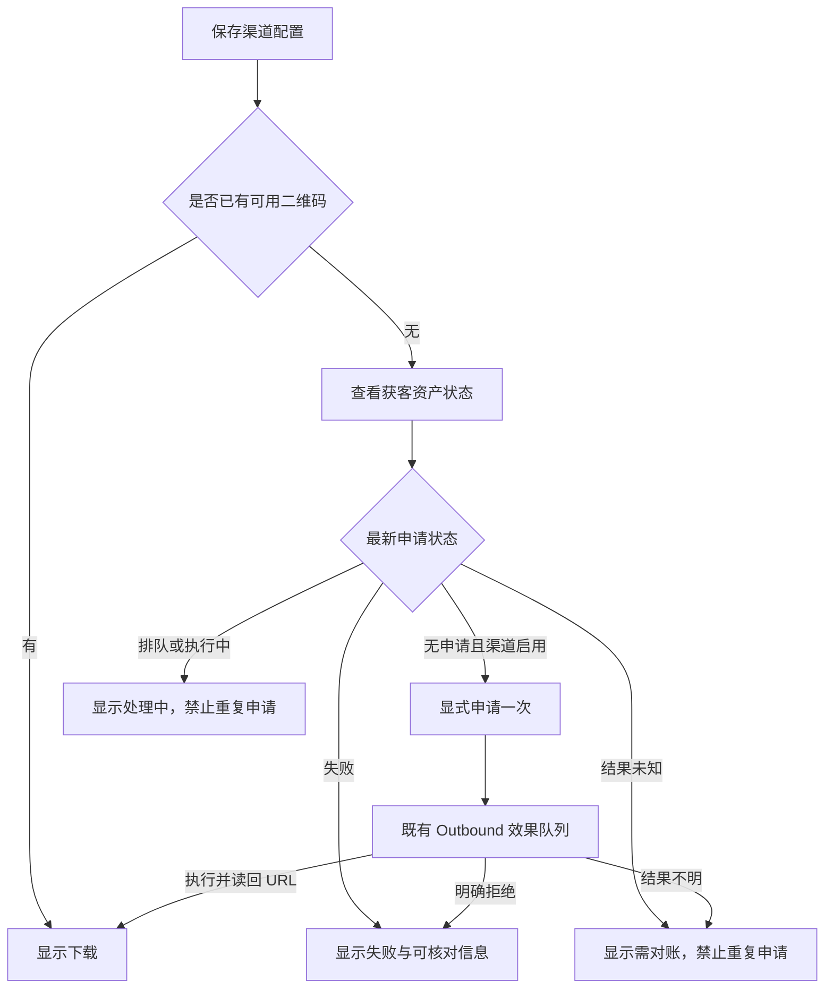

# 渠道二维码生成热修缺陷合同（2026-09-25）

## 生产证据与业务判断

- 初查时生产版本 `3ab9946d45b99101d483e23d8a68c2492047b748`。渠道 57、58 已保存为启用的二维码配置，却没有 `channel_acquisition_assets` 记录；列表显示“后端未返回二维码地址”，没有可见申请入口。详情抽屉的申请按钮存在，但其三元表达式未被模板引擎渲染，按钮没有文字。
- 对渠道 58 仅申请一次后，资产 5／效果 `eer_38711` 进入 `outcome_unknown`；外部调用计数为 1，企微只读列表及详情按本次唯一 state 回查没有找到资产。此读回不能单独证明企微从未执行，禁止自动重试或直接结算为失败。
- 首轮热修版本 `ddcca554dbb4e9c6557493816ae5127cec5a7329` 已直接部署生产。页面入口与结果未知防重复读回通过；对现有测试渠道 57 申请一次，效果 `eer_38713` 收到企微明确拒绝，成为 `final_failed`。进一步检查发现空 `scene_value` 被组装为 51 字符的 `state`，超过“联系我”接口的 30 字符约束。单人二维码请求还应使用 `type=1`，而企微可返回 HTTP 的 `qpic.cn` 二维码地址，应用须仅对可信主机升级为 HTTPS 再供同源下载。
- 业务预期：保存渠道配置后，管理员能看见明确的“查看并申请二维码”入口；申请被接受仅表示排队，只有执行／对账且得到有效受控 URL 后才开放下载；结果未知需对账，不能再发新的 Provider 写入。

## 参考与复用

- 企微“联系我” API 的 `scene=2` 返回二维码 URL；参考 [smart-unicom/wecom](https://github.com/smart-unicom/wecom/blob/main/contact_way.go) 和 [go-laoji/wecom-go-sdk](https://github.com/go-laoji/wecom-go-sdk/blob/develop/external_contact_way.go) 的 `config_id`／`qr_code` 明确返回值，不以 HTTP 202 或排队收据当作二维码。
- 参考 [企业微信开发者文档](https://developer.work.weixin.qq.com/document/path/92572) 的“联系我”请求约束，以及 [go-workwx 的请求结构](https://github.com/xen0n/go-workwx/blob/v2/external_contact.md.go) 中 `state` 的 30 字符限制。Provider 请求和渠道归因绑定必须计算同一个不超过 30 字符的默认 `state`。
- 复用本仓 Channel Catalog、`/api/admin/channels/{id}/acquisition-assets`、同源二维码下载、Outbound/External Effects 和现有管理端列表／抽屉。冻结 donor 只作为模板输入；前端变更放在 `web/v3/channelCenterAdapter.ts`，不新造 Provider 写入通道。

## 边界与验收

- OneID：不涉及客户身份解析或归属；仅对渠道配置和资产申请操作。
- Persistence：渠道配置使用原有本地事务；资产申请使用现有持久效果队列，真实企微写在事务外。数据 Owner 为 Channel；Outbound 是唯一企微写入者。
- 对已有 `queued`、`attempted`、`outcome_unknown` 的同渠道二维码，服务端拒绝新增申请；`outcome_unknown` 先人工只读对账。明确企微拒绝可归为 `final_failed`，保留可审计收据。
- 验收：列表缺码行有可见入口；详情按钮有文字且重复点击不产生第二个效果；202 只显示“已受理／待执行”；已完成 URL 才显示下载；停用渠道不能申请；生产资产 5 不被重试。受影响前端模板测试和 Channel/Outbound 专项测试通过，预发布真实部署与读回后再交发布指挥台。
- 补充验收：默认 `state` 长度为 30 且与归因绑定一致；单人二维码请求发送 `type=1, scene=2`；仅允许可信 `qpic.cn` 主机的二维码 URL 升级为 HTTPS；生产测试渠道 57 应取得企微实际二维码并能通过后台下载。
- 回滚：生产仅晋级预发布已验收的同一包；若业务读回失败，由发布指挥台按现有 release receipt 回滚。旧 `outcome_unknown` 状态不因回滚而抹除。
