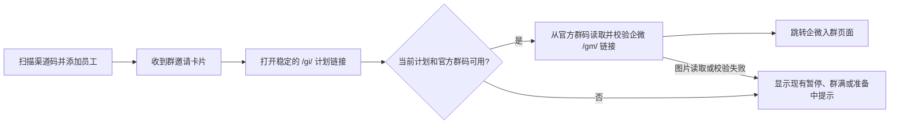

# 群邀请卡片直达企微页面热修

状态：用户已于 2026-09-25 明确要求热修图 1 卡片点击后直达图 3。

## 业务判断与流程

现状是 C 展示企微二维码图片，用户还要长按识别才能到 F。生产只读核验：渠道“拉群热修”当前欢迎素材引用计划 11“测试多群计划”；计划为 `sequence/active`，官方群码效果为 `executed`，二维码图片来自 `wework.qpic.cn`。用户提供的图 2 二维码指向 `work.weixin.qq.com/gm/...`，图 3 是该链接打开的企微页面。Product Design 流程复核的结论：多一次长按识别阻断了卡片的主要行动；直达时应保留暂停、群满、准备中的明确状态和现有二维码回退路径。截图不能证明真实扫码入群或无障碍完整性。

## 修复合同

1. 保留 `/gi/<token>` 作为稳定入口及现有卡片素材 ID；每次访问先读取当前计划状态。只有计划 active、当前群确定、企微 `join_way` 已执行或对账完成时才尝试直达。
2. 从现有企微 `qr_code` 图片地址安全下载图片，解出二维码中的 `https://work.weixin.qq.com/gm/<opaque>`；严格校验 HTTPS、固定域名、单段路径、无凭据、端口、查询或片段。成功时返回临时跳转。不能由 `config_id` 猜测企微地址。
3. 图片不可用、解码失败或内容不可信时，显示现有入群提示页及官方二维码；暂停、群满、准备中同样保留现有页面。公开 JSON 合同和后台“下载企微入群码”保持现状。
4. 不修改渠道回调、OneID、欢迎语、计划配置、群切换、Provider 写入或生产数据。生产发布前后的核对分别记录准确版本、健康、已认证计划读回、真实测试卡片点击与企微页面及群轮替观察。

## 架构与复用

- OneID：不涉及身份解析或归属变更；仅处理现有群邀请入口。
- Persistence：Provider 图片读取；本热修不新增业务表或事务。
- External Effects：无 Provider 写入；复用已有 `fetchOfficialQRCode` 的图片域名、TLS、大小、尺寸和无重定向约束。
- QR 解码采用纯 Go 的 [gozxing](https://github.com/makiuchi-d/gozxing)；企微[客户群加入群聊接口](https://developer.work.weixin.qq.com/document/path/92229)返回二维码图片而非文档化的直接 `/gm/` 链接。参考现有单配置、稳定二维码与 `update_join_way` 的[群邀请计划合同](../plans/2026-09-18-group-invitation-plans.md)，不冻结某个当前群的链接。

## 验收与回滚

- 有效官方群码：`/gi/` 首次点击直接到受信企微 `/gm/` 页面；计划更新后入口仍指向同一已确认企微码。
- 暂停、群满、准备中、恶意二维码、图片异常：不得跳转到不可信页面或错误群，现有页面可继续引导或说明状态。
- `?format=json` 和官方码下载、渠道欢迎语素材引用保持可读。Go 专项、Host 旅程和预发布业务读回分层报告。
- 回滚同一发布包到上一个已验收版本即可恢复原有展示二维码的行为；不需回滚生产数据。
