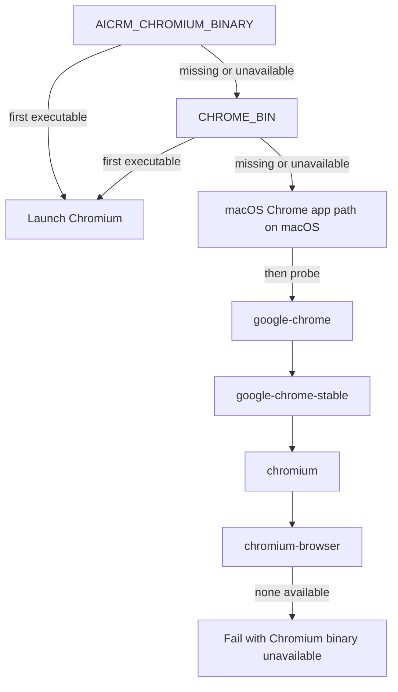

# Ops CPU profile Chromium binary selection contract

## Defect and scope

`TestPostgreSQLOpsCPUProfileChromiumJourney` can start the wrong executable on Linux: its embedded browser script honors `AICRM_CHROMIUM_BINARY` and otherwise hardcodes `chromium`. It ignores `CHROME_BIN` and installed `google-chrome` binaries, so DevTools never becomes ready when the runner exposes Chromium under those names.

The test journey will resolve its executable through the same selector used by the Data Workspace Chromium journey. Both journeys will share the candidate order and executable probe.

## Selection flow

Each candidate is probed with `--version`; the first successful candidate is used. The journey then follows its existing process and DevTools readiness checks.

## Acceptance

- The Ops CPU profile journey honors both explicit environment overrides and chooses the first executable available from the supported defaults.
- Data Workspace keeps its existing selection behavior through the shared resolver.
- Focused tests cover explicit override order, the Linux `google-chrome` fallback, macOS candidate ordering, and a clear error when no executable is available.
- The selector remains stateless and does not change customer identity, business persistence, or Provider behavior.

## Reuse and classification

- GitHub reference: merged [PR #45](https://github.com/qianlan33333-png/AI-CRM-v4/pull/45) added the Data Workspace selector and deterministic candidate-probe tests. Generalize that implementation for both journeys instead of adding a second fallback list.
- OneID: not involved; this only selects a local browser executable for an administrator diagnostics test.
- Persistence: stateless selector; the surrounding journey continues using its isolated PostgreSQL test fixture.
- External Effects: not involved; the test launches a local child process and makes no Provider calls.
- Frontend: not involved; no interface code changes.
- Rollback: revert this PR to restore the previous selector path.
