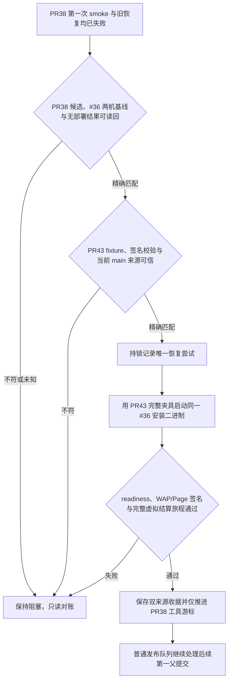

# PR38 预发烟测夹具一次性恢复缺陷合同

## 业务判断与流程

PR38 的发布工具变更仍须通过其原定的已安装支付宝虚拟结算旅程。#36 应用包没有损坏。第一次失败有两个测试夹具原因：PR38 在隔离 schema 中执行 migration SQL，却没有登记 `platform_schema_migrations`，导致 #36 readiness 检查持续返回 `503 not_ready`；PR41 补上台账后，其最后一条断言又把虚拟 HTTP gateway 的调用数要求为大于零，但该 server 只计数 `alipay.trade.query`。WAP/Page 的支付链接由 `BuildWapPay`/`BuildPagePay` 在本地签名生成，不会查询网关。实际烟测在报错前已完成两种 handoff URL 结构检查和订单、支付、意图持久化读回，因此 provider-call 断言把“生成链接”误判成“必须发起查询”。

PR43 `948ffd35063efcb8609cd6c33eff48acf9697b0b` 同时继承 migration-ledger 修复，修正该断言为不发 HTTP API 请求，并校验 WAP/Page 的 RSA 签名和篡改拒绝。只有该准确 PR43 fixture 的直接预发烟测通过后，才可使用它消耗 PR38 的一次恢复机会；PR41 的结果不能视为完整验收通过。

**实际预发演练已通过。** 2026-09-25，单一发布执行者在不写发布账本的独立演练中，用 PR43 fixture 对已安装 #36 二进制完成 WAP/Page 虚拟结算旅程及签名校验，耗时 85.3 秒。核对值：PR43 tree `8a356497374af9a913d7d28ccec78ca55df20586`，#36 binary SHA-256 `27837da34e3d05e0aabc0694baf1dfa6fe490d180e0a50486b7d130c3beec10f`，manifest SHA-256 `aaf11cfd46c36f1efdb39ea500a215769da3d99ec0ec3d0b6dff21fd02ec0ad3`，安装 helper SHA-256 `2a6c8a222dee5d19e505083d8311f548d8effafcb3fd68f856d8a24c82fa46f7`。演练后预发和生产仍健康运行 #36；没有残留 schema、进程或快照，账本 SHA 与 one-shot marker 均未改变。因此这项证据满足恢复前的 fixture 演练门槛，但没有消耗 PR38 的恢复机会，也没有推进队列或部署。

## 范围与分类

- OneID：不涉及；只运行本机隔离合成结算旅程。
- Persistence：仅更新受锁发布状态中的一次性尝试和成功收据；临时 schema 由现有夹具清理。
- External Effects：真实支付不涉及；使用 loopback 虚拟支付宝。
- 不安装、构建、传输或晋级应用包，不写生产，不改 PR38 候选源码，也不重置任何预发数据库。

## 信任与停止条件

恢复入口只接受准确 PR38 `32043f2ecdb814270245dbf2b3840eb868e0a33f`、原 PR37 游标、准确已安装 #36 SHA、首次烟测失败及已消耗的原恢复标记。必须重新读取预发与生产当前版本、清单、健康和 PR38 收据/备份状态，拒绝 `outcome_unknown`、任何目标收据、版本/清单不一致、队列头变化或已有本恢复尝试。

测试夹具取自已合并 PR43 精确提交，不在 PR38 snapshot 中叠补文件：candidate `32043f2ecdb814270245dbf2b3840eb868e0a33f`、fixture `948ffd35063efcb8609cd6c33eff48acf9697b0b`、fixture tree `8a356497374af9a913d7d28ccec78ca55df20586`、smoke 文件 SHA-256 `4176c260dd4fa89b0036aa37a9f6fac33c58d3a7262f4c65e40d334af7f71eeb`、migration fixture SHA-256 `b75eebf20e210aecb4f1d960a2adb9522b45468a2f014435d377f435ebbe197b` 和固定 helper SHA-256 `2a6c8a222dee5d19e505083d8311f548d8effafcb3fd68f856d8a24c82fa46f7` 分别写入 receipt。PR43 必须是当次准确 `origin/main` 的祖先；对象和摘要变化即停止。成功只将旧发布账本的 `processed_sha` 前进至 PR38，部署 SHA 仍为 #36，让原串行发布器逐个处理后继提交。

持久写入 attempt marker 后发生的任意失败或进程中断都会消耗这唯一一次尝试；不得清除 marker 后重跑，不得自动重试。之后仍由原发布执行者只读对账或创建新候选。

## 参考与仓库复用

- 本仓 PR41 `[test(release): record migrations in synthetic smoke schema]` (`e8456a9`) 补上 synthetic schema 的 canonical migration ledger。
- 本仓 PR43 `[test(release): verify generated Alipay URL signatures]` (`948ffd3`) 将 WAP/Page gateway API 调用数验证为零，同时校验签名并证明篡改会失败。
- 复用 `scripts/domestic_release.py` 的既有 PR38 固定身份、first-parent 队列、发布锁、host readback、`run_stage_smoke`、固定安装包与摘要验证；不新建 runner、schema 清理流程或第二套发布账本。
- 复用 `deploy/domestic-promote.py` 现有 `--run-staging-smoke` 路径，并将测试代码树明确绑定为 PR43 commit。

## 验收

1. PR38 旧 smoke 初始化因缺少迁移台账导致 readiness 失败；PR43 对相同迁移序列记录准确 checksum，并把 gateway HTTP API 调用断言设为零。
2. 只有本次精确候选、PR43 fixture 来源、#36 两机无收据/备份的唯一状态可进入恢复；真实预发烟测必须证明已安装 worker 产生 WAP/Page handoff、持久化正确，并验证签名及篡改拒绝。
3. 错误 main、fixture SHA/tree/file hash、生产结果未知、任一版本或清单变化、已有新 recovery marker、非队首候选全部拒绝且不调用 smoke/install/传输。
4. 失败或崩溃后不允许第二次执行；成功后 receipt 同时保存 candidate #38 与原始 fixture PR43 执行收据，游标只推进到 PR38，部署 SHA 保持 #36。
5. 本次不宣称 PR39 或后续候选已部署。
