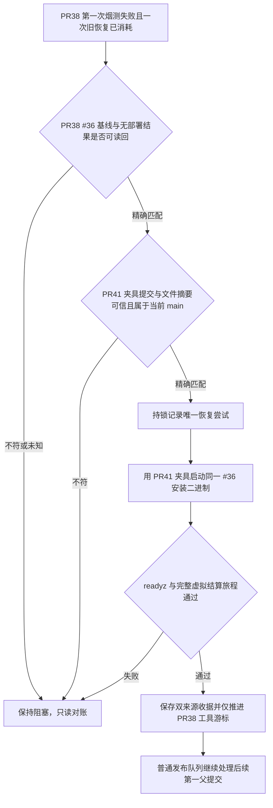

# PR38 预发烟测夹具一次性恢复缺陷合同

## 业务判断与流程

PR38 的发布工具变更仍须通过其原定的已安装支付宝虚拟结算旅程。当前阻塞不是应用包损坏：准确 PR38 夹具在隔离 schema 手工执行了 migration SQL，却没有登记 `platform_schema_migrations`；已安装 #36 程序的 `/readyz` 会检查该台账，因此子 API 进程保持运行但持续返回 `503 not_ready`。PR41 `e8456a9ef91efe00a3f9c87514363eb6436fff35` 已为合成 schema 写入每条 canonical migration 的版本、名称和 SHA-256，并加入 readiness 回归。

## 范围与分类

- OneID：不涉及；只运行本机隔离合成结算旅程。
- Persistence：仅更新受锁发布状态中的一次性尝试和成功收据；临时 schema 由现有夹具清理。
- External Effects：真实支付不涉及；使用 loopback 虚拟支付宝。
- 不安装、构建、传输或晋级应用包，不写生产，不改 PR38 候选源码，也不重置任何预发数据库。

## 信任与停止条件

恢复入口只接受准确 PR38 `32043f2ecdb814270245dbf2b3840eb868e0a33f`、原 PR37 游标、准确已安装 #36 SHA、首次烟测失败及已消耗的原恢复标记。必须重新读取预发与生产当前版本、清单、健康和 PR38 收据/备份状态，拒绝 `outcome_unknown`、任何目标收据、版本/清单不一致、队列头变化或已有本恢复尝试。

测试夹具取自已合并 PR41 精确提交，不在 PR38 snapshot 中叠补文件：候选、夹具提交、夹具 tree、smoke fixture 文件摘要、迁移初始化文件摘要、固定 helper 摘要分别写入 receipt。PR41 必须是当前准确 `origin/main` 的祖先；对象和摘要变化即停止。成功只将旧发布账本的 `processed_sha` 前进至 PR38，部署 SHA 仍为 #36，让原串行发布器逐个处理后继提交。

持久写入 attempt marker 后发生的任意失败或进程中断都会消耗这唯一一次尝试；不得清除 marker 后重跑，不得自动重试。之后仍由原发布执行者只读对账或创建新候选。

## 参考与仓库复用

- 本仓 PR41 `[test(release): record migrations in synthetic smoke schema]` (`e8456a9`) 是直接修复：migration 执行与 canonical ledger 写入在同一事务完成，并验证 readiness 与来源 checksum。
- 复用 `scripts/domestic_release.py` 的既有 PR38 固定身份、first-parent 队列、发布锁、host readback、`run_stage_smoke`、固定安装包与摘要验证；不新建 runner、schema 清理流程或第二套发布账本。
- 复用 `deploy/domestic-promote.py` 现有 `--run-staging-smoke` 路径，并将测试代码树明确绑定为 PR41 commit。

## 验收

1. PR38 旧 smoke 初始化代码经 readiness 合同必定缺少台账并失败；PR41 版本在相同迁移序列中写入全部准确 checksum 后 readiness 通过。
2. 只有本次精确候选、PR41 fixture 来源、#36 两机无收据/备份的唯一状态可进入恢复。
3. 错误 main、fixture SHA/tree/file hash、生产结果未知、任一版本或清单变化、已有新 recovery marker、非队首候选全部拒绝且不调用 smoke/install/传输。
4. 失败或崩溃后不允许第二次执行；成功后 receipt 同时保存 candidate #38 与 fixture PR41 身份，游标只推进到 PR38，部署 SHA 保持 #36。
5. 本次不宣称 PR39 或后续候选已部署。
