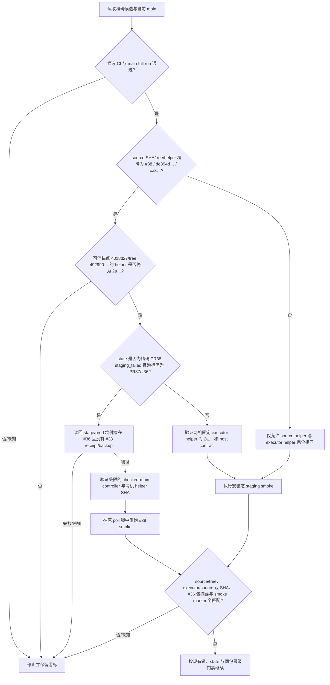

# PRD：PR38 staging smoke 固定 helper 前向兼容

状态：已确认冻结（仅发布工具修复）
负责人：AI-CRM-v4 发布执行者
板块：发布控制器 / staging smoke
分支/worktree：`codex/pr38-smoke-forward-helper`
基线：main `4018d27e719a4f54b279df1c33e1fe8d69882855`，tree `49299006dd4db445f368351ef26f7e2173586a27`

## 1. 业务判断

- 场景：已检查的 #38 候选 `32043f2ecdb814270245dbf2b3840eb868e0a33f` 必须通过安装态 staging smoke，才能按原串行发布状态机继续。
- 失败原因：#38 的 smoke helper 从 Git archive 建立只读源码快照；Node source-view 准备脚本要求 `source/.git/index`。#38 固定 helper `ca3ae4c8c8022620ba87e1d6c0c006fac222b0e63419c56adfb65b852ff3f5f9` 没有在快照中附加 Git metadata，因此失败关闭。
- 已合并修复：PR40 merge `cba3247932e4e79efbfe07a7b8533510be0d4757` 的 helper SHA 为 `2a6c8a222dee5d19e505083d8311f548d8effafcb3fd68f856d8a24c82fa46f7`，增加隔离的 `.git/index` metadata 并验证它不指向 live index。#38 候选自身仍必须保留来源 helper SHA `ca3…`；不能把其来源改写为 `2a…`。
- 成功标准：只对精确 #38 source SHA/tree + 来源 helper SHA `ca3…`，允许使用已合并可信 main `4018d27…`/tree `49299006…` 中的固定 smoke executor helper SHA `2a…`。staging smoke 继续测试已安装的 #36 包；receipt 同时绑定 source/executor helper 双 SHA、source SHA/tree、installed SHA、manifest SHA、binary SHA 和通过 marker。任一字段不匹配都停止，不推进 cursor、不安装候选。
- 范围：不改变应用包、业务数据或支付测试门禁；不允许任意未来 helper、未知 source、手改账本、跳过 staging smoke 或单独晋级生产。

## 2. 业务判断流程

## 3. GitHub 与仓库参考

| 来源 | 可借鉴能力 | 采用/舍弃 |
| --- | --- | --- |
| [PR40 `fix(deploy): prepare source views in staging smoke archive`](https://github.com/qianlan33333-png/AI-CRM-v4/pull/40) | 固定 helper 在归档快照上附加隔离 Git index；相关 helper 与测试已合并且 checks 通过 | 复用其 `2a…` 已审查实现，不复制第二套快照准备逻辑 |
| `scripts/donor-source-views.mjs` 中的 `gitDirectory()` / `gitIndexStamp()` | source-view 准备明确要求快照含 `.git/index`，且通过 `git ls-files` 读取索引 | 保留脚本契约；不弱化成只信任环境变量 |
| [Git `git archive` 文档](https://git-scm.com/docs/git-archive) | archive 是版本树文件快照，不包含可写工作区的 `.git` 控制目录 | 继续用归档保证候选源码不可变；Git metadata 由固定 helper 用独立 index 安全附加 |

## 4. 复用与架构分类

- 已有模块：`scripts/domestic_release.py` 的固定 controller 验证、staging smoke 和 receipt 校验；`deploy/domestic-promote.py` 的 PR40 快照隔离实现。
- 采用：候选来源 helper digest 与可信执行 helper digest分开记录；仅为 #38 的精确 SHA/tree/hash 对开放兼容；执行 helper 固定锚定 4018d27 中的 `2a…`。
- OneID：不涉及；不读取或分配客户身份。
- Persistence：本地发布控制状态/receipt 文件；沿用现有发布锁与 `atomic_json`。不触碰业务 PostgreSQL。
- External Effects：不涉及业务 Provider 写入；GitHub 读取用于现有 CI/main 校验，staging smoke 仅访问 staging 本机服务和数据库。
- 数据 Owner：发布控制器拥有 staging smoke receipt；业务表无变化。
- 事务边界：沿用现有单次 poll 锁与状态原子写；失败不前移 cursor。

## 5. PR 接口与错误语义

- 正常候选：来源 helper digest 必须与 staging/prod 当前 fixed helper digest相等。
- 唯一兼容候选：source SHA `32043f2ecdb814270245dbf2b3840eb868e0a33f`、tree `de394d4902d56337d110d2acd0a2f889f9dc0be6`、source helper SHA `ca3…`；可信执行工具锚定 source SHA `4018d27e719a4f54b279df1c33e1fe8d69882855`、tree `49299006dd4db445f368351ef26f7e2173586a27`、helper SHA `2a…`。
- 当前 checked main 必须是该可信锚点的后代，且当前 main 中 helper 文件仍精确为 `2a…`；不接受任意较新 helper。
- 固定 controller 允许前向字节匹配的唯一候选是精确 PR38；controller 安装字节必须等于本次已检查、full regression 通过的 current main 完整文件 SHA-256；builder 同时锁定 PR38 审核过的 SHA-256 `775be1…`。核验记录包含 main SHA/tree 与候选/安装文件 SHA-256；后续 main controller 改动若未同步安装会被拒绝。
- `staging_failed` 只允许精确 PR38 的恢复：state 游标必须是 PR37/#36、failure 与 smoke 记录必须匹配已知失败形态；PR38 必须仍是下一提交。恢复前在 poll 锁内只读核验 stage/prod healthy、current/manifest 仍为 #36，并确认两机都不存在 #38 install receipt 或 backup；任何偏差都停，不改 state 游标、不重试安装。SMOKE 恢复只允许一次，启动前先写入 attempt guard；结果未知或再次失败后只读对账，不重试。
- receipt 字段：`source_helper_sha256`、`executor_helper_sha256`、原始 `helper_sha256`、`source_sha`、`source_tree`、`installed_sha`、`manifest_sha256`、`installed_binary_sha256`、`test_marker`、`verified_at_utc`。
- 未知状态、helper mismatch、tree mismatch、receipt 缺字段或 smoke 失败：沿用失败关闭，保留 cursor 与证据，不重试安装。

## 6. 测试与验收

| 测试层 | 适用性 | 验收 |
| --- | --- | --- |
| 控制器专项测试 | 必须 | 精确 #38→4018 helper 对通过；错误 SHA/tree、main helper 改动、未知未来候选、两机 helper 不同均拒绝 |
| receipt 单元测试 | 必须 | source/executor 双 SHA、source/tree、#36 installed SHA/manifest、binary digest/marker 任一不匹配即拒绝 |
| 发布状态测试 | 必须 | 缺失或失败 smoke 不推进 state/cursor、不调用 production copy；成功后只走现有状态机；真实 `staging_failed` #38 state 只能经两机 #36/无 #38 receipt 读回后恢复 |
| 前端、OneID、业务迁移、Provider | 不适用 | 未改应用运行时或业务数据 |
| GitHub checks | 必须 | 新 PR 当前 head required checks 全绿；合并后 main 新 tip 重新核对 full regression 成功 |

## 7. 并行快照、上线与回滚

- PR 脚本/测试只改发布控制器；release 工作流串行，由当前唯一发布执行者负责。
- main 当前 `4018d27…`；新 PR 合并后必须对新的准确 main tip 重新验证 required checks 和 force-full marker。
- 安装前继续确认 timer stopped、stage/prod host contract、fixed helper hash、#36 ready 和无未知生产结果。
- PR40 helper `2a…` 仅按已验证来源部署；staging smoke 仍运行 #38 source/tree 对 #36 安装包。通过后再按既有串行门禁处理后续候选，生产仍晋级预发布验收的同一包。
- 若修复/检查失败，保持 timer 停止与原生产 #36；保留状态和日志；通过新 PR revert 修复，不删除 receipt、不修改业务数据、不伪装 #38 已完成。

## 8. 变更分类

`change_class=governance_only`。runtime package、staging app install、业务 readback 均 N/A；交付依赖发布控制器专项测试、PR governance checks、main full-run read回和部署后发布读回，不生成虚假业务 receipt。
