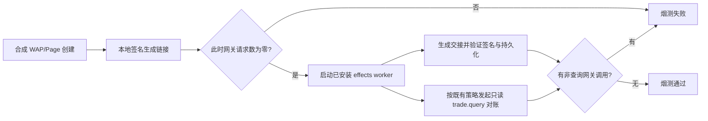

# PRD：PR48 安装态烟测区分支付链接与对账查询

日期：2026-09-25
范围：发布验证夹具；不改变支付、SCRM 或生产发送逻辑。

## 业务判断

PR48 合并候选 `960b30e` 已在国内预备机安装健康。固定安装态支付宝烟测在 WAP/Page 链接、签名和持久化读回均通过后，因合成网关收到两次 `alipay.trade.query` 而失败。两笔支付各自进入既有 River 对账任务；该只读查询发生在 effects worker 启动后，和本地签名生成支付链接是不同动作。生产尚未安装本候选。

## 参考与复用

- [PR43 安装态支付宝烟测](https://github.com/qianlan33333-png/AI-CRM-v4/pull/43)验证本地签名的 WAP/Page URL，原零调用断言适用于当时的已安装二进制。
- 当前 `internal/payment/completion.go` 已在支付交接效果完成后把两笔支付送入现有 River 对账；`internal/payment/reconciliation_river.go` 只执行 `ReconcileAlipayPayment` 的查询。本次继续复用该行为，不关闭支付对账、不建立新队列。

## 最小实现与验收

在 effects worker 启动前检查合成网关请求数为零，证明创建和签名阶段没有服务商 HTTP 调用。worker 启动后，合成网关只允许 `alipay.trade.query`；任何其他方法仍使烟测失败。保持原有 WAP/Page 链接、RSA 签名、订单和支付持久化读回。用同一已安装候选的固定 helper 重跑烟测，通过后才允许生产安装。

OneID 不涉及；没有新的业务持久化。External Effects 只观察既有支付对账读取，SCRM 发送门禁不变。预备环境当前已安装不代表生产已上线；生产安装后仍需独立健康、版本和业务读回。
