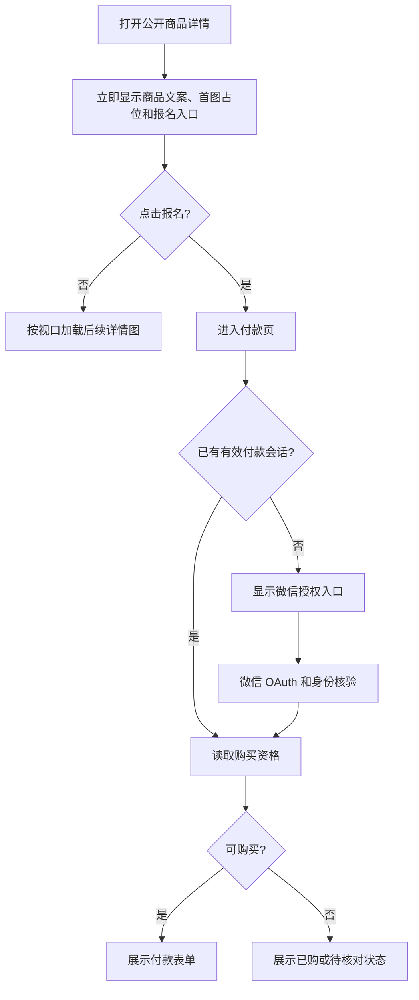

# 公开商品与微信登录加载缓慢：缺陷合同

## 业务判断流程

公开商品内容不需要付款身份；创建订单、查看个人购买状态仍需要原有可信会话与资格校验。

## 线上证据与根因

- 2026-09-25 02:03–02:07 的用户截图显示商品、微信登录和身份核验分别出现等待或局部绘制。
- 生产版本 `3ab9946d45b99101d483e23d8a68c2492047b748`，CPU/内存正常；公开页面与静态资源首包约 0.1–0.3 秒。`/p/122331` 在未登录浏览器实测只显示“登录才能完成支付”，商品内容被隐藏。
- 同一详情页先串行请求 `/api/v1/wechat-pay/checkout-session`、`purchase-status`，成功后才执行 `revealProduct()`；无会话时先跳微信授权。公开展示被付款资格依赖阻塞。
- 当前商品页约 158 KB，其中约 109 KB 是没有收货地址时仍内嵌的省市区数据。登录插图为 1,245,266 字节 PNG；商品的 5 张原图共约 3.2 MB。5 图在生产机本地各约 0.1 秒返回，外网并发下载约 4–6 秒，表明主要开销在传输与页面编排。
- 生产 `payment_h5_oauth_states` 最近 12 小时已消费的 14 次授权，发起至消费平均 2.4 秒、最长 7.3 秒；02:00–02:10 的 3 次平均 6.0 秒。这只覆盖 OAuth 状态消费，不证明 Provider 交换和用户手机端总耗时。
- 生产 Caddy 未启用响应压缩；本缺陷先在应用内容与图片体积上修复，Caddy 配置由发布窗口单独核对。

## 参考与复用

- [web.dev LCP 与关键图片加载](https://web.dev/articles/optimize-lcp) 和 [web.dev 响应式图片](https://web.dev/articles/responsive-images)：缩小传输字节并优先首图、延后视口外图片。
- [MDN Cache-Control](https://developer.mozilla.org/en-US/docs/Web/HTTP/Reference/Headers/Cache-Control) 和 [Caddy encode 文档](https://caddyserver.com/docs/caddyfile/directives/encode)：哈希资源长缓存，HTML 按协商压缩。
- [GoogleChrome Lighthouse 的图片检查](https://github.com/GoogleChrome/lighthouse/blob/main/docs/new-audits.md)：参考其大图压缩与尺寸检查口径。
- 复用现有 `Product` 公开路由与图片绑定校验、Media `large_1440` 变体、已有付款会话和购买资格接口；不新增身份解析、订单状态机或素材存储。

## 修复范围与验收

1. 有详情图的 `/p/{code}` 首次 HTML 只包含公开商品、详情图片和报名链接，脚本不请求付款会话、不启动 OAuth。没有详情图时维持跳转 `/pay/{code}` 的既有行为。
2. `/pay/{code}`、微信 OAuth、支付前身份核验、已购和原订单恢复行为保持原合同；非收货地址商品不内嵌省市区数据。收货地址商品仍保留完整三级选项。
3. 商品图使用已有 Media 变体并保持 Product 绑定校验；首图优先，其余按视口加载。登录插图维持现有视觉但缩小体积。
4. 预发布在移动视口和公开/无会话/有会话模拟旅程检查首屏、授权、支付入口和图片加载；核对 HTML、图片字节数、状态码、缓存与回退到原包的路径。

## 分类与边界

- OneID：读取现有付款页面可信会话；公开详情不解析、建立或关联身份。
- Persistence：公开详情为只读；付款与 OAuth 保持既有事务和 Provider 读取/写入边界。
- External Effects：本修复不发起支付、退款或其他 Provider 写入。
- 数据 Owner：Product 拥有商品绑定，Media 拥有图片内容，Payment 拥有会话和购买资格。跨域只使用现有 Port。
- 回滚：发布指挥台晋级的同一包可切回上一个已验收包；图片原件保留，不迁移业务数据。
