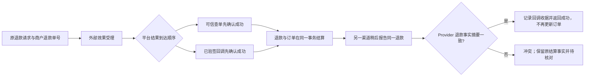

# 退款查询先完成、回调后到的重放合同

## 业务判断与流程

目标是 `PAY-02/PAY-05` 的一个最小切片：同一笔退款由查单先完成后，迟到的已验签成功回调应留下可追溯收据，并不得重复扣减订单或派生权益。若回调指向不同平台退款事实，必须拒绝，不能把它解释为同一笔退款。

## 依据、选择与复用

- 当前 `internal/payment/app/service.go` 的支付成功回调已经比较已结算事实，再记录 `replayed`；退款分支尚未处理 `RefundCompleted` 的同事实回调。`ReconcileWeChatPayRefund` 与 `ReconcileAlipayRefund` 已能依据可信查询结算退款，复用其现有收据、Payment Store 和 Order Port。
- [微信支付退款结果通知](https://pay.wechatpay.cn/doc/v3/merchant/4012268885) 要求商户正确处理重复通知；[微信支付退款申请](https://pay.wechatpay.cn/doc/v3/merchant/4012791862) 区分退款请求受理与最终结果，并要求重试沿用原商户退款单号。
- GitHub 参考：[River](https://github.com/riverqueue/river) 的 PostgreSQL 事务提交语义提示业务结算、收据与任务不能拆成独立提交。此处沿用本仓 PostgreSQL Unit of Work，不引入其他队列。

考虑过仅按通知 ID 去重，但查单与回调本来就有不同证据 ID，不能覆盖此顺序。也考虑过让重复终态统一成功，但不同平台退款摘要必须保持冲突。选用现有 `provider_refund_digest` 判别同一平台事实，并沿用 `ClaimCallback` 保存不同事件的已验签收据。

## 边界和验收

- OneID：不涉及；只读取已绑定 Payment/Refund，不解析或修改客户身份。
- Persistence：本地事务；退款收据、状态和订单结算沿用现有 PostgreSQL Unit of Work。Provider 读取发生在事务外。
- External Effects：涉及既有退款 Provider 效果和只读查询；本改动不创建、重试或更换效果幂等身份。
- Owner：Payment 拥有退款及回调收据；Order 只经稳定 Port 接收原始结算。不得跨领域直写。
- 验收：查单先完成后，匹配摘要的另一回调事件返回成功，`ClaimCallback` 记为 `replayed`，退款版本不增加，Order 不再结算；同通知重放仍成功；不同摘要/金额/Provider 保持冲突；原未完成退款仍只结算一次。
- 回退：若回归出现异常，撤回此逻辑改动；已持久化的原始退款、回调和对账收据不删除。上线判断须绑定准确 PR head 与预发布业务读回，不能用单元测试替代。
