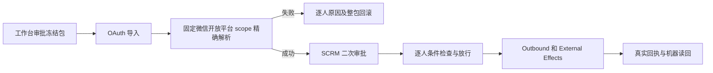

# V4 SCRM 受控单聊与机器只读同步 PRD

状态：用户已确认实施（2026-09-25）。开发基线：V4 `origin/main` 04f7ec4074cddf5deb6f443e406e32a3101a6166；提交前重新对齐当前主线。

## 业务判断

工作台负责产品与策略、人群和话术包以及首次人工审批。SCRM 只接收冻结包，精确解析成员身份，执行二次人工审批及发送前门禁，最后以真实回执和互动事实供工作台读取。未知联系权限、免打扰或人工接管状态必须阻断发送。生产客户自动运营保持关闭。

## 参考与复用

公开参考：[Customer.io automation](https://docs.customer.io/messaging/send/automations/overview/)、[Microsoft Graph delta query](https://learn.microsoft.com/en-us/graph/delta-query-overview)、[Mautic campaign builder](https://github.com/mautic/documentation/blob/master/en/campaigns/campaign_builder.md)。采用条件检查、opaque 游标与包和执行分离的做法；复用 V4 Access OAuth、Open Platform V1、OneID、AI Review Plan、Outbound 与 External Effects，不新增鉴权或发送内核。

## 首期合同

- `GET /open/v1/customers`：现有 `client_credentials` 与 read scope、独立 capability、Owner Scope、CIDR；100 条上限、含界 `updated_from`、不含界 `updated_to`、绑定窗口和 grant 的游标。只含 `CID-<id>` 安全引用、负责人、标签、绑定/联系状态、已入库企微私聊的最近员工发言与客户发言时间、`updated_at` 和 tombstone。没有归档事实时对应时间为空；不将排队视为已发送。未解析单独保留，不猜测合并。失败不当空页，不能推进水位。
- 工作台导入走既有 `POST /open/v1/ai/review-plans` 并额外要求 `ai.workbench.package.create` capability，保留原有 `ai.review_plan.create`/write gate。专用 Client 还必须有不超过 10 个精确 `customer_id` 的 Owner Scope allowlist。请求含 `package`、`members`、共享 `content`；固定开放平台 scope 解析 UnionID，拒绝未验证、冲突、负责人或关系变化；全体通过才冻结版本和内容、提交计划、幂等收据及审计。`request_id` 仅追踪；`Idempotency-Key` 和创建 Client 下唯一 `client_reference` 防重复。UnionID 仅用于请求期解析，不存入业务快照。
- 工作台计划最多 10 人；现有批量审批路径在逐人门禁、合成白名单和暂停/恢复/取消完成前主动阻断。排队和服务商接受均不称为送达。
- 结果按创建 Client 和当前 Owner Scope 授权。Radar 与聊天只提供不含正文的互动摘要，并标记未归因于该批发送。

## 架构与验收

OneID：仅经 Identity Port 解析已验证固定 scope，不建客不合并。Persistence：同步窗口由 Open Platform 拥有；包、审核计划、幂等收据及审计同一 PostgreSQL UoW。Provider 读取由各数据 Owner 提供；企微写只归 Outbound，结果未知只按原幂等身份对账。无第二套身份、队列、Worker 或发送状态机。

验证分页变更/解绑/撤销、未解析 tombstone、同值不同 scope、幂等冲突、401/403/404/409/429/503、部分失败、正文/凭据不出接口。V4 的 `fast`、`compile`、专项与完整门禁分别记录；预发布只用合成夹具和虚拟 Provider，P3 真实 canary 必须双方确认账号及 allowlist。生产地址、Client grant 与 CIDR 只以部署后授权读回为准。后续合并和生产由 V4 发布指挥台完成。

当前始终保持 `automatic_send_allowed=false`、`send_triggered=false`；P0 不写入，P1 仅允许合成包登记。源头事实或执行许可缺失时不提升完成状态。

## 本候选的实际边界

本候选交付机器联系人窗口、工作台审核候选包和创建 Client 范围内的逐人状态读取；工作台来源包的既有一键审批/发送路径被关闭。二次审批放行、逐批暂停/取消、服务商真实回执关联与互动归因尚未交付，因为现有数据源没有可用于发送前判断的权威联系权限、免打扰、人工接管及合成白名单配置。`last_real_touch_at` 是已入库私聊员工发言时间，不能替代 delivery receipt。正式 Token URL、Client grant、出口 CIDR、生产地址仍需部署后授权读回确认。
