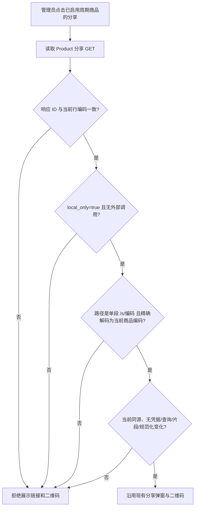

# 周期商品分享路径合同热修

## 业务判断与生产证据

2026-09-25 只读检查生产发布 `3ab9946d45b99101d483e23d8a68c2492047b748`：`/readyz` 为 ready。已启用周期商品 ID 12／编码 `ces` 与 ID 15／编码 `lianmeng` 的公开 GET `/s/ces`、`/s/lianmeng` 均为 200。Product 分享 handler 按商品编码返回 `/s/{product_code}`；冻结的管理端 client 却要求 `/p/service_period/{id}`，该旧公开路径 GET 为 404，因此点击分享出现“周期商品分享响应不完整或越过本地边界”。没有修改生产数据或发起支付、消息、Provider 调用。

## 缺陷合同与复用

- 用户目标：启用中的周期商品点击分享，展示可访问的同源 `/s/{product_code}` 链接，预览与二维码使用同一地址；错误响应继续拒绝展示。
- 范围：V4 自有 `web/v3/productAdapter.ts` Host 接缝和真实 Host 回归。现有 OpenAPI 的旧 `/p/service_period/{id}` 描述与运行时不符；它受单独的源码权威锁和串行治理约束，后续由合同治理变更校正。冻结 donor、公共页、购买、支付、成员权益、分销规则、Provider 和数据库均不改。
- 参考：本仓[普通商品分享修复](2026-09-15-product-create-and-share-contract-repair.md)同样按商品编码验证 Owner 回包；Product handler `serviceShare` 和公开 `/s/{code}` 是现行实现。[Chromium URL 展示安全指南](https://github.com/chromium/chromium/blob/main/docs/security/url_display_guidelines/url_display_guidelines.md)强调 URL 可被伪装，[MDN URL.pathname](https://developer.mozilla.org/en-US/docs/Web/API/URL/pathname)明确路径按段解析。因此保留严格的同源、单段和解码比对，不采用宽松前缀。
- Product Design 复核：用户截图显示列表及分享按钮正常，失败由 toast 报出；本修复沿用现有后台壳、按钮和二维码弹窗，不变更布局或视觉资产。线上已登录 Chrome tab 受另一浏览器会话占用，当前无法操作该 tab 的交互截图；真实业务点击仍需发布后读回。

## 架构分类

- OneID：不涉及。商品 ID／编码不是客户身份，不读取或写入客户归属。
- Persistence：无新持久化。管理端分享是受权 Product GET，前端只渲染返回的路径。
- External Effects：不涉及。保留 `local_only=true`、`real_external_call_executed=false` 的校验，不新增 Provider 写入或任务。
- Owner 与回滚：Product Owner 生成 `/s/{code}`；V4 Host 验证并展示。回滚本 PR 的前端适配即可，生产业务数据无需回滚。

## 验收

1. 已启用的 `ces`、`lianmeng` 分享结果分别为同源 `/s/ces`、`/s/lianmeng`，公开 GET 可访问；二维码、复制、预览同址。
2. 错误 ID、错误编码、旧 `/p/service_period/{id}`、额外路径、查询串、跨源和外部执行标志均拒绝展示。
3. 受影响 Web Host 回归、类型检查、来源校验及准确 PR 必需 check 通过；合并后按 `docs/operations/domestic-release.md` 由国内发布器串行构建和技术发布，核对预备机与生产准确 SHA、文件摘要、服务及 `/readyz`。真实登录后的分享业务读回单独记录，不能以技术健康冒称业务修复。
