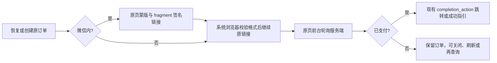

# 原页支付宝付款体验修复

继承用户已确认的支付宝付款闭环父 PRD（回调 PR 的 `2026-09-26-alipay-payment-loop.md`）。基线 `6d3ee9c`。遵循 Product Design，以已有 CRM 付款页为视觉来源；原页灰色全屏蒙版、白色右上箭头、授权文案，复制备用及关闭可用。箭头复用 Tabler Icons MIT 资产。

复用已有会话、checkout checkpoint、签名 URL、completion_action 和付款状态读取。页面回前台唤醒单一轮询；隐藏暂停、pagehide 清理、pageshow 恢复；不因已生成 URL 停止确认。外部浏览器在 OAuth/bootstrap 前读取 fragment（不进服务器 query/access log），限定 Alipay HTTPS 网关、支付 method、单值必需字段及明文商家号；SDK AES 业务密文只做密文格式校验，保留原字节，由支付宝验签，前端不持有解密密钥。它不会创建新订单。

Payment 拥有 `GET /pay/alipay/return`，更换新 WAP/Page 链接的 return_url 路径并沿用配置的 H5 HTTPS origin（与付款会话一致）。参数不能确认付款或发会话；页面以现有带 Cookie 的 checkout-status 验证结果，缺少会话提示返回微信原页。有跳转继续跳转，无跳转显示已支付，并复用 QR action。旧 continue 路由兼容 WAP/Page。

参考：[支付宝通知](https://help.alipay.com/support/help_detail.htm?help_id=397421)、[smartwalle](https://github.com/smartwalle/alipay)、[Tabler arrow-up-right](https://github.com/tabler/tabler-icons/blob/main/icons/outline/arrow-up-right.svg)。OneID 无新身份；Persistence 沿用原 checkpoint 与服务端读取，无迁移；External Effects 沿用原订单与原 Provider URL，不创建第二个效果。回退本 PR 代码，新旧已签名 URL 保留原效期，兼容入口不删除。

验收：360/390/430 实际浏览器蒙版截图；首次创建、超时后原幂等重试、刷新、前台唤醒、失败保留订单、外部 fragment 在授权前继续、坏链接拒绝、已有跳转/QR/none；return 参数不作为成功依据。真实 PostgreSQL Host 旅程确认 WAP/Page 原订单/原签名链接及 return 路由。生产原页结果与真实 Provider 回调另验。
