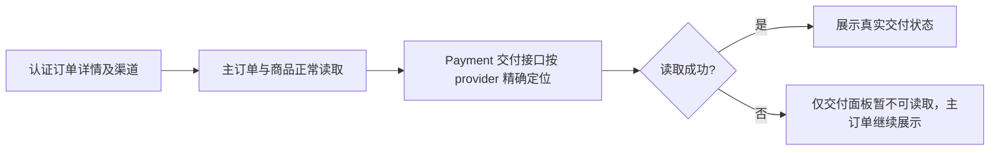

# 支付宝订单详情交付面板修复

复用用户已确认的支付宝付款闭环父 PRD（回调 PR 的 `2026-09-26-alipay-payment-loop.md`）。基线 `6d3ee9c`。Product Design 审计以用户提供的订单详情 404 截图及现有 CRM 页面为目标；保持主订单展示与当前面板视觉。

新增认证 `GET /api/admin/order-deliveries/{ref}?provider=...`；明确支持 wechat/wechat_pay/wechat_shop/alipay，重复、未知、缺失渠道拒绝。旧微信接口保持原语义。Payment Handler 复用 Order/Outbound 读取 Port，禁止跨领域表访问。V4 适配器转换冻结 renderer 的旧请求；HTTP 或网络失败返回显式 unavailable 的兼容 DTO，并标记独立面板。没有交付成功、排队或退款能力的推断。

参考：[支付宝异步通知](https://help.alipay.com/support/help_detail.htm?help_id=397421)、[smartwalle](https://github.com/smartwalle/alipay) 的渠道边界；仓库已有 provider-aware 主订单接口与交付读取 Port 可直接复用。OneID 只读原订单身份；Persistence/External Effects 无写入，无迁移或新效果。回退本 PR 行为代码即可，订单及交付事实不改变。

验收：认证与三个 provider 的读取；未知/重复渠道；支付宝同号不读微信；交付失败不阻断主订单；冻结源不改。生产认证详情截图与接口读回由指挥台安装后独立取得。
