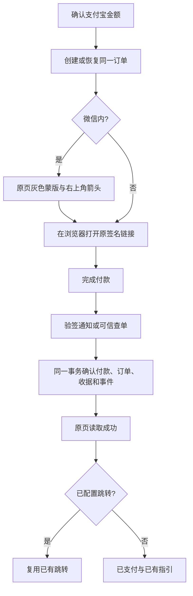

# 支付宝付款闭环修复（已授权父 PRD）

2026-09-26 用户确认实施。生产诊断基线 `960b30e`；开发基线 `6d3ee9ccd8e9b7ce36b9980507fb6e17d217977c`。

## 已核实与范围

支付宝官方通知诊断返回 404；Payment 回调误用微信商家单号查询。真实付款 16:13:50，查单 16:15:10 成功，没有通知收据。原页取得付款链接后停止轮询；附属交付读取固定微信导致订单整页 404；return_url 指向问卷页。截图留于任务附件与 `/tmp/aicrm-payment-20260926-{notify,order}-404.png`，不复制客户身份资料入仓。

父能力拆分三个可独立回退的缺陷 PR：回调确认、付款体验、订单详情。退款 PR #55 仅修改退款分支；本 PR 保持该范围独立。前端依 Product Design 与现有 CRM 页面修改，不编辑冻结源视图。

## 参考与复用

[支付宝异步通知](https://help.alipay.com/support/help_detail.htm?help_id=397421)、[smartwalle SDK](https://github.com/smartwalle/alipay)、[gopay](https://github.com/go-pay/gopay) 提供验签、重复通知和成功应答参考。复用 GetPaymentByMerchantProvider、ClaimCallback、PostgreSQL UoW、Order PaymentSettlement Port、River、签名付款链接、可信付款会话、completion_action、Order/Outbound 交付读取 Port。

OneID：复用原会话与既有客户，不新增身份匹配。Persistence：沿用 Payment/Order 单事务收据、审计和事件。External Effects：现有 Provider 查单为读取，付款及后续效果身份不变；不另建状态机、队列或重复效果。无需迁移。

## 子 PR 1：回调确认

按验签渠道和商家号精确查询；应用、金额、币种与交易摘要保持校验。支付宝已支付同交易的迟到通知记 replayed（兼容旧查询时间），不二次结算。新查询用 SDK send_pay_date。脱敏诊断仅固定类别：到达、解析、验签、订单定位/事实拒绝、事务失败、成功。

验收覆盖首次、重复、查单后到、并发、跨渠道同号、错误应用/金额/签名/交易、Order 消费失败的整笔回滚和同通知重试。真实 Payment/Order/数据库测试与真实 Provider 验收分开。

## 发布与回退

按当前 V4 国内发布规则：准确 PR check 通过，指挥台串行合并；预备机按第一父链构建、合成数据验收并晋级同一包。旧 merge-preview 不再是门禁。生产须独立读回真实通知收据、认证订单详情与原付款页成功行为；当前历史订单只能通过合法通知重试补收据，不手工伪造或再结算。失败撤回行为代码，保留原订单与历史证据；未知效果先只读核对。
