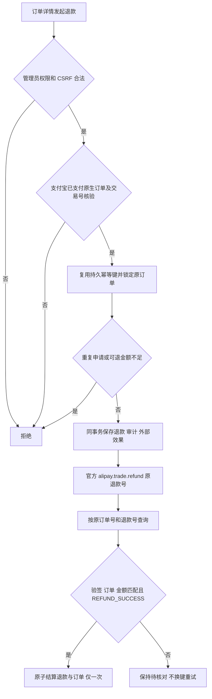

# 支付宝支付退款

管理员在现有订单详情页对原生支付宝已支付订单申请全额或部分退款；沿用退款金额、原因、已核验交易号和确认勾选。申请被接受只显示处理中，官方退款查询明确成功才结算订单、权益及佣金。历史订单只读。

参考：支付宝官方 https://aipay.alipay.com/docs/vibe-pay/ai-web-app-payment-qianyi/api-list/alipay-trade-refund.html 与 https://aipay.alipay.com/docs/vibe-pay/ai-web-app-payment-qianyi/api-list/alipay-trade-fastpay-refund-query.html；现用 SDK https://github.com/smartwalle/alipay 支持两个接口。查询需 out_trade_no/trade_no 与 out_request_no，10000 仅表示查询成功，未返回成功状态不能视作退款成功。固定退款号与金额，结果不明只读对账。

复用 Payment RequestRefund、External Effects PaymentV1、River 对账、Order Settlement Port 及 web/v3/orderAdapter 的持久恢复表单。发现查询缺原订单号及后台不支持支付宝；在本仓 Host 扩展，不修改冻结供体。用户明确要求直接复用现有退款申请页，不单独设计；保留布局、样式和交互，仅按渠道更新文案和能力。

OneID：读取订单已有 canonical customer，不解析/创建/合并身份。Persistence：Payment 拥有退款，订单锁、幂等、审计、效果接受共用现有 PostgreSQL UoW。External Effects：alipay.refund.v1，原退款号、稳定四摘要、既有执行/未知/对账语义；Provider 网络调用不持有事务，不增队列或状态机。

限制：复用权限/CSRF、交易核验、单笔未终结退款与可退金额边界；官方请求号 64 字符，金额使用分整数转换元两位小数。没有业务依据不加审批。

验证：签名 HTTP 合同检查查询原订单和退款号、金额/交易错配和验签失败；管理员渠道开关/权限/确认/幂等；退款重复结算及未成功状态；前端持久恢复、正确渠道和文案。运行 fast、compile、Payment/Order/External Effects 相关测试及订单 Host 合同；准确 SHA/tree 交付国内候选。预发合成检查、生产技术部署和真实支付宝退款验收分别记录。

无数据库迁移。回退代码时保留已受理退款数据与原键，继续按原退款号对账；不能用回退触发再次退款。真实资金退款不作为开发测试自动执行。

## 五项影响判断（791 基线重提）

| 判断 | 本次影响及依据 |
| --- | --- |
| 对外合同 | 新增支付宝 scoped 退款管理接口，更新 OpenAPI；原退款表单增加支付宝渠道，查询必须同时传原订单号和退款号。请求接受不等于退款成功。 |
| 业务机制 | 复用 Payment 事务、原退款键、权限/CSRF、External Effects 和 River 对账；只有验签及订单/交易/金额一致的明确成功才结算一次。无迁移或新执行内核。 |
| 关联模块 | 准确 diff 涉及 Payment app/http/port/provider、Composition route、Order settlement 的调用合同及 External Effects 消费者；OpenAPI canonical donor source 摘要和 embed 视图相连，需依赖/可信映射复核。 |
| 页面影响 | 复用 web/v3/orderAdapter 现有退款申请页，支付宝订单可申请并恢复，显示对应渠道/交易号，详情刷新保留 provider 作用域；无新页面或设计变更。 |
| 验证证据 | 新 SHA 重跑 fast、compile、Payment/Order/External Effects 全包、签名 Provider 及 PostgreSQL 连接合同、现有退款 Host、OpenAPI/typecheck/build；影响计划另存证据。Linux 必需检查、预发安装旅程、生产读回和真实资金退款仍分别验证。 |

本次只将原退款行为重放到 `7916dc2d63eda463e2af535fd4f06eb53d60ecb0`，保留已授权父 PRD 与官方参考，未带入旧维护/bench 测试提交，未新增业务限制。
