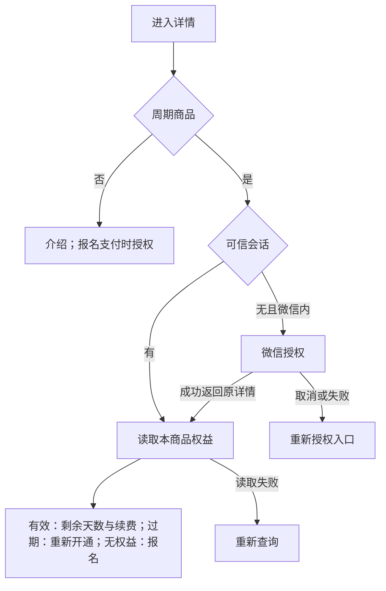

# 周期商品详情提前授权与权益展示

复用用户已确认的父方案：周期商品在微信内进入详情即识别身份；已有可信会话直接读权益，无会话立即授权，成功返回原详情展示剩余天数。普通商品介绍匿名浏览、支付时授权。未识别身份与已识别但无权益分开表达；查询失败可重试，授权失败不循环跳转。不自动下单。

参考检索已在父方案完成：[微信授权 GitHub 实现](https://github.com/feng19/wechat/blob/master/lib/wechat/official_account/web_page.ex)。采用现有 Payment H5 OAuth、HttpOnly 会话及 Order Entitlement Port，不引入外部依赖。国内主线已有周期详情/支付分离与失败回跳，保留这些行为。

OneID：由现有 OAuth/Session 应用解析；详情只读取可信 canonical customer。Persistence：沿用现有一次性 OAuth state 与会话事务，无新增业务表或迁移。External Effects：详情无订单/支付写入；Provider 授权读取由现有 Adapter 执行。复用既有身份、订单幂等与回调防重放边界，不涉及新增业务限制。

接口：现有 `/api/h5/service-period-products/{code}` 增加 `authenticated`；其余权益字段与付款链接保持兼容并保留合法推广参数。有效但已消费付款授权的会话仍可查看权益；再次付款继续走现有 fresh-authorization 检查。

Product Design：以用户截图及现有周期详情为目标，沿用标题、权益卡片、图片与底部按钮；只添加查询、微信打开提示和重试状态。冻结 donor 文件保持不变，Owner adapter 替换其匿名刷新生命周期。实际 Host 浏览器验证后记录 design-qa。

验收：已有/无会话的有效老用户、无权益/过期用户、会话过期、取消/失败/冲突/重复回调、推广参数、非微信、查询失败、返回页/续费后刷新、普通商品匿名详情与原订单恢复。Host Chromium + PostgreSQL 合成旅程与现有支付恢复旅程；真实微信回跳与付款另记。

发布：准确国内 base/head/tree 的相关测试，预备机构建一次、预发旅程、同包生产、版本/完整摘要/健康/业务读回。回滚复用已有安装器，不迁移数据库。

维护基线更新仅重放原授权行为，保留原失败证据；由唯一发布指挥台完成维护 main 后核对正式 base，不使用性能对照分支发布。

| 影响判断 | 本候选范围 |
| --- | --- |
| 对外合同 | 周期状态增加 authenticated，详情增加授权与查询重试；支付接口合同不变 |
| 业务机制 | 沿用可信会话、一次性 OAuth state 和 OneID；权益只读，无迁移或下单 |
| 关联模块 | Product HTTP/embed → Payment HTTP/OAuth/Session → Identity 与 Order 权益；生产、测试、embed 依赖图由准确 affected 计划复核 |
| 页面影响 | 周期详情、授权回跳、支付返回刷新；验证普通详情、邀请推广与支付动作连接合同 |
| 验证证据 | fast/compile、八个映射 Go 包全集、OAuth/Session 专项及四个映射 Host 页面合同；本地 macOS 证据不代替 Linux 检查和真实微信验收 |
