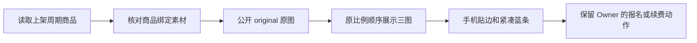

# 周期商品长图清晰度与紧凑布局热修

用户在本任务确认本方案并授权实施，保留紧凑蓝条；只处理本缺陷。

## 业务判断与根因

目标 `/s/ces`，生产基线 `00e248605b7cc0cd5b481b091bf12a6d23688f12`。
素材 1076/1077/1078 原图分别 1080×2524、1080×2838、1080×2382；
公开 original GET 返回的 SHA-256 与用户提供的三张 JPEG 完全一致。
当前公开页选择最长边限制1440的变体，宽度降至616/547/652，文字细节丢失。
页面16px内边距叠加详情14px内边距，在390px视口中图片宽330px；蓝区最小高度154px。

## 实现与复用

复用 Product 的公开媒体绑定及 Media 的 original 能力；图片URL选择恢复 original，
保留原来的首图 eager/high 与后续 lazy。原图总计约1MB，不增加响应转换或共享缩放依赖。
只在 `publicCommerce.css` 的周期商品 main 下覆盖现有样式，不修改 frozen donor。
手机图片宽100%、高度auto、无圆角裁切和图间间隙；桌面680px居中。
蓝条padding16px、标题22px、取消min-height；价格卡margin12px/padding16px。
固定bar与main同宽并保留safe-area；预留92px+底部safe-area，最后图片不被遮挡。

参考：[MDN responsive images](https://developer.mozilla.org/en-US/docs/Web/HTML/Guides/Responsive_images)、
[GitHub imaging](https://github.com/disintegration/imaging)；采用已有原图而非新增图片处理。
Product Design audit已核对实际生产手机截图，implementation复用已选页面视觉及用户提供原图，
按既有页面缺陷修复的audit/consistency路径完成，未另建页面或引入后台壳。

OneID：不涉及新的身份解析/客户归属，既有可信服务期状态保持原样。
Persistence：展示无状态，仅读取既有商品/素材；无表写入、迁移或持久任务。
External Effects：不涉及支付提交、Provider写或企微发送；仅核对原有操作目标。

## 验收与回退

原图哈希一致、图片顺序/加载优先级不变，未绑定图片404；原有权益/上架校验保留。
375/390/430及1280px核对无横向滚动、完整三图与等比展示、bar对齐、长标题换行及底部避让。
运行Product HTTP专项/现有状态合同、frontend build/typecheck/shell、fast和compile。
本地静态镜像预览只证明样式和原图加载；真实Host/认证状态与生产版本需发布后读回。
发布指挥台独占主机与队列，本任务只交准确源码及证据。国内main切换后更新准确基线再提交。
发布失败回退上一已验收技术包；不覆盖素材、不改付款或权益，不做反向数据库恢复。
