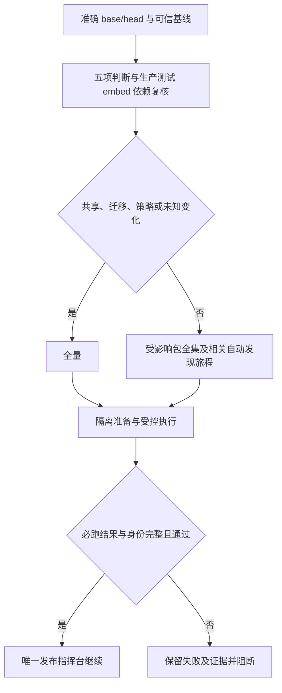
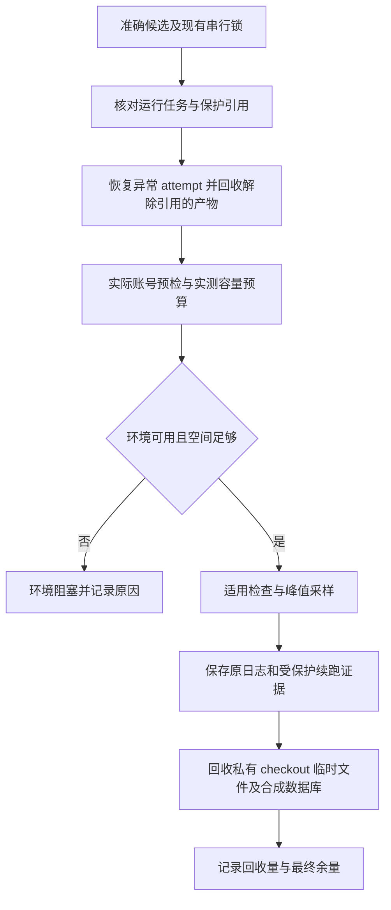

# V4 预发布检查提速

用户已确认本 PRD，目标是在 2 核 2GB 上使同类商品授权候选正常缓存检查不超过 10 分钟。原候选 2c120d17 首轮 59 分 06 秒，后端/前端通过，浏览器 32 通过、2 失败；保留原日志，优化不改成通过。

复用现有 affected_plan、Go test-import graph、quality_lanes、dev_preflight 与国内控制器，不另建发布队列。仅先启用已登记的公共商品/周期权益/H5 授权路径；完整包测试保留 vet、race、count=1。共享测试夹具、检查策略、迁移与未知输入全量；策略候选由旧可信规则验证，完成 full/targeted 结果对照后才安装为下一候选的可信基线。

参考：GitHub 独立 runner 并行 https://docs.github.com/en/actions/reference/runners/github-hosted-runners ；PostgreSQL 16 TEMPLATE https://www.postgresql.org/docs/16/sql-createdatabase.html ；参数权限 https://www.postgresql.org/docs/16/sql-grant.html 。国内不能照搬每任务 4 核 16GB；最多两个独立任务，重资源槽只有一个。数据库模板只含迁移结果，克隆各自种数据；迁移专测仍从空库运行。前端基础产物和 npm 准备按输入摘要复用，每个测试恢复可写副本。新增进度与耗时证据保持旧接口兼容。

OneID：不修改业务身份；Persistence：仅合成测试库及既有检查收据；External Effects：不启用真实 Provider。不引入第二身份、业务队列、重试或对账内核。

限制必要性：2GB 同时编译/浏览器会争用资源，最多两个任务及单重资源槽；模板仅接受本机合成库，避免触碰业务库；复用必须核对输入与输出摘要，避免把旧产物当新证据。沿用单测与浏览器业务超时，不靠扩大超时提速。

验证：选择器边界与漏选拒绝；模板隔离、序列、触发器、迁移账本、清理；产物失配重建；调度失败/取消/缺失拒绝；本地 fast、compile、专项及预备机准确树全量基线，再两次授权候选性能验证，冷缓存独立记录。性能目标只度量检查，不冒充生产安装或真实支付验收。

交付：独立国内维护候选提交准确 ref/base/head/tree、本地和 Linux 证据、原任务 ID 给路由指定指挥台。检查器安装由指挥台执行；失败保持原队列顺序。新增只读进度字段可被旧客户端忽略；回退旧检查器即恢复全量选择，保留历史收据。

用户补充的奥卡姆判断：媒体历史孤儿数据夹具在自己的临时库中事务性恢复外键为 NOT VALID，新写入仍受约束，删除对 session_replication_role 的依赖，不再需要参数授权或超级用户。运维旅程复用已有浏览器解析器；预检在实际构建账号下探测可执行文件。已知前置环境故障记录 kind=environment/candidate_verdict=not_evaluated，候选保留 pending、全局 blocked，修复后同 SHA 重新提交，不判为业务回归通过或失败。

同类清理：29 处测试旅程统一复用 chromium_binary.mjs，按真实 --version 探测，支持 Google Chrome、Chromium 和现有显式配置。测试库中针对本角色拥有对象的定向触发器故障注入保留；它不要求越权，也实际验证损坏历史数据的恢复行为。

环境续跑：故障分为已证实环境故障、候选断言失败、未知／执行不完整。只有明确的前置环境缺失、已知媒体参数权限或浏览器可执行文件缺失属于可续跑环境失败；业务断言及混合代码失败从头检查，超时、未知退出和缺失证据记录 unknown/not_evaluated，先定位，不能自动续跑或算通过。前次检查结束后先验证源树未变，把成功阶段、逐命令成功证据、自动发现的完整旅程清单及测试终态写入根账号保护的 checkpoint，并核对根账号日志摘要。同一 base/head/tree、可信策略、执行范围、主机、账号、数据库身份和工具版本才复用：成功阶段不重跑，失败阶段复用已通过的独立校验命令，浏览器只执行失败/未完成旅程；Go 根据准确源码的 go list 清单仅复用已有包级通过终态（无测试包须有 no test files 证据），失败或未完成包运行完整测试，不用单测名称缩减。控制器合并旧成功包与新包终态并校验完整清单，原失败包内已过的单测也重跑。逐命令收据同时记录原必跑命令与实际执行命令。新 checkout 的依赖及产物准备仍按摘要恢复，构建/安装/生成命令不当作可跳过的校验。

源码修改（包括测试或检查器）、基线/规则/必跑集合/工具变化均不继承旧通过；原 SHA 的历史失败和各次 attempt 留存。旧执行器没有生成受保护 checkpoint 的历史失败不能直接当作已认证的续跑证据。没有增加自动重试队列；修复环境后使用现有同候选重新提交入口，保持队列顺序。

公共商品范围默认保持 shadow，仅当指挥台完成全量对照与两轮性能检查，并在受保护配置中写入 verified_commerce_policy_fingerprint（与已验证 planner_policy_fingerprint 精确一致）后启用。策略代码变化自动失配并退回全量；不允许维护候选使用自己的新规则缩减验证。

性能验收工具：scripts/ci/check_benchmark.py --base <已验证维护候选> --report-dir <checkout 外的新目录> [--cold]。使用维护候选叠加原授权改动的独立、干净 checkout，只读执行一次 full 及 warm-1/warm-2，按 lane 比对测试终态、必跑包及旅程；两次均不超过 600 秒才记录性能目标达成。该命令不提交队列、不安装、不修改指挥台配置；冷缓存记录单列。正式维护候选仍由旧可信规则验证。

本维护候选五项判断：

| 判断 | 本次结论 |
| --- | --- |
| 对外合同 | 保留 checks 和旧收据字段，新增可选阶段、耗时、失败分类、复用来源；无业务 API/事件/支付输出变化 |
| 业务机制 | 不改 OneID、业务事务、真实 Provider；仅隔离合成数据库、测试产物和检查证据 |
| 关联模块 | affected_plan、quality_lanes、国内控制器、Composition 夹具、29 处旅程解析器、开发入口；规则候选必须由旧可信策略完整验证 |
| 页面影响 | 业务页面不变；检查进度增加机器可读字段；商品规则即使后端单独修改也覆盖授权回跳、拒绝重试、购后动作、邀请和分销最终结果 |
| 验证证据 | CI/发布合同、非超级用户数据库专项、准确提交 fast/compile、同机旧策略全量、full/targeted 对照、两次缓存不超过 600 秒；实际生产及真实 Provider 不在本次合成验收内 |

环境预检在耗时检查前由实际构建账号执行，验证本机合成库的 CREATE、TEMPLATE、DROP 和真实浏览器版本。删除权限要求后不使用超级用户、不授权 session_replication_role，也不添加 chromium 软链接；同类脚本统一解析现有可执行文件。模板、克隆及准备失败的账本与日志保留，清理不得终止其他账号连接。

用户于 2026-09-27 明确恢复开发，授权清理无用产物、使用新增 70GB 数据盘并完成最终上线。维护候选与业务候选仍按唯一指挥台协调的顺序串行；维护验收期间自动发布暂停，完成后由指挥台恢复原候选。保留 2c120d17 两次失败；第二次中断的终止原因尚未确定，原始 JSON 截断及空收据属于执行不完整，不追认为环境续跑证据。精确可信全量、结果对照、续跑合同及两次性能验收完成后才可安装检查器和写入商品规则验证指纹。任何漏选、证据失配或策略字节变化关闭快速规则并退回完整检查。

## 产物保留和回收

复用唯一指挥台、现有串行锁与根账号保护的 attempt 账本，不新增清理服务或另一套发布队列。每轮先恢复已结束的注册任务、回收解除引用的包，再探测空间、数据库和浏览器。正常结束、断言失败、超时和中断均先保存证据再回收；控制器异常退出时，下次启动核对 PID 和构建账号子进程，仍运行的任务保留。

| 对象 | 明确保留边界 |
| --- | --- |
| 国内权威裸仓库 | 始终保留；main、所有候选及未完成引用受保护；不自动删引用 |
| 私有测试 checkout、profile、TMPDIR、阶段虚拟环境 | 本 attempt 结束、证据保存且进程退出后立即回收；崩溃遗留由下次持锁启动恢复 |
| 迁移模板、隔离测试库及准备快照 | 本 attempt 内复用；结束保存账本、校验和、计数后删除，仅处理登记且本测试角色拥有的合成库 |
| 发布包 | 当前版本、上一回退版本、所有候选/任务/Git 引用保留；独立安装收据和完整清单证明解除引用后回收；同包重复构建目录校验字节相同后删除，元数据保留 |
| Go/npm/module 缓存 | 同一构建账号复用一个规范目录；旧缓存逐文件核对后合并，冲突保留；超过实测容量时按最近使用淘汰，仍被权威源码引用的模块不删 |
| 未结案或待重试测试证据 | 保留原始日志、准确 SHA、范围、各 attempt 与受保护 checkpoint，禁止按时间自动删除 |
| 已结案的大文件证据 | 压缩并核对解压字节，上传既有国内归档存储并独立读回摘要后删除本机大文件；小账本、原路径映射及归档回执持续保留。归档失败仍保留本机文件 |

缓存合并、远端归档首次启用须由指挥台完成对应演练并设置受保护配置。编译缓存和测试结果复用分别校验。常规检查不清空缓存；`--cold` 仅为独立性能演练使用隔离缓存。空间不足属于 environment/not_evaluated，不能等数据库写入失败后冒充业务回归。

容量配置 `check_capacity` 使用同机采样：`measured_at_utc`、`workspace_peak_bytes`、`database_reserve_bytes`、`evidence_reserve_bytes` 与 `cache_limits_bytes`。合计空间预算在开跑前核对，缓存按配置分别限额。首次维护全量可用 `maintenance-check --calibrate-check-capacity` 记录峰值，不借此启用普通候选或设置拍脑袋阈值。计量包括逐命令耗时/磁盘增量、整轮最低余量、准备次数、缓存复用、回收量和结束余量；重叠任务的磁盘峰值不能简单相加。

## 新数据盘与环境故障修复

数据盘由唯一指挥台在原串行锁内核对设备、已有文件系统及占用，只初始化已证实为空的设备。迁移构建目录和缓存时逐文件核对字节，使用 bind mount 保留既有构建入口；权威 Git、控制器状态、当前及回退包和根账号保护的证据继续保留。新增可选配置 `check_storage_mount`、`check_storage_uuid`、`check_storage_paths`：每次构建命令、检查开始和回收前核对真实挂载 UUID 与管理路径所在设备，盘缺失或身份改变先环境阻塞，不允许退回根盘悄悄运行。旧未使用数据盘的配置仍兼容。

根盘 `check_capacity` 与数据盘 `check_storage_capacity` 分别采样和核对，两者均使用上述实测预算字段，按各盘实际负责的工作、数据库和证据增量填写。不能用数据盘剩余空间掩盖根盘数据库容量不足。attempt 记录根盘、执行临时文件所在盘和报告所在盘的最低余量、峰值增量；同一设备的数值不能重复相加。

每个 attempt 在根账号账本中先登记短目录，再创建实际构建账号独占的 `ac-<随机标识>`，默认位于 `/tmp`；可以配置已验证的短 `check_execution_root`。实际账号逐级以 `O_RDONLY|O_DIRECTORY|O_NOFOLLOW` 打开目录，避免 CPU 诊断遇到只可穿越不可读的祖先；真实 Chrome 用业务旅程相同启动参数验证 DevTools `/json/version`，不以 `--version` 代替启动。首段致命 stderr 与末段警告分别留存并脱敏，结束删除 profile。旧可信基线没有准备助手时由控制器完成同账号 PostgreSQL 16 CREATE/TEMPLATE/DROP 探测，所有数据库创建前写账本，不需要额外参数权限。

浏览器诊断助手 `internal/webshell/chromium_launch.mjs` 的引用全部来自旅程/测试，实际 `go list -deps` 核对全部应用命令的生产嵌入清单也不含该文件，因此登记为精确 CI 文件；修改它不要求安装业务应用。其他 webshell 文件及未知浏览器资产仍按运行时变化处理，维护候选的旧可信全量验收保持不变。

退出、超时和中断先终止该隔离命令的进程组；恢复不再靠工具名称白名单识别存活进程，任何构建账号存活进程均保护资源、阻断新的重任务。回收前再次核对账号进程，存活则保留账本和产物，待退出后由下次持锁启动回收；先核对全部登记控制器的存活情况，再删除任何已结束 attempt。数据库探测的模板和克隆名称沿用现有严格格式，创建前分别登记，DROP 失败保留记录；清理核对数据库确实归本测试角色所有。

Go 编译缓存包含本仓包的绝对目录，随机源码目录会使相同源码重复编译（已用 Go1.26.6 实跑核对）。在已有全局串行锁及存活进程保护下，各 attempt 使用固定的 `domestic-main-check-current` 位置重新创建完整私有 checkout，阶段仍分别使用独立源码目录；结束全部删除，下轮重新创建，保留的只有容量受控的编译/依赖缓存。未登记且已存在的工作目录阻断并保留诊断，不直接删除。无需添加 `-trimpath` 或改动依赖 `runtime.Caller` 的业务测试；`-count=1` 和完整测试证据核对不变。清理故障与原业务/未知故障同时发生时保留原故障分类，登记待回收记录，不能改成可续跑环境成功。

旧可信浏览器阶段的 `run.json` 可以未填写 `go_json_log`：验证器与续跑读取统一解析固定的 `browser-execution.log`，仍核对准确 SHA/tree、成功命令、动态发现的全部旅程及真实 JSON 终态。显式非法日志路径、日志缺失、跳过或未完成仍阻断；不修改旧收据或追认未完成的全量通过。原 829 全量因该格式兼容错误未执行 SDK，保留原失败，新维护提交必须重新完成可信全量。

维护安装标记保持既有七字段协议，不把续跑路径加入共享台账。通过标记内既有收据摘要匹配受保护的完成收据，核对 base/head/tree 后读取其中的 checkpoint，再由现有证据加载器复核规则、环境和日志摘要；旧标记没有可信完成收据时重新检查。生成、严格验证、真实落盘、重新加载、安装字节核对和同 head 重提形成连续合同，避免只测试单独 validator 或跳过状态写入。604 的五阶段结果全部通过，但维护标记提交失败，仍保留为未通过维护验收。

f8 的完整后端检查发现会员表格旅程的旧时序假设：协作者列表在刷新开始时被加载占位替换，行暂时消失不代表刷新完成。测试随后向禁用的分享开关发送合成 change，冻结分享控制器按 loading 状态忽略该输入。修复只等待现有开关恢复可交互，不扩大四秒等待、不改冻结页面、业务 API 或权限；真实 HTTP 合同对删除后刷新加入受控 200ms 延迟，仍验证协作者创建/编辑/删除及分享创建/公开读取/撤销。受控对照中旧条件稳定失败，新条件整个 HTTP 包通过；保留 f8 原失败，新提交重新完成适用检查。该 Node 旅程只由包内测试执行，生产仅嵌入 host.js，登记精确测试文件，不放宽同目录未知资产的运行时分类。

## 验收台账

| 项目 | 已验证证据 | 同机真实验收状态 |
| --- | --- | --- |
| 一次恢复空间 | 指挥台持锁删除 18 组已安装历史重复包，释放 11,074,187,264 字节；独立核对当前/回退/引用/两次失败记录 | 已完成；服务健康和源码状态保持 |
| 检查范围与结果对照 | 本地选择器、完整包、动态旅程与缺失拒绝合同 | 待准确 Linux 全量及 full/targeted 对照 |
| 环境续跑 | 本地同身份、包全集、旅程补跑、代码/策略变更、未知故障及证据篡改拒绝合同 | 待 Linux 运行合同和故障演练；历史无可信 checkpoint 不追认 |
| 生命周期 | 本地十轮实际临时目录回收合同，覆盖成功/失败/超时/中断、启动恢复、保护引用、归档校验及缓存冲突 | 待同机十轮执行及空间稳定性；本地合同十轮不是十轮业务检查验收 |
| 性能与容量 | 现有草稿专项及原失败耗时只作为诊断 | 待冷缓存、两次热缓存、失败续跑、全量实际降幅及容量预算；目标尚未达成 |

一次清理证据：预发 `/opt/aicrm/domestic/control/work/diagnostics/disk-cleanup-20260926T165245Z/result.json`，SHA256 `2361002b686ee8872c45868c836f9aab7179e7a30740e6e8aeba301359456020`。清理后前置检查实跑通过，不修改原两次失败结果。其余验收通过后才更新台账；不能用本地合同、缓存命中或达到时限替代完成证据。
