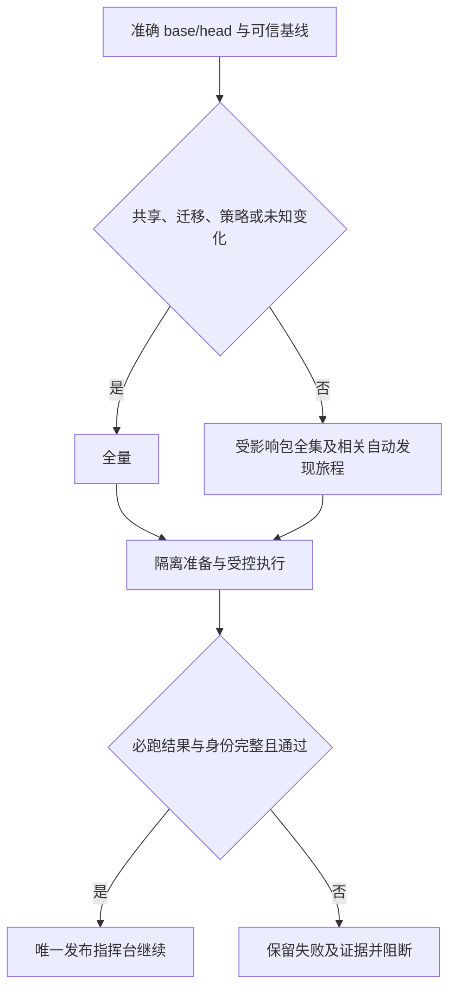

# V4 预发布检查提速

用户已确认本 PRD，目标是在 2 核 2GB 上使同类商品授权候选正常缓存检查不超过 10 分钟。原候选 2c120d17 首轮 59 分 06 秒，后端/前端通过，浏览器 32 通过、2 失败；保留原日志，优化不改成通过。

复用现有 affected_plan、Go test-import graph、quality_lanes、dev_preflight 与国内控制器，不另建发布队列。仅先启用已登记的公共商品/周期权益/H5 授权路径；完整包测试保留 vet、race、count=1。共享测试夹具、检查策略、迁移与未知输入全量；策略候选由旧可信规则验证，完成 full/targeted 结果对照后才安装为下一候选的可信基线。

参考：GitHub 独立 runner 并行 https://docs.github.com/en/actions/reference/runners/github-hosted-runners ；PostgreSQL 16 TEMPLATE https://www.postgresql.org/docs/16/sql-createdatabase.html ；参数权限 https://www.postgresql.org/docs/16/sql-grant.html 。国内不能照搬每任务 4 核 16GB；最多两个独立任务，重资源槽只有一个。数据库模板只含迁移结果，克隆各自种数据；迁移专测仍从空库运行。前端基础产物和 npm 准备按输入摘要复用，每个测试恢复可写副本。新增进度与耗时证据保持旧接口兼容。

OneID：不修改业务身份；Persistence：仅合成测试库及既有检查收据；External Effects：不启用真实 Provider。不引入第二身份、业务队列、重试或对账内核。

限制必要性：2GB 同时编译/浏览器会争用资源，最多两个任务及单重资源槽；模板仅接受本机合成库，避免触碰业务库；复用必须核对输入与输出摘要，避免把旧产物当新证据。沿用单测与浏览器业务超时，不靠扩大超时提速。

验证：选择器边界与漏选拒绝；模板隔离、序列、触发器、迁移账本、清理；产物失配重建；调度失败/取消/缺失拒绝；本地 fast、compile、专项及预备机准确树全量基线，再两次授权候选性能验证，冷缓存独立记录。性能目标只度量检查，不冒充生产安装或真实支付验收。

交付：独立国内维护候选提交准确 ref/base/head/tree、本地和 Linux 证据、原任务 ID 给路由指定指挥台。检查器安装由指挥台执行；失败保持原队列顺序。新增只读进度字段可被旧客户端忽略；回退旧检查器即恢复全量选择，保留历史收据。

用户补充的奥卡姆判断：媒体历史孤儿数据夹具在自己的临时库中事务性恢复外键为 NOT VALID，新写入仍受约束，删除对 session_replication_role 的依赖，不再需要参数授权或超级用户。运维旅程复用已有浏览器解析器；预检在实际构建账号下探测可执行文件。已知前置环境故障记录 kind=environment/candidate_verdict=not_evaluated，候选保留 pending、全局 blocked，修复后同 SHA 重新提交，不判为业务回归通过或失败。

同类清理：29 处测试旅程统一复用 chromium_binary.mjs，按真实 --version 探测，支持 Google Chrome、Chromium 和现有显式配置。测试库中针对本角色拥有对象的定向触发器故障注入保留；它不要求越权，也实际验证损坏历史数据的恢复行为。

环境续跑：只有明确的前置环境缺失、已知媒体参数权限或浏览器可执行文件缺失属于可续跑环境失败；业务断言、HTTP 403、未知错误、超时及混合代码失败仍阻断并从头检查。前次检查结束后先验证源树未变，把成功阶段、逐命令成功证据、自动发现的完整旅程清单及测试终态写入根账号保护的 checkpoint，并核对根账号日志摘要。同一 base/head/tree、可信策略、执行范围、主机、账号、数据库身份和工具版本才复用：成功阶段不重跑，失败阶段复用已通过的独立校验命令，浏览器只执行失败/未完成旅程，然后合并并校验完整必跑结果。新 checkout 的依赖及产物准备仍按摘要恢复，构建/安装/生成命令不当作可跳过的校验。

源码修改（包括测试或检查器）、基线/规则/必跑集合/工具变化均不继承旧通过；原 SHA 的历史失败和各次 attempt 留存。旧执行器没有生成受保护 checkpoint 的历史失败不能直接当作已认证的续跑证据。没有增加自动重试队列；修复环境后使用现有同候选重新提交入口，保持队列顺序。

公共商品范围默认保持 shadow，仅当指挥台完成全量对照与两轮性能检查，并在受保护配置中写入 verified_commerce_policy_fingerprint（与已验证 planner_policy_fingerprint 精确一致）后启用。策略代码变化自动失配并退回全量；不允许维护候选使用自己的新规则缩减验证。

性能验收工具：scripts/ci/check_benchmark.py --base <已验证维护候选> --report-dir <checkout 外的新目录> [--cold]。使用维护候选叠加原授权改动的独立、干净 checkout，只读执行一次 full 及 warm-1/warm-2，按 lane 比对测试终态、必跑包及旅程；两次均不超过 600 秒才记录性能目标达成。该命令不提交队列、不安装、不修改指挥台配置；冷缓存记录单列。正式维护候选仍由旧可信规则验证。
