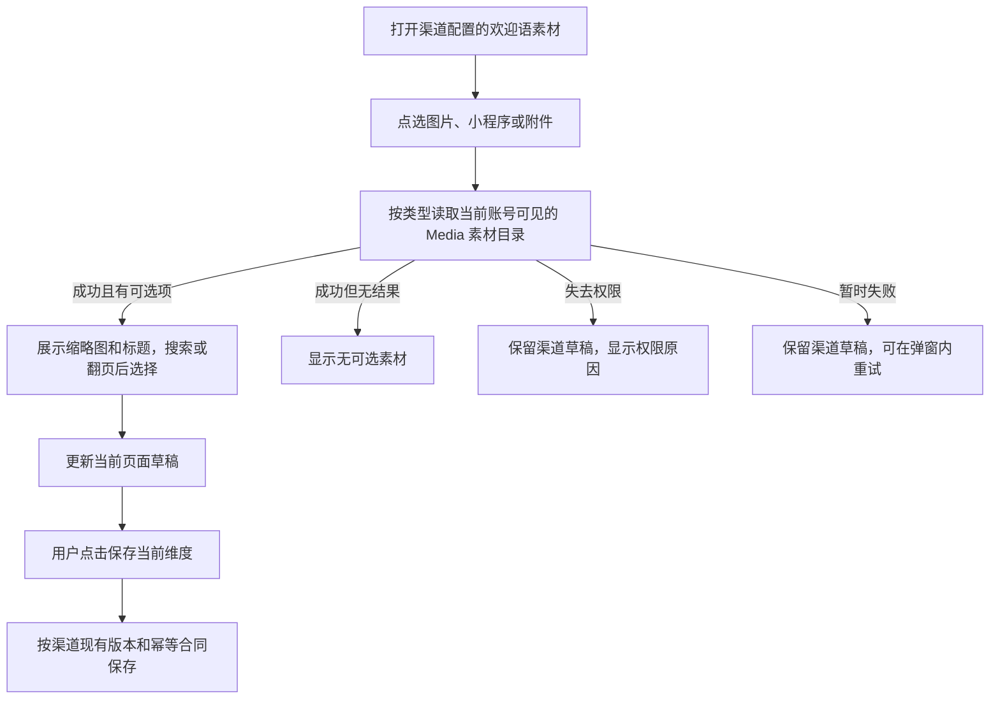

# 渠道欢迎语素材选择器加载修复

## 业务判断

## 现象、根因与复用

生产渠道页的三个弹窗一致显示“页面请求组件加载失败”。旧 `material_picker.js` 在发请求前要求 `window.AdminApi.requestJson`，当前渠道 Host 只安装了错误格式化方法，没有安装该请求桥接。旧 `/api/admin/material-picker/items` 也不是 V4 Media 的目录合同。复用现有 `materialPickerAdapter`、`SelectionSession` 和 Media 的 `/api/admin/{image,miniprogram,attachment}-library` 读取；不复制选择器或增加兼容 API。参考 [netresearch/assetpicker](https://github.com/netresearch/assetpicker) 的调用方提供目录适配器做法，目录权限仍由本仓 Media API 判定。

## 范围与验收

- 打开图片、小程序、附件时，分别读取对应的 V4 Media 目录；搜索、分页和图片缩略图可用。
- 选择一项只更新欢迎语本地草稿；取消、读失败或无权限不保存渠道，也不触发 Provider 写入。现有“保存当前维度”继续负责持久化。
- 403/401 明确提示并锁定当前选择会话；其他读失败可重试。已有选择不因目录读取失败被清除。
- 回归测试覆盖三个类型、正确端点、选择后草稿、未保存无写请求及读失败。生产验收在渠道码中心的欢迎语素材维度查看三个弹窗和最终保存读回；真实欢迎语发送另行验收。

## 影响判断

- 对外合同：无新增 API；使用现有 Media 列表合同。
- 业务机制：只修复渠道欢迎语素材目录读取；渠道保存和外部发送不变。
- 关联模块：Channel 前端 Host 调用 Media 只读目录；不跨领域读表。
- 页面影响：三个弹窗改用已有共享选择器，提供搜索、刷新、分页和失败状态。
- 验证证据：Host 回归测试、前端构建与相关预检；生产界面和真实 Provider 结果分开读回。

OneID：不涉及，配置素材不识别客户。Persistence：弹窗只读 Media，选择保留在浏览器草稿；保存仍走现有 Catalog 本地事务。External Effects：弹窗不涉及 Provider 写；既有渠道欢迎语发送流程不变。没有新增限制。
