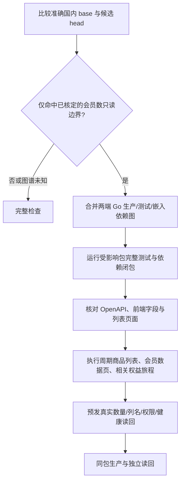

# 周期商品会员数只读统计：受影响检查与小粒度测试计划

## 业务判断流程

## 依据与现状

- 本仓现有 `go_affected_graph.py` 通过 base/head 两端的 `go list -deps -test -json` 计算反向闭包，包含测试导入和嵌入文件；Go 官方文档明确这些字段和 `-deps`、`-test` 语义：https://pkg.go.dev/cmd/go#hdr-List_packages_or_modules。
- Go 的 `go test -list` 只列顶层测试等条目，`-json` 可核对执行结果，`-count=1` 禁用缓存：https://pkg.go.dev/cmd/go#hdr-Test_packages；因此顶层条目必须与执行事件逐一核对，子测试的 skip 也必须拒绝。
- 当前已发布修复的准确 `d0566b40a0330b12abb9cba390dc6f73319cd924` → `c510a95b6ca52801c9561a3463c3e68c4bbc1cf9` 图谱选中 **35 个 Go 包**（含 `cmd/aicrm`）。这只是这一对提交的计算结果，后续提交必须重算。现行规则因 `api/openapi.yaml` 等受保护路径退回全量。
- `cmd/aicrm` 当前有大量集成及 Chromium 测试。按自动发现的顶层清单分组并串行执行，逐项证明恰好一次、无 skip；拆分后也要按业务源文件和依赖定位可以选哪些测试，不能只换一个大包名。

## 本次范围与验收

1. 建立显式的只读会员数规则，首个校准样本只接受已审核的 Order 统计 Port/Store、Product HTTP/UI、相关测试、OpenAPI 响应字段及前端映射/列名的准确补丁签名。后续 Order 只读计数函数及对应测试变化可生成缩范围候选计划，函数外源码必须逐字一致；该类新补丁在取得独立全量对照前仍强制全量。数据库写入或外部效果调用直接回退全量。Product 鉴权、响应结构、OpenAPI、UI、共享设施、迁移和规则本身变化也回退全量。
2. 每次从准确 base/head 图谱生成包数和清单；执行清单中每个 Go 包的完整测试，包括测试导入闭包；无按测试名过滤的包级捷径。Go 测试保留 `-race -count=1 -p 1` 和现有数据库环境门槛。
3. 核对 OpenAPI 中 `member_count`、前端 DTO 的真实数值、周期商品列表列名/权限，以及周期商品列表、会员数据页和相关权益旅程。缺任一证据视为不完整。
4. `cmd/aicrm` 的完整验证支持从编译后的顶层清单自动发现、稳定小组串行运行、执行 JSON 与清单双向核对，重复、缺失或任何 skip 均失败；浏览器旅程保持独立环境门槛。
5. 预发与生产必须独立读回 `ces`、`lianmeng` 等真实会员数、页面列名、无权限结果、服务和 `/readyz`。现有技术发布收据不能代替发布后的认证页面读回；无新业务程序包的检查策略提交只推进源码游标。

## 后续结构

先按测试源文件/业务域保留可定位的细粒度清单，再抽出共享测试设施并把测试迁入业务 Go 包。迁移前后比较自动发现清单和业务旅程，证明没有漏测或重复；以可选择的最小业务边界为目标，拆包本身不承诺缩短总耗时。

## 架构分类与交付

仅变更检查策略和测试组织；不涉及 OneID/外部身份归属，不新增持久化、任务、Provider 写入或外部效果。属于共享检查策略变更，本候选本身做全量检查；新缩范围规则需在准确旧修复差异上与既有全量收据对照后才可启用。
