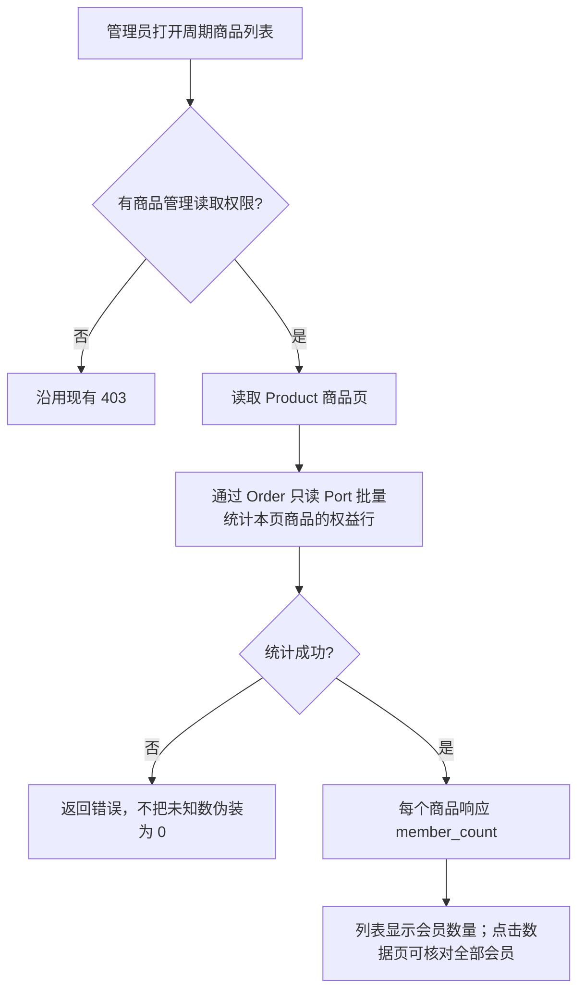

# 周期商品列表会员数修复

## 现象与验收

生产 `/admin/service-period-products` 中 `ces`（OPC创业孵化小赛）的列表数字为 0，但 Order 域会员数据有 93 条（有效 87、过期 6，2026-09-28 只读查询）。`lianmeng` 有 7 条也显示 0。列表应按“数据”页不加筛选时的会员总数展示：包含有效、过期和其他保留在会员数据中的记录，每个权益行计一次；数字随权益数据变化，不缓存于商品行。列表列名改为“会员数量”，避免把手工或历史会员误称销售。

## 业务判断流程

## 参考与复用

- [WooCommerce Subscriptions 按商品统计订阅](https://github.com/pronamic/woocommerce-subscriptions/blob/main/includes/admin/reports/class-wcs-report-subscription-by-product.php) 展示了按商品定义订阅计数口径的做法；本项目遵循自身 Order 域会员关系，不照搬其状态筛选。
- 复用本仓 `order_service_entitlements` 与 Order read Port；“数据”页的 `summarizeMemberGrid` 不加筛选时按会员行计总数。列表现有 DTO 已消费 `member_count`，缺失时降为 0，这是该缺陷的直接原因。普通商品 `sold_count` 的订单口径不变。
- Product Design 检查：复用当前管理端单壳和现有表格，只更正数字来源及列名，不增视觉组件或新交互。

## 范围与边界

- 对外合同：周期商品列表项新增非负 `member_count`；周期商品详情读取可同口径返回；普通商品 API 不变。计数失败时读取失败，不返回假 0。
- 业务机制：Order 拥有权益表和批量统计；Product 仅通过稳定 Port 读取。不写数据库，不改变权益、订单、支付或权限。
- OneID：不涉及身份匹配或归属变更，只按已存在的 `service_product_id` 统计权益行。
- Persistence：只读查询，复用现有 PostgreSQL UoW；无迁移、无持久任务。
- External Effects：不涉及 Provider、支付调用或异步效果。不涉及新增限制。
- 页面影响：`spProducts` 列表数字与列名；“数据”页及普通商品页行为不变。

## 验证与交付

Order 集成测试覆盖多商品、无会员、有效与过期、重复客户权益行；Product HTTP 测试覆盖列表批量返回、失败不伪装 0、无权限；前端 Host 测试覆盖列名和现有 DTO。生产验收由唯一发布指挥台对同一包完成预发相关旅程、生产读回，再核对 `ces` 与 `lianmeng` 列表数字和“数据”页总数。普通发布无数据库备份。回退按发布器既有同包回滚流程，权益数据不回写。
