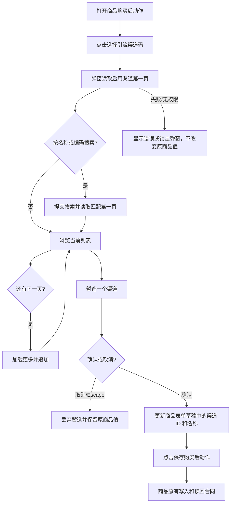

# 商品购买后渠道码选择弹窗

## 目标与现状

普通商品和周期商品的“支付后展示引流二维码”当前使用原生下拉框。商品页从旧目录读取含归档记录的前 50 条，生产渠道 #61“99 元付款+黄小璨企微”已启用且有二维码，却不在商品 #68 的选项中。运营人员需要按名称找到任意位置的启用渠道码，确认后再保存商品。

## 参考与复用

- 生产“渠道配置 → 客服分配 → 添加客服”的标准弹窗：居中遮罩、顶部标题、搜索与提交按钮、可滚动列表、暂选回显、取消与确认；同仓 `staffPickerAdapter.ts` 使用 `SelectionSession` 和 `installSelectionDialog` 管理分页、IME、焦点与草稿。
- [Ant Design Select 官方文档](https://ant.design/components/select/)提供搜索和虚拟滚动的成熟交互参考；本仓不引入该依赖，沿用已有选择器体系。
- 复用 Channel Owner 已授权的 `/api/admin/channels?status=active&limit=50&q=...&cursor=...`，服务端搜索名称/编码并返回 `next_cursor`。逐页加载至末尾，无目录总条数上限；不把一次请求的 50 条上限误当列表总上限。

## 行为与边界

1. 普通与周期商品共享单选渠道弹窗；初始搜索为空，每页按服务端游标加载，搜索提交后从第一页重新开始。只列启用渠道；已保存的渠道若不在初始目录页，用渠道详情读回名称，即使未在当前页也保持回显，取消不改变商品草稿。
2. 选择确认只改本地表单草稿；“保存购买后动作”继续使用原商品写入与读回。读取失败可重试，403 禁止确认；不把缺席于某页解释为渠道失效。清空选择后 QR 模式仍沿用原有保存校验。
3. 遮罩、尺寸、列表卡片和底部按钮对齐客服弹窗；使用已有 `SelectionSession`、`installSelectionDialog` 与共享样式。键盘 Tab、Escape、中文输入法的 Enter 保持标准组件行为。

## 分类与影响

- OneID：不涉及；仅选择渠道定义 ID，不解析或关联客户身份。
- Persistence：只读渠道目录 + 商品原有本地事务；无新表、迁移或持久任务。
- External Effects：不涉及；选择和保存不触发企微 Provider 写入。
- 限制必要性：不涉及新增限制；保留服务端单页上限和商品既有单选/有效 ID 校验。
- 对外合同：复用现有渠道 GET 与商品写入，不改接口或错误码；`lead_channel_id` 的业务含义不变。
- 关联模块：Product 页面 adapter、共享选择会话和弹窗样式；Channel Owner 只读 API 不改；普通商品、周期商品调用同一控件。
- 页面影响：购买后动作的原生下拉改为可搜索、可分页的弹窗；其余购买后模式不变。
- 验证：覆盖第 50 条之后的渠道、服务端名称搜索、已选回显、取消、分页、空态/失败/403、保存前后渠道 ID，检查普通及周期商品页面。

## 验收与回退

在认证商品页输入“99 元付款+黄小璨企微”能找到渠道 #61，确认后本地显示该名称；取消不改旧值；保存后读回 `lead_channel_id=61`。预发使用合成目录验证 50 条之后的渠道和虚拟支付旅程；生产真实扫码/支付另行验收。若候选失败，停止发布并保留原生产包；不修改渠道或订单数据。
