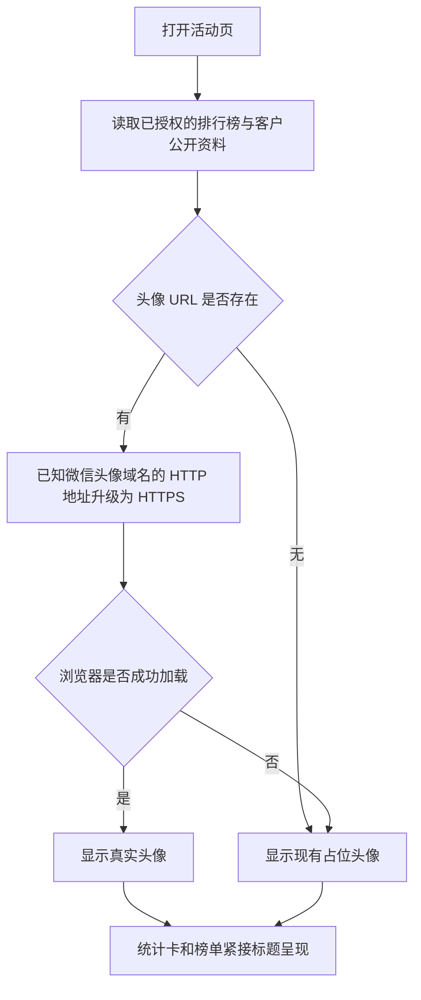

# 裂变活动头像与首屏密度修复

## 现象与生产证据

- 2026-09-28 生产活动 `测试裂变`（ID 4）排行榜显示浅蓝的占位头像。只读查询确认该参与者的客户公开资料已有头像 URL，来源为 `wecom_callback`，域名 `wx.qlogo.cn`，地址协议为 HTTP；该活动参与者 1 人，头像资料非空。
- 同一头像地址改用 HTTPS 请求返回 `200 image/jpeg`。生产 `/referral` 的 CSP 为 `img-src 'self' data:`，因此浏览器无法加载该外部头像。无须重新获取授权、重写客户资料或修改身份归属。
- 用户截图中标题下方至统计卡之间的空白约一段卡片高度；现有移动端 hero `min-height: 148px`，统计卡上移 `30px`，可通过缩短 hero 收紧。

## 业务判断

## 参考与复用

- [Auth.js 微信 Provider](https://github.com/nextauthjs/next-auth/blob/main/packages/core/src/providers/wechat.ts)使用微信返回的 `headimgurl`。本仓复用客户公开资料投影、Referral `avatar_url` 接口字段和现有占位图，不新增头像采集流程。
- 前端复用已挂载的 `web/v3/referralCenter.ts` 与 `web/v3/referral.css`，不改榜单交互、支付或邀请业务。
- Product Design：以用户提供的生产截图为选定视觉目标；只收紧首屏留白，保留现有颜色、字体、卡片和固定操作栏。

## 范围与验收

1. 仅活动公共页的图片 CSP 允许生产资料中已确认的微信头像域名，其他页面不放宽。
2. 已知微信头像域名的 HTTP URL 在展示时升级到 HTTPS；资料值保持不变。空 URL 或加载失败仍使用现有占位图。
3. 移动端 hero 缩短约 40 CSS px，统计卡及下方榜单整体上移约 36 CSS px，标题与卡片不重叠；固定排名条和底部邀请按钮仍可操作。
4. 回归 CSP 范围、头像 URL、Referral 前端行为、页面构建及相关 Go 检查。真实微信内浏览器截图与生产已登录业务读回在发布后单独记录。

## 边界、影响与回退

- OneID：只读取已解析客户的公开资料，不新增身份匹配、建客或合并。
- Persistence：展示与响应头无状态；不写数据库，不新增任务。
- External Effects：不涉及 Provider 写入；头像图片由用户浏览器按已有 URL 读取。
- 对外合同：字段和接口不变；头像可正常呈现。业务机制：无事务、归属或效果变化。关联模块：`cmd/aicrm` 公共页 CSP、Referral H5，其他页面仅回归 CSP 未放宽。页面影响：移动端活动首屏及头像。验证证据：准确候选测试与发布者的预发旅程、生产读回分别记录。
- 不涉及新增业务限制；只复用按页面划分的 CSP 安全边界。若需回退，撤销本次 CSP、URL 展示与 CSS 变更即可，无数据回滚。
