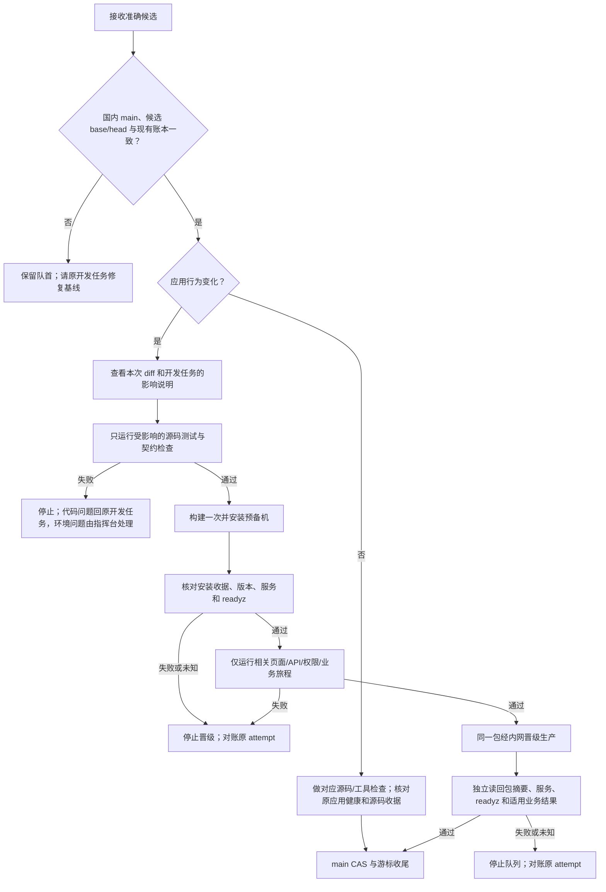

# CRM V4 小改动发布流程 PRD

日期：2026-09-28  
状态：本候选实现发布控制器的预发验证停点；业务专属旅程仍按每次候选实施。

## 1. 业务判断流程



## 2. 判断原则

当前开发以影响面清楚的小改动为主。开发任务在提交前说清改了什么、影响哪个页面/接口/领域、运行了哪些定向检查；指挥台核对实际 `base→head` diff，不为未来可能出现的复杂变化预建影响图实体、规则库、第二队列或通用旅程平台。先让这条简单流程可靠运行，遇到真实漏检或难定位的案例，再针对该案例补规则。接受未来因此产生少量返工。

检查随变化走：只改前端且未改变 API 合同时，做相关前端检查和安装后页面旅程，不运行无关 Go 包；改 Go 时，按当前 base/head 的实际依赖关系算出受影响包，运行这些包的完整测试；改 OpenAPI 时核对其前端消费字段；共享基础、迁移、发布工具或影响不明时扩大范围。准确包数由当次计算，不预设固定值。测试清单和未运行项写入现有检查收据，不能把未运行说成通过。

预备机的完整检查包含限时数据库断言，五条 lane 串行执行，避免 2 核 2GB 上浏览器与后端争用造成偶发超时；受影响范围的定向检查仍沿用现有并行方式。

预发只测这次受影响的页面、接口、权限和业务链路，外部支付等效果使用虚拟 Provider。预发通过后晋级同一个包，生产核对完整摘要、版本、服务、`/readyz` 和本次适用的安全业务读回。真实支付、退款、扫码另记验收。普通发布不备份数据库；只有生产迁移前备份。

OneID：不涉及客户身份处理。持久化：复用现有 `/opt/aicrm/domestic/control/state.json`、单锁、attempt 和收据。External Effects：生产安装沿用现有串行发布与恢复合同；预发旅程不触发真实 Provider 写入。

## 3. 对当前控制器的最小改动

当前 `_check_report` 在构建和预发安装前运行，安装后只对部分路径运行特定 smoke。保留安装前 `_check_report` 与现有构建、安装、同包晋级、CAS 流程。应用候选在已有 `stage_install_completed` 后暂停，保留原 `in_flight`、队首与串行锁语义。指挥台运行本次相关的已安装旅程，写入由准确 SHA 命名的受保护收据，然后调用现有 `poll` 继续同包晋级；不新增队列、人工 ACK 或发布入口。源码-only 候选不暂停、不重装应用。

中断后先读原 attempt、锁、安装收据、版本与健康。若预发已安装，只重做尚未完成的只读/合成旅程，不再安装同一包；若安装结果未知，先只读对账。验证收据必须晚于安装，且指向准确源码 SHA/tree、完整包摘要和安装收据摘要；每项通过的旅程都附受保护日志及摘要。预发失败时生产保持原包，队首保留。生产结果未知时停队列，已安装成功仅做现有源码游标与收据收尾。源码-only 不重装应用。GitHub 仍由用户人工归档，服务器 timer 保持关闭。

## 4. 验收例子与后续取舍

“周期商品会员数只读统计”这类改动，按当次 diff 计算受影响 Go 包并跑完整包测试，核对 OpenAPI 和前端字段；预发跑周期商品列表、会员数据页及相关权益旅程；生产读回真实数量、列名、权限和健康。数据库聚合、页面读回、真实业务验收分别记录。

`cmd/aicrm` 测试过重时，可以临时按自动发现清单串行分组，并核对每项恰好执行一次、没有静默跳过。拆组只改善定位与超时边界，主要提速仍来自缩小受影响范围。共享测试设施和按业务迁包留到具体超时或选择范围过大的证据出现后再做；迁包的目标是让未来需要测的包更小。

参考：[AWS CodeDeploy 的安装后服务验证阶段](https://docs.aws.amazon.com/codedeploy/latest/userguide/reference-appspec-file-structure-hooks.html)和[同一批文件跨环境部署](https://docs.aws.amazon.com/codedeploy/latest/userguide/deployments-cross-account.html)。只借鉴阶段顺序，执行继续使用 CRM 现有控制器和收据。

## 5. 本次候选的五项影响判断

| 项目 | 结论 |
| --- | --- |
| 对外合同 | `release` 对应用候选返回 `stage_validation_pending`；原有 `poll` 读取准确预发证据后继续，源码-only 路径不变。 |
| 业务机制 | 只改变发布时机；不改业务数据、事务、客户身份或 Provider 写入。 |
| 关联模块 | 复用 `scripts/domestic_main_release.py` 的原队列、锁、安装器、bundle 与收据；生产安装器和构建器不改。 |
| 页面影响 | 不改页面；未来每个应用候选按其实际受影响页面执行预发旅程。 |
| 验证证据 | 控制器定向/全套合同、候选 fast、国内维护检查和源码游标读回；此源码-only 候选无应用包安装。 |

新增的最小限制是准确预发旅程收据。没有它，预发安装完成后控制器会立即触发生产写入，无法保证本次相关旅程先通过。复用原 attempt、队首和 `poll`，只要求发布指挥台保存实际检查日志与摘要，不要求开发任务或用户另做 ACK。

## 6. 本次最小交付与证据格式

控制器仅增加一个可恢复的预发验证停点。它不自动猜测本次要跑哪些业务旅程；唯一指挥台依据准确 diff 和候选影响说明执行必要检查。预发旅程在合成数据和虚拟 Provider 上进行，不能把登录页健康或源码测试充作受影响业务页面的已安装结果。若当前业务没有可执行的已安装旅程，保持队首等待该候选补齐适用验证；不以空收据放行。

`release` 对应用候选返回 `stage_validation_pending` 和收据路径，生产尚未安装。指挥台把每项实际检查日志保存为受保护的 `<SHA>-<name>.log`，再在同目录创建 `<SHA>.json`，权限 0600、归发布控制器账户所有。格式：

```json
{
  "schema_version": 1,
  "status": "passed",
  "source_sha": "<候选SHA>",
  "source_tree": "<候选tree>",
  "manifest_sha256": "<完整包摘要>",
  "stage_receipt_sha256": "<规范JSON安装收据摘要>",
  "verified_at_utc": "<晚于安装的UTC时间>",
  "checks": [
    {
      "name": "<本次业务旅程>",
      "status": "passed",
      "log": "<受保护日志绝对路径>",
      "log_sha256": "<日志摘要>"
    }
  ]
}
```

`poll` 对准确收据、日志和仍在运行的预发包做独立读回；无收据仅返回等待，不碰生产。检查失败不写通过收据，原 attempt 和队首保留。晋级后生产仍独立核对同一包、服务、健康及适用安全业务结果，最后才推进 main CAS、源码游标与既有收据。当前候选只改控制器、测试和说明，因此属于源码-only；发布时不安装应用。
