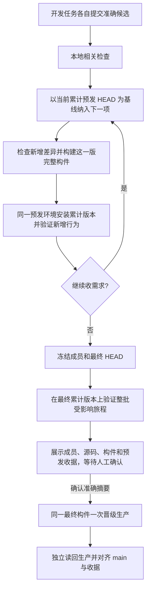

# 累计预发、整批一次晋级

## 目标与业务判断

开发需求各自保持独立候选和相关测试。共享预发只有一套运行应用，所以按到达顺序安装累计版本：`生产 P → 预发 P+A → P+A+B → P+A+B+C`。每次新增需求均可在预发验证；生产始终运行 P。负责人决定收批后，验收最终累计版本，人工确认一份准确清单，并将预发运行的最终构件一次性安装到生产。不存在“三份不同版本同时运行在同一预发地址”的承诺，也不设置任意的批量数量上限。

## 外部参考和仓库复用

- [GitLab Resource group](https://docs.gitlab.com/ci/resource_groups/) 说明共享部署目标的写操作需串行；本方案继续使用现有预发机锁。
- [GitHub Deployment environments](https://docs.github.com/en/actions/concepts/workflows-and-actions/deployment-environments) 将预发和生产作为不同目标，生产可由人工审批。本项目继续使用国内控制器，不新增 GitHub 门禁。
- 复用现有国内裸仓库 `main`、候选队列、串行锁、单次构件、安装收据、源码 bundle、生产 CAS 和 `approval_digest`。在原账本记录累计预发链，不建立第二发布队列。

## 范围与合同

1. **打开批次。** 首项从生产源码 `main=P` 出发，经相关检查和一次构建后安装到预发；形成成员 A 的 `base/head/tree`、检查、构件、安装、旅程收据。预发通过时继续允许下一项进入，不把“待生产审批”当作队列阻塞。
2. **追加成员。** 下一开发候选必须明确基于当前预发累计 HEAD；开发任务负责合入前序提交并重跑受影响检查，工作台不代为解决冲突。控制器核对前一项预发收据和健康、候选 ref/head/tree、连续源码链，然后仅检查本次差异，构建并安装新的完整累计版本。旧版本的收据保留供审计。
3. **共享预发含义。** 预发每次只有一个活跃版本。安装 B 后，环境运行 A+B；A 的旧包不再是当前预发。每项有自己的预发验证，最终收批时对 A、B 等仍适用的行为在最终累计版本上读回，防止后项破坏前项。
4. **封批与审批。** 人工选择停止收项，控制器冻结有序成员身份、生产基线 P、最终 HEAD/tree、完整构件摘要、源码 bundle 摘要、最后预发安装收据及整批旅程收据，生成一个 `approval_digest`。批准前可以继续积累候选，但追加任何提交、重装或收据变化都使旧摘要失效。封批后新候选留待下一批；不按等待时间自动批准。
5. **生产晋级。** 对上述准确摘要得到明确人工确认后，控制器重验 ref、源码祖先链、最终包字节、预发运行版本与健康、生产仍在 P，再复制同一最终包并只安装一次。生产源码游标与国内 `main` 从 P 一次前进到最终 HEAD；全部成员记录同一批生产收据。生产独立读回版本、摘要、服务、健康及本批适用的安全业务行为。
6. **失败与恢复。** 新成员检查失败时保持已验证的预发版本和成员链，不覆盖它；代码问题回调原开发任务并保留顺序。安装结果不明先只读对账，不能重装猜测。若预发确实未恢复到上一个已验证版本，批次暂停修复。生产结果不明继续沿用原 attempt 对账，绝不再次安装。撤出已累计的成员需从 P 构建新的准确累计链并重验，不能只从审批清单中删名字。
7. **迁移和容量。** 如果批内包含数据库迁移，最终还要在独立合成库验证生产从 P 直接迁至最终版本，不能只凭预发逐次迁移成功；生产仅在执行迁移前备份。预发机保留当前包、可回退的前一包及小型收据，旧中间构件经摘要核对后按现有容量策略回收，不因批次等待无限保留大包。

## 必要性判断与边界

| 对象 | 不加约束的具体后果 | 最小约束 |
| --- | --- | --- |
| 成员基线 | 并行开发的提交可能覆盖前序预发内容 | 下一项的第一父链必须从当前累计 HEAD 继续 |
| 共享预发写入 | 并行安装会混淆运行版本与收据 | 复用现有独占锁，依次安装 |
| 人工审批 | 批次变化后旧确认可能批准另一份包 | 摘要绑定有序成员、最终包和预发证据；变化即失效 |
| 结果不明 | 盲目重装可能重复迁移或效果 | 先按原 attempt 和主机读回对账 |

不设置“只能三项或五项”的配额，不让每项分别审批生产，不要求 GitHub PR 或全仓测试作为普通业务需求的默认门禁。

## 五项影响判断

| 判断 | 结论 |
| --- | --- |
| 对外合同 | 开发候选及业务 API 不变；发布命令增加打开、追加、封批和整批晋级的明确结果 |
| 业务机制 | 生产业务数据不因流程本身变化；预发连续安装版本，生产只安装最终版本一次 |
| 关联模块 | `scripts/domestic_main_release.py`、国内构建与安装收据、受信任影响检查、发布说明和对应控制器合同测试 |
| 页面影响 | 无产品页面或交互改动；工作台应展示批次成员、预发当前版本和待审批对象 |
| 验证证据 | 控制器状态迁移、真实主机预发演练、累积包资源闭包、最终整批旅程、人工审批与生产读回 |

OneID：不涉及，发布器不解析或归属客户。Persistence：仅现有发布账本和主机收据，不新增业务表或持久任务。External Effects：生产部署和源码游标是需串行、可对账的外部写入；沿用现有锁、attempt、bundle、收据与结果不明恢复，不新增第二执行内核。

## 对抗性验收

- A 与 B 分别通过，但 B 的最终预发构件使 A 的页面失效：封批旅程失败，不能生成审批摘要。
- B 的 ref 在检查后移动、成员顺序改变、预发包被替换或生产基线 P 改变：旧审批失效，不能生产写入。
- B 只到“请求发出”，页面仍在加载：旅程不得判通过；等待业务结果或按准确失败记录。
- B 的检查失败或预发安装中断：A 的已验证证据不被覆盖；未知安装结果先只读对账。
- A、B 各自在预发逐步迁移成功，但生产 P 直接到 A+B 的迁移失败：批次不得封批。
- 多次累计安装耗尽预发磁盘：容量预检应在写入前停止；可恢复清理仅处理已由摘要和收据证明可回收的旧构件，不删当前包、前一包或源码证据。
- 两个发布进程同时安装预发：已有锁只允许一个写者。
- 人工确认前 timer 或 `poll` 多次运行：不得调用生产安装、推进 `main` 或自动批准。
- 生产安装响应丢失：核对同一最终包、receipt 和服务，再决定收尾；不得第二次安装。

## 当前候选迁移

现有 `257d465` 已在旧控制器的单项 `stage-validation-pending`，生产仍在 `73de4fb`。用户已明确选择把 `257d465` 纳入首批，暂不单独晋级。旧控制器禁止其后继续预发，也禁止此状态进行维护检查。切换需要先检查新控制器候选并验证其固定文件，再在独占锁内核对原预发构件、源码、旅程与生产基线，把原尝试登记为首项；失败保持原状态，不改账本或生产。下一项以批次 HEAD 为基线。新控制器真正安装并完成接管前，不把文档或本地代码当作已启用累计预发。
