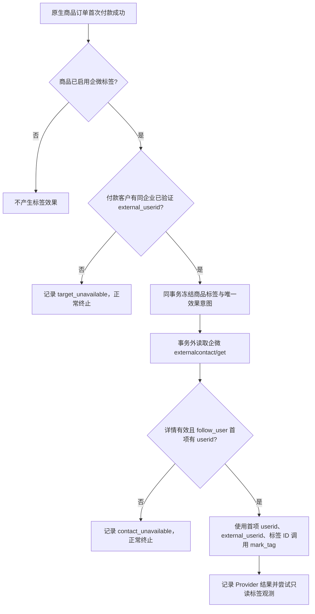

# 商品报名付款后按企微客户详情首位客服打标签

## 业务判断

付款时不根据本地主负责人或回调关系表选客服。首位客服以本次企微客户详情返回的 `follow_user[0].userid` 为准；不跳过首位去猜测其他客服。无企微身份、客户详情不存在、无联系人或首位客服 ID 缺失时正常终止，不发起写入。读取暂时失败按既有外部效果重试语义处理，写入结果未知时不换幂等键盲重试。

## 参考与复用

- 企业微信客户详情 `externalcontact/get` 返回 `follow_user[].userid`；`externalcontact/mark_tag` 接受 `userid`、`external_userid`、`add_tag`。参考 [企微客户详情](https://developer.work.weixin.qq.com/document/path/92114)、[企微编辑客户标签](https://developer.work.weixin.qq.com/document/path/92118) 与 [go-workwx 的接口模型](https://github.com/xen0n/go-workwx/blob/v2/external_contact.md.go)。企微要求外部联系人属于该客服；详情首项提供该关系事实。
- 复用 V4 已有的已验证企微身份读取、商品付款动作、Customer 标签命令、External Effects 队列、Outbound Provider 写入和企微详情只读客户端。只为 `product_paid_purchase` 来源提供首位客服规则，其他标签命令保持原有目标规则。

## 范围与合同

- 对外接口和页面不变。商品保存仍存本地标签 ID；启用后的最终输出是企微 `mark_tag` 对相应买家执行一次。
- Product 仍拥有付款动作快照，Order 仍拥有付款事实，Customer 仍拥有标签命令，Outbound 独占企微写入。不得新增身份匹配、标签队列或 Provider 写入口。
- OneID：读取付款人的 canonical customer 与同企业、已验证的企微 external_userid；无唯一可信值时终止，不猜测身份。
- Persistence：付款动作、标签命令及效果接受继续参与付款事务；企微详情读取和写入在事务外的既有 External Effects worker 中执行。
- External Effects：一次付款事件使用原有稳定 key；同一效果只选一次客户与标签，执行时从实时详情取第一位客服；结果未知遵循原效果对账语义。
- 不涉及新增业务限制；只保留企微接口必须的身份、联系人及标签绑定条件。

## 受影响模块与验证

Product 首付事件、Customer 标签命令的来源特定冻结、WeCom 客户详情最小读取、Outbound 标签执行及 Composition。普通/周期商品管理页面、订单付款接口不变。验证无身份、无详情、空联系人、首位客服、多个客服、标签绑定变化、付款重放及 Provider 失败/未知，不用 Mock 成功冒称真实企微标签已显示。

现有已拒绝的生产命令保持原收据；先交付未来付款路径。历史补打需以准确拒绝集合进行只读预览，再用单独受控恢复入口和新幂等键逐笔接受，避免把已执行或结果未知的效果重复发送。
